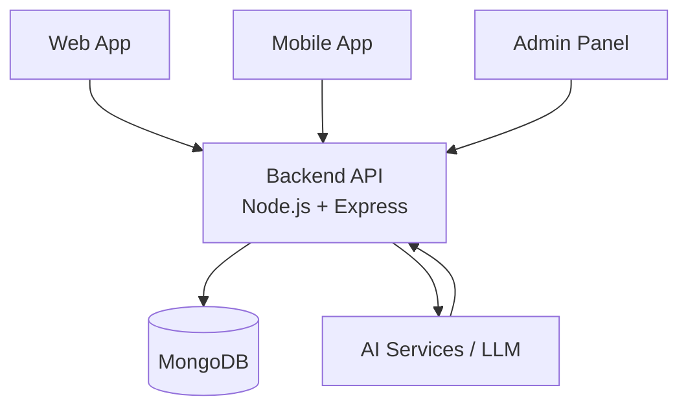
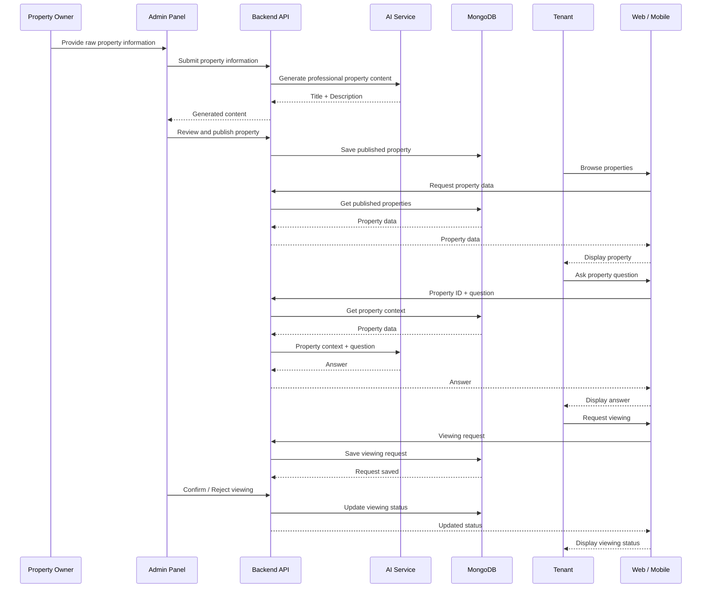

# Property Rental Platform — Agent Guidelines

## 1. Project Overview

**Property Rental Platform** is an AI-powered rental property discovery platform that connects tenants with available rental properties.

The platform allows tenants to discover properties through web and mobile applications, view property information, save favorites, ask property-specific questions through AI, and request property viewings.

The platform also includes an internal Admin Panel for managing and publishing property information.

This repository is a **monorepo** containing the complete platform.

---

## 2. Project Goals

The main goals of the project are:

* Provide a simple property discovery experience for tenants.
* Provide the same core property data across Web and Mobile.
* Maintain one centralized backend and database.
* Allow the internal team to manage and publish property listings.
* Use AI to convert raw property information into professional content.
* Provide a property-specific AI chatbot for tenant questions.
* Allow tenants to request property viewings.
* Keep the system simple, maintainable, and easy for the team to develop independently.

---

## 3. Repository Structure

```text
property-rental-platform/
│
├── web/          # Tenant-facing web application
├── mobile/       # Tenant-facing mobile application
├── admin/        # Internal admin panel
├── backend/      # Backend API and database logic
├── ai/           # AI-related functionality
├── docs/         # Project and technical documentation
│
├── AGENTS.md
├── README.md
├── .gitignore
└── LICENSE
```

Each major application has its own `AGENTS.md` containing its specific development rules and implementation details.

The root `AGENTS.md` defines rules that apply to the **entire repository**.

---

# 4. Architecture

The platform follows a centralized backend architecture.



### Architectural Principles

* Web, Mobile, and Admin communicate through the Backend API.
* The Backend is the central source of business logic.
* MongoDB is the central source of application data.
* AI functionality is accessed through the Backend.
* Frontend applications must not directly access the database.
* AI API keys and other secrets must never be exposed to Web or Mobile.
* Shared data structures must remain consistent across all applications.

---

# 5. Main System Flow

The complete platform works through the following high-level flow:



---

# 6. Data Ownership

The Backend defines and maintains the official application data structures.

Core entities include:

* Users
* Properties
* Favorites
* Viewing Requests

The exact schemas and API contracts are documented separately under `docs/` and the Backend's own `AGENTS.md`.

### Single Source of Truth

For shared application data:

```text
Backend API
     ↓
MongoDB
     ↓
Web / Mobile / Admin
```

Web, Mobile, and Admin must not create independent versions of the same backend data structure.

---

# 7. Monorepo Rules

### Independent Applications

Each application should remain isolated within its own directory:

```text
web/
mobile/
admin/
backend/
ai/
```

Avoid importing application-specific code directly between these directories.

For example:

* `web` should not import code directly from `mobile`.
* `mobile` should not import code directly from `admin`.
* `admin` should not import backend implementation files.
* Frontends communicate with Backend through APIs.

---

## Backend as the API Boundary

Frontend applications must communicate with the Backend through defined APIs.

```text
Web ────────┐
Mobile ─────┼──→ Backend API → MongoDB
Admin ──────┘
```

Do not bypass the Backend to access MongoDB or internal server logic.

---

## AI as a Backend Service

AI functionality should be accessed through the Backend.

```text
Web / Mobile / Admin
          ↓
       Backend
          ↓
       AI Service
```

Never expose AI credentials or secret API keys in frontend code.

---

# 8. Shared Data Contract

All applications must follow the API contract defined by the Backend.

For example, a Property returned by the Backend must use the agreed field names.

```text
propertyId
title
description
propertyType
price
location
bedrooms
bathrooms
amenities
furnished
images
availability
status
```

Do not independently rename or restructure shared fields in a frontend.

If a field needs to change, update the API contract and communicate the change before implementation.

---

# 9. Git Workflow

The repository uses:

```text
main
  │
  └── develop
        │
        ├── feature/...
        └── fix/...
```

### `main`

* Stable version.
* Production-ready code.
* No direct development work.

### `develop`

* Main development branch.
* Feature branches are created from `develop`.

### Feature Branches

Use:

```text
feature/<area>-<feature>
```

Examples:

```text
feature/web-search
feature/mobile-property-details
feature/admin-properties
feature/backend-auth
feature/ai-chatbot
```

Bug fixes:

```text
fix/<area>-<issue>
```

Example:

```text
fix/backend-viewing-status
```

---

# 10. Git Rules

* Never directly push to `main`.
* Create feature branches from the latest `develop`.
* Keep each branch focused on one feature or related task.
* Use clear commit messages.
* Push the feature branch and create a Pull Request.
* Merge completed work into `develop`.
* Only stable, tested code should move from `develop` to `main`.

Before starting new work:

```bash
git checkout develop
git pull origin develop
git checkout -b feature/your-feature
```

---

# 11. Coding Principles

### Keep Code Simple

The project should be easy for the whole team to understand.

* Prefer simple solutions over unnecessary abstractions.
* Keep functions and components focused.
* Avoid unnecessary complexity.
* Follow existing project patterns.

### Reuse Code

* Avoid unnecessary duplication.
* Create reusable utilities/components when genuinely useful.
* Do not create abstractions just for the sake of abstraction.

### Clear Naming

Use descriptive names.

Good:

```text
getPropertyById
createViewingRequest
PropertyDetails
ViewingRequestForm
```

Avoid unclear names:

```text
getData
doThing
temp
x
```

### No Unnecessary Dependencies

Do not add a new package unless it is actually required for the feature.

---

# 12. Environment & Secrets

Never commit secrets to Git.

Do not commit:

```text
.env
.env.local
API keys
database passwords
JWT secrets
AI API keys
```

Use `.env.example` files to document required environment variables without exposing real values.

---

# 13. Documentation

Project-level documentation belongs in:

```text
docs/
```

Recommended files:

```text
docs/
├── api.md
├── database.md
└── project-requirements.md
```

When an API or database structure changes, the relevant documentation should also be updated.

Application-specific implementation rules belong in the respective application's `AGENTS.md`.

---

# 14. Testing and Validation

Before creating a Pull Request:

* Verify the feature works locally.
* Check related API calls.
* Check error handling.
* Check the affected application.
* Ensure no secrets or unnecessary files are committed.
* Ensure existing functionality has not been broken.

Do not mark a task complete if the affected feature is known to be broken.

---

# 15. Change Management

Before making a significant architectural change:

1. Check the existing implementation.
2. Check the relevant documentation.
3. Determine whether the change affects other applications.
4. Update the API/data contract if required.
5. Implement the change.
6. Test affected areas.

Avoid making breaking changes to shared APIs without updating all affected applications.

---

# 16. General Agent Rules

When working on this repository:

1. **Read the relevant existing code before changing it.**
2. **Read the nearest `AGENTS.md` before working in a directory.**
3. Follow existing conventions instead of introducing a completely new pattern.
4. Do not modify unrelated parts of the project.
5. Keep changes focused on the requested task.
6. Do not invent new project requirements.
7. Do not add features that are not part of the current requirements without approval.
8. Protect secrets and credentials.
9. Keep API and database contracts consistent.
10. Update documentation when making important structural changes.

---

## 17. Scope Boundary

The root `AGENTS.md` defines **project-wide rules only**.

Detailed implementation instructions should live in the relevant directories:

```text
web/AGENTS.md
mobile/AGENTS.md
admin/AGENTS.md
backend/AGENTS.md
ai/AGENTS.md
```

Those files should define the specific technology, folder structure, coding conventions, APIs, and responsibilities for that application/service.

The root file should remain focused on **overall architecture, shared rules, monorepo conventions, data contracts, and project-wide development practices**.
