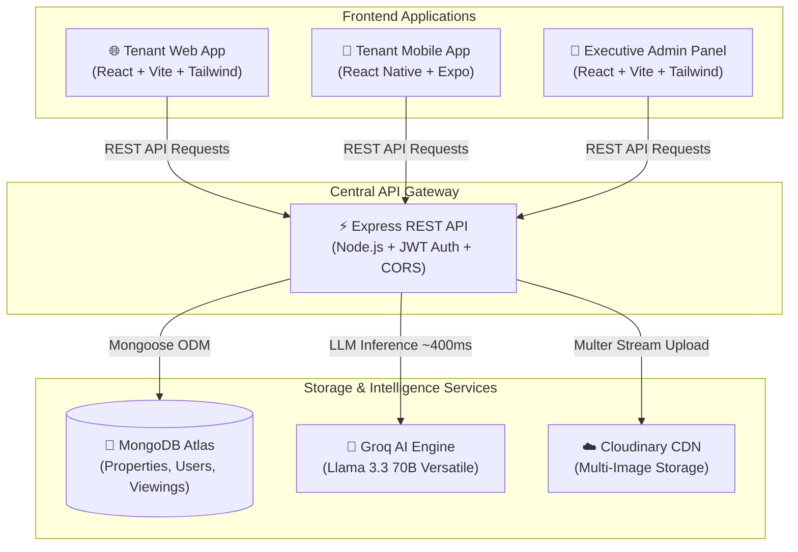
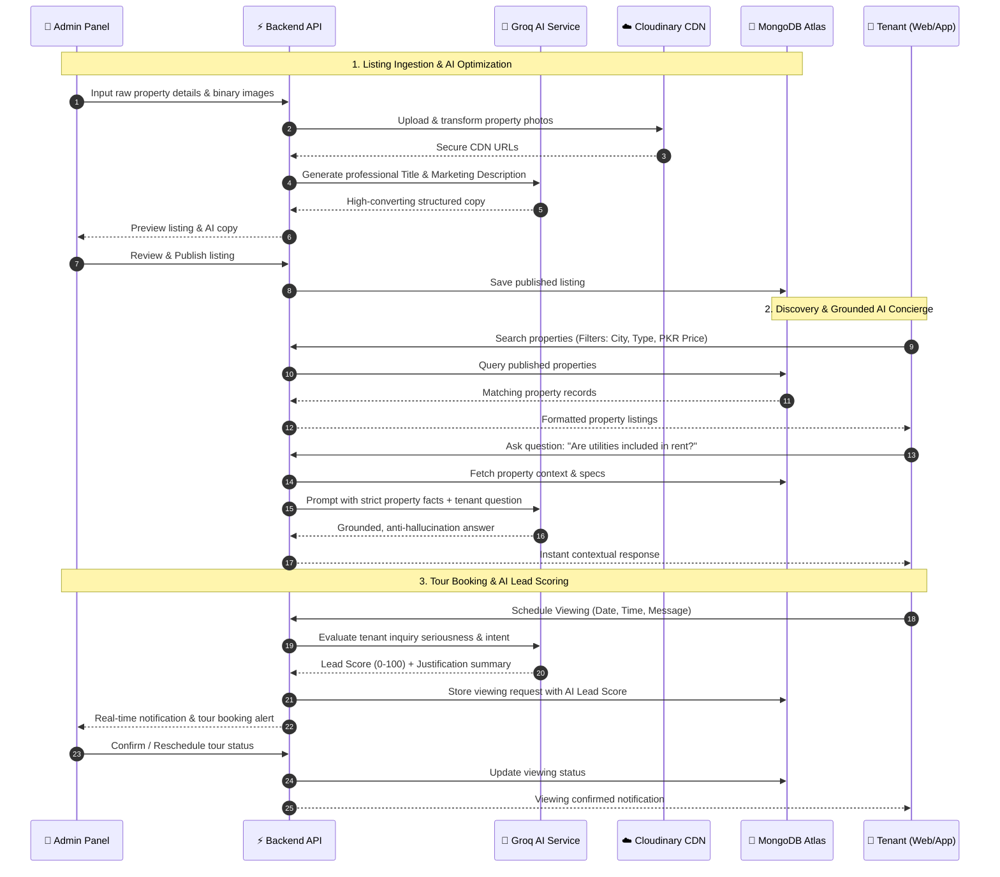

# HAVEN — AI-Powered Property Rental Platform

[](https://github.com/ArsalanTheCoder/property-rental-platform)
[](https://nodejs.org/)
[](https://react.dev/)
[](https://expo.dev/)
[](https://www.mongodb.com/)
[](https://groq.com/)
[](https://cloudinary.com/)

An enterprise-grade, end-to-end AI-powered rental property discovery and management ecosystem. **HAVEN** connects prospective tenants with verified residential listings across Web and Mobile applications, powered by an internal Admin Panel, contextual Groq LLM intelligence, and centralized MongoDB architecture.

---

## 📺 Video Demo & System Walkthrough

Experience the full live demonstration of the **Tenant Web App** and **Executive Admin Panel**:

[](https://drive.google.com/file/d/161ccr9QtEjP6ZTp7gRSPt8I4uGepMaDl/view?usp=sharing)

> 🔗 **Direct Google Drive Video Link:**  
> [https://drive.google.com/file/d/161ccr9QtEjP6ZTp7gRSPt8I4uGepMaDl/view?usp=sharing](https://drive.google.com/file/d/161ccr9QtEjP6ZTp7gRSPt8I4uGepMaDl/view?usp=sharing)

---

## 🏛️ System Architecture

The platform follows a centralized backend monorepo architecture. All frontend clients (Web, Mobile, Admin) interface exclusively with the centralized Backend REST API, ensuring single-source-of-truth business logic and secret protection.



---

## 🔄 End-to-End System Lifecycle Flow



---

## 📁 Monorepo Structure

```text
property-rental-platform/
│
├── 🌐 web/                  # Tenant-facing React 18 Web Application (Vite + Tailwind CSS)
│   ├── src/
│   │   ├── components/      # Glassmorphic UI components, SearchBar, PropertyGrid, Modals
│   │   ├── pages/           # Home, PropertyList, PropertyDetail, Viewings, Favorites, Auth
│   │   ├── context/         # AuthContext, FavoritesContext, ThemeContext, ToastContext
│   │   └── services/        # Axios HTTP client & API service endpoints
│   └── package.json
│
├── 📱 mobile/               # Tenant-facing Mobile Application (React Native + Expo SDK 51)
│   ├── app/
│   │   ├── (auth)/          # Clean login, register, and email verification screens
│   │   ├── (tabs)/          # 2-Column Home grid, Search, Saved Favorites, Bookings, Profile
│   │   └── property/[id]/   # HD Carousel gallery, Grounded AI Chatbot, Tour booking
│   ├── src/
│   │   ├── components/      # Compact PropertyCard, Badges, SearchBar, StatusPills
│   │   └── context/         # AuthContext, FavoritesContext
│   └── package.json
│
├── 🏢 admin/                # Internal Executive Administration Panel (React + Vite)
│   ├── src/
│   │   ├── components/      # Dark-slate Sidebar, ImagePicker, WorkflowActions, Tables
│   │   ├── pages/           # Dashboard, Properties, PropertyForm, Viewings & AI Leads, Users
│   │   └── services/        # Admin property management, Cloudinary upload, Dashboard stats
│   └── package.json
│
├── ⚡ backend/              # Centralized Node.js + Express REST API Gateway
│   ├── src/
│   │   ├── config/          # MongoDB Mongoose connection, Cloudinary SDK, Groq Client
│   │   ├── controllers/     # Auth, Public Properties, Admin, Viewings, AI, Favorites
│   │   ├── middlewares/     # JWT Auth, Role Guard, Error Handler, Multer Upload
│   │   ├── models/          # User, Property, ViewingRequest, Favorite, RefreshToken
│   │   ├── routes/          # Express route definitions
│   │   └── services/        # Business logic, AI prompts, Lead evaluation, Email service
│   └── package.json
│
├── 🧠 ai/                   # AI System Prompts, Guardrails & Evaluation Heuristics
│   ├── prompts/             # Title generator, description enhancer, grounded chatbot
│   └── AGENTS.md
│
├── 📚 docs/                 # Architectural Documentation, RFCs & API Guides
│   ├── admin-panel-api-guide.md
│   ├── web-and-mobile-api-guide.md
│   ├── api.md
│   └── database.md
│
├── AGENTS.md                # Project-wide development standards & Monorepo rules
├── README.md                # Master platform documentation
└── package.json             # Root monorepo workspace configuration
```

---

## 🚀 Key Modules & Capabilities

### 1. 🌐 Tenant Web Application (`/web`)
* **Aesthetics:** Aurora gradient backdrop, glassmorphism (`glass-card`, `glass-nav`), and dark/light theme switching.
* **Smart Search:** Multi-facet filtering by location, property type, price ranges in Pakistani Rupees (`Rs. 60,000`), furnished state, and bedrooms.
* **Property Detail & Showcase:** HD photo gallery carousel, verified amenity pills, and instant tour booking modal.
* **Grounded AI Concierge:** Real-time conversational modal answering questions strictly from property metadata.
* **Optimistic Favorites:** 1-click wishlist toggle synced directly with MongoDB Atlas.

### 2. 📱 Tenant Mobile Application (`/mobile`)
* **2-Column Compact Grid:** High-density, beautifully proportioned 2-in-a-row property listings (`numColumns={2}`) on Home, Search, and Favorites.
* **Fallback Image System:** Automatic graceful fallback to high-resolution architectural photography when listings have no photos.
* **Offline Resilience:** Null-safe favorites filtering, optimistic UI toggles, and token-based auto-restoration.
* **Native Gestures:** Pull-to-refresh feeds, modal slide-ins, and keyboard-avoiding authentication.

### 3. 🏢 Executive Admin Panel (`/admin`)
* **Executive Dashboard:** 4 dynamic KPI stat cards (Total Listings, Published, Pending Inquiries, Registered Tenants) and quick management actions.
* **AI Content Studio:** 1-click generation of SEO-optimized property titles and professional descriptions from raw specs.
* **Cloudinary Media Pipeline:** Multi-file drag-and-drop image upload with live thumbnail badges (`Ready to Upload` vs `Uploaded (Cloudinary)`).
* **Viewing Inquiries & AI Lead Scoring:** Unified tour request management with automated AI lead seriousness evaluations (`★ 0–100`).
* **Tenant Moderation:** Inspect tenant verification states and account moderation controls.

### 4. ⚡ Centralized REST Backend (`/backend`)
* **Authentication:** Stateless Access Tokens + Secure HTTP-only Refresh Tokens with Argon2/bcrypt password hashing.
* **Dynamic CORS Engine:** Multi-origin dev allowlist supporting local web, admin, and mobile network IP addresses.
* **Strict Anti-Hallucination AI:** Groq Llama 3.3 70B integration with factual system prompts ensuring responses never fabricate unlisted property attributes.
* **Security & Validation:** Joi / Express-validator request schema validation and rate limiting.

---

## 🛠️ Technology Stack

| Layer | Technologies |
| :--- | :--- |
| **Frontend Web** | React 18, Vite 5, Tailwind CSS, Framer Motion, Lucide Icons, Axios |
| **Frontend Mobile** | React Native, Expo SDK 51, TypeScript, React Navigation, Expo Vector Icons |
| **Admin Panel** | React 18, Vite 5, Tailwind CSS, Plus Jakarta Sans, Heroicons |
| **Backend API** | Node.js, Express.js, Mongoose ODM, JSON Web Tokens (JWT), Multer |
| **Database** | MongoDB Atlas (Multi-collection relational modeling with indexation) |
| **AI / LLM** | Groq SDK (Llama 3.3 70B Versatile, Temperature: 0.1 for high precision) |
| **Media CDN** | Cloudinary REST Storage & Transformation API |

---

## ⚙️ Quick Start & Local Setup

### Prerequisites
- **Node.js**: `v18.0.0` or higher
- **npm**: `v9.0.0` or higher
- **MongoDB Atlas** database connection URI
- **Groq AI** API Key ([console.groq.com](https://console.groq.com))
- **Cloudinary** Account (Cloud Name, API Key, API Secret)

---

### Step 1: Clone the Repository
```bash
git clone https://github.com/ArsalanTheCoder/property-rental-platform.git
cd property-rental-platform
```

---

### Step 2: Configure Environment Variables

#### Backend (`backend/.env`)
```env
PORT=5000
NODE_ENV=development
MONGO_URI=mongodb+srv://<username>:<password>@cluster.mongodb.net/property-rental?retryWrites=true&w=majority
CLIENT_ORIGIN=http://localhost:3000,http://localhost:5173

JWT_ACCESS_SECRET=your_super_secret_access_jwt_key_here_32_chars
JWT_REFRESH_SECRET=your_super_secret_refresh_jwt_key_here_32_chars
JWT_ACCESS_EXPIRY=15m
JWT_REFRESH_EXPIRY=7d

# Groq AI Credentials
GROQ_API_KEY=gsk_your_groq_api_key_here
GROQ_MODEL=llama-3.3-70b-versatile

# Cloudinary Storage
CLOUDINARY_CLOUD_NAME=your_cloud_name
CLOUDINARY_API_KEY=your_api_key
CLOUDINARY_API_SECRET=your_api_secret

# Master Admin Seed
ADMIN_EMAIL=admin@rentalplatform.com
ADMIN_PASSWORD=AdminSecurePass123!
```

#### Web Application (`web/.env`)
```env
VITE_API_BASE_URL=http://localhost:5000/api/v1
```

#### Admin Panel (`admin/.env`)
```env
VITE_API_BASE_URL=http://localhost:5000/api/v1
VITE_USE_MOCKS=false
```

---

### Step 3: Install Dependencies & Run

Open separate terminal windows for each service:

#### 1. Start Backend API & Seed Admin
```bash
cd backend
npm install
npm run seed:admin
npm run dev
# Server running at http://localhost:5000/api/v1
```

#### 2. Start Tenant Web App
```bash
cd web
npm install
npm run dev
# Web running at http://localhost:3000
```

#### 3. Start Executive Admin Panel
```bash
cd admin
npm install
npm run dev
# Admin running at http://localhost:5173
```

#### 4. Start Mobile Application
```bash
cd mobile
npm install
npm start
# Press 'a' for Android emulator or scan QR code via Expo Go
```

---

## 🔑 Default Master Credentials

| Portal | Role | Email | Password |
| :--- | :--- | :--- | :--- |
| **Admin Panel** | Master Administrator | `admin@rentalplatform.com` | `AdminSecurePass123!` |
| **Web / Mobile** | Demo Tenant | `tenant@rentalplatform.com` | `TenantPass123!` |

---

## 👥 Project Team & Engineering Roles

| Team Member | Role | Key Contributions & Scope of Work |
| :--- | :--- | :--- |
| **Mohammad Arsalan**<br/>`@ArsalanTheCoder` | **Project Architect & Lead Full-Stack Engineer** | • Overall System Architecture, Monorepo Setup & Git Branching Strategy<br/>• Centralized Backend REST API Gateway & Controller Implementation<br/>• MongoDB Atlas Relational Schema Modeling, Indexes & Validation<br/>• JWT Authentication (Access/Refresh Tokens) & Dynamic Multi-Origin CORS<br/>• Cloudinary Image Pipeline & Full System Integration across Web/Admin/Mobile |
| **Muhammad Hanif**<br/>`@Hanif` | **Admin Panel & Operations Specialist** | • Internal Executive Admin Panel (`/admin`) Development in React 18 & Vite<br/>• Property Creation, Updating, and Status Lifecycle Management<br/>• Image Picker with Real Binary File Previews & Upload Progress<br/>• Viewing Requests & Tour Bookings Administration Interface<br/>• Admin Panel Integration Contracts & Documentation (`docs/admin-panel-api-guide.md`) |
| **Farooque Sajjad**<br/>`@Farooquekk` | **Mobile App Developer** | • Tenant-Facing Mobile Application (`/mobile`) in React Native & Expo SDK 51<br/>• 2-Column Compact Grid Property Feed (`numColumns={2}`) & Search<br/>• High-Resolution Fallback Image Pipeline for Missing Photos<br/>• Mobile Auth, Persistent Saved Favorites Context & Viewing Bookings Flow<br/>• Cross-Device Network Adaptability (Physical Android & Emulator Support) |
| **Ihsan Ali**<br/>`@Ihsanali786` | **Web Frontend Developer** | • Tenant-Facing Web Portal (`/web`) in React 18, Vite & Tailwind CSS<br/>• Aurora Gradient Hero Section, Glassmorphic Navigation & Footer<br/>• Multi-Criteria Property Search & Filter System (PKR Price Range, Bedrooms, City)<br/>• Property Details Showcase, Photo Gallery & Tour Request Appointment Modal<br/>• Web API Integration & Responsive Layout Design |
| **Sanaullah** | **AI / LLM Prompt Engineer** | • Groq SDK Integration (`llama-3.3-70b-versatile`) with Sub-Second Inference<br/>• AI Property Marketing Title & High-Converting Description Generation<br/>• Strict Anti-Hallucination Grounded Q&A Chatbot System Prompts<br/>• Automated Tenant Inquiry Seriousness Lead Scoring Heuristics (`★ 0–100`)<br/>• AI Integration Boundaries & Service Layer Documentation |

---

## 📜 Monorepo Guidelines & Code of Conduct

1. **API Boundary:** Frontends must interface with MongoDB solely through the Express REST API Gateway. Direct database imports across directories are strictly prohibited.
2. **Secret Protection:** AI keys, Cloudinary credentials, and database URIs must never be bundled into client bundles.
3. **Data Integrity:** All applications must adhere strictly to the shared property and viewing request schemas documented under `docs/`.

---

## 📄 License

This project is licensed under the [MIT License](LICENSE).

---

<div align="center">
  <sub>Built with ❤️ by the <b>HAVEN Engineering Team</b> for modern property rental discovery.</sub>
</div>
