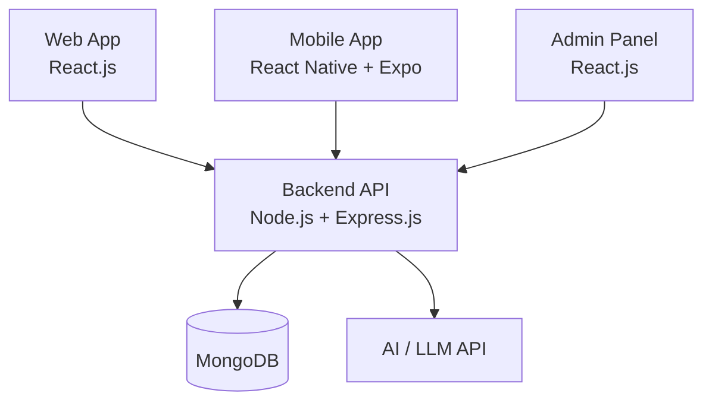
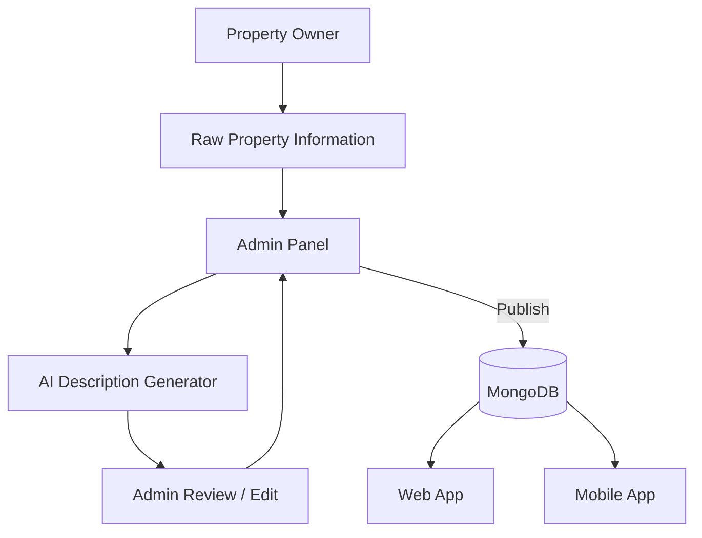
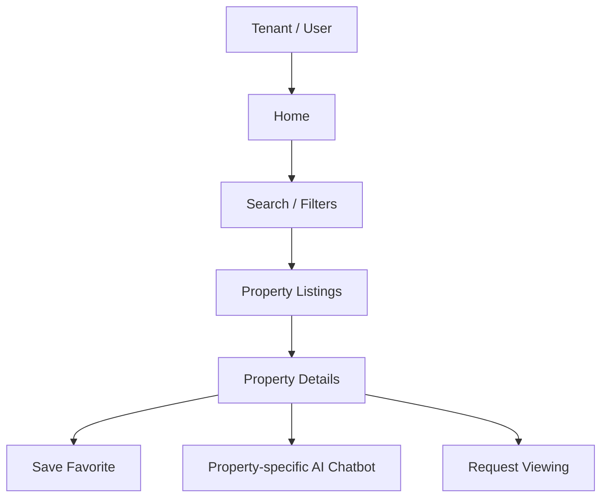
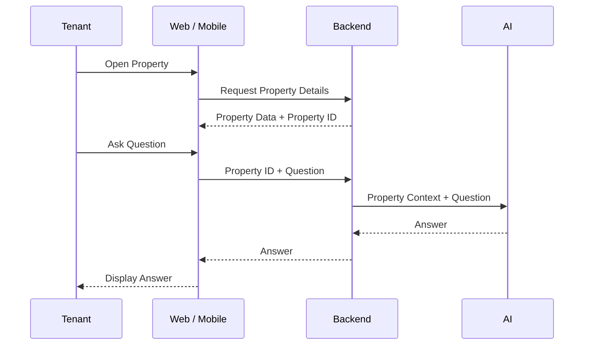
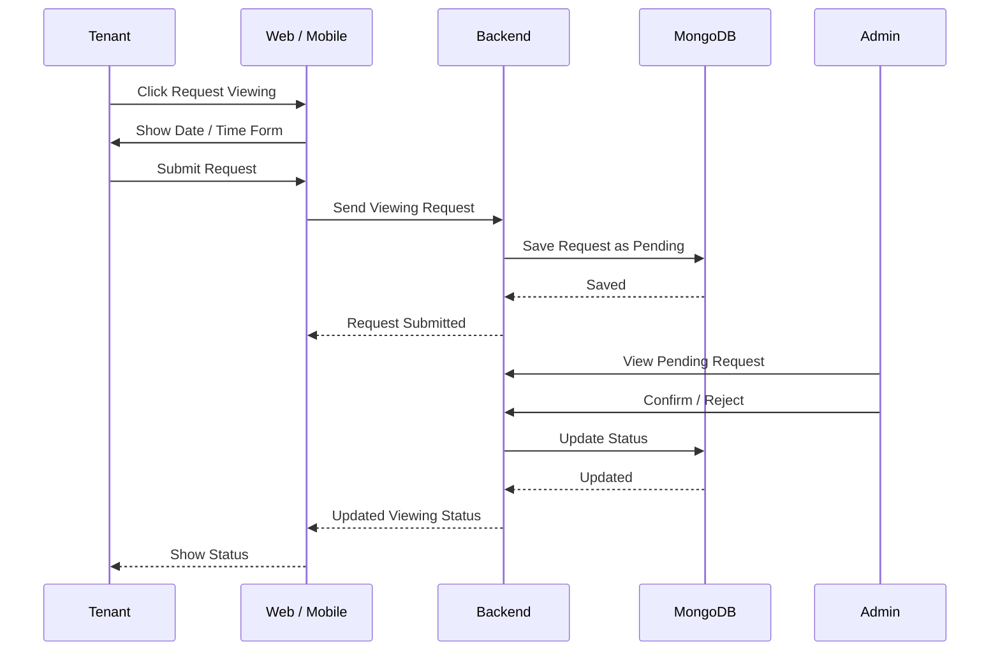
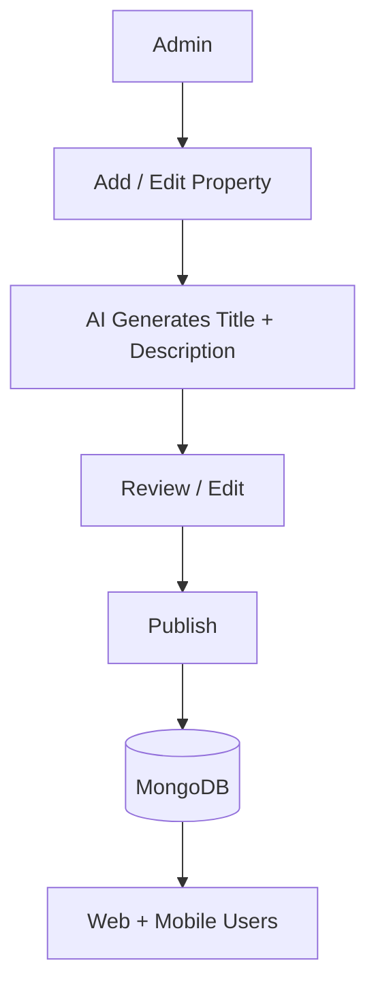
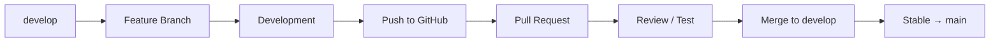
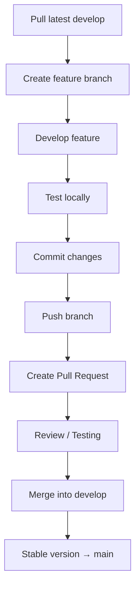
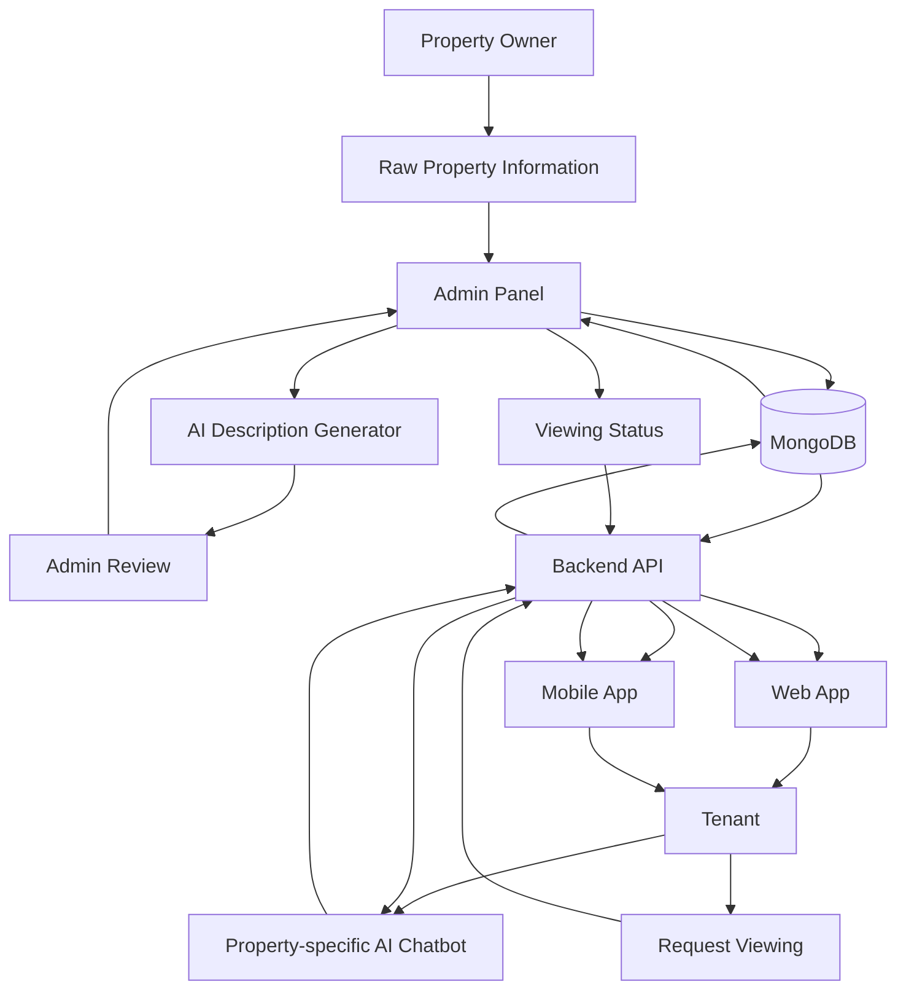

# Property Rental Platform

An AI-powered property rental platform where tenants can discover rental properties through a web application and mobile application. The platform also includes an Admin Panel for managing properties and AI features for property descriptions, property-specific questions, and lead scoring.

---

## 1. Project Architecture

The platform consists of:

* **Web App** — React.js
* **Mobile App** — React Native + Expo
* **Admin Panel** — React.js
* **Backend API** — Node.js + Express.js
* **Database** — MongoDB
* **AI** — AI/LLM API

### Architecture Diagram



---

## 2. Project Structure

```text
property-rental-platform/
│
├── web/
│   └── React Web Application
│
├── mobile/
│   └── React Native + Expo Application
│
├── admin/
│   └── React Admin Panel
│
├── backend/
│   └── Node.js + Express API
│
├── ai/
│   └── AI-related code
│
├── docs/
│   ├── api.md
│   ├── database.md
│   └── project-requirements.md
│
├── README.md
├── .gitignore
└── package.json
```

---

# 3. Main Features

## Web Application

* User signup/login
* Property listings
* Property search
* Property filters
* Property details
* Property images
* Favorites
* Request Viewing
* Viewing status
* Property-specific AI chatbot

## Mobile Application

* User signup/login
* Property listings
* Property search
* Property filters
* Property details
* Favorites
* Request Viewing
* Viewing status
* Property-specific AI chatbot

## Admin Panel

* Admin login
* Dashboard
* Add property
* Edit property
* Property management
* AI-generated title and description
* Review/edit AI content
* Publish/unpublish property
* User management
* Viewing request management

## Backend

* Authentication
* User APIs
* Property APIs
* Favorite APIs
* Viewing APIs
* Admin APIs
* MongoDB integration
* AI integration

## AI

* Property title generation
* Property description generation
* Property-specific chatbot
* Inquiry lead scoring

---

# 4. Main Data Structure

All developers must use the same data structure.

## Property

```text
propertyId
title
description
propertyType
price
location
bedrooms
bathrooms
amenities
furnished
images
availability
status
```

## User

```text
userId
name
email
phone
authentication
favorites
```

## Favorite

```text
favoriteId
userId
propertyId
```

## Viewing Request

```text
viewingId
userId
propertyId
userName
userPhone
date
time
message
status
createdAt
```

### Viewing Status

```text
pending
confirmed
rejected
cancelled
completed
```

---

# 5. Property Creation Flow

The internal team enters the raw property information. AI generates a professional title and description. The admin reviews the content and publishes the property.



---

# 6. Tenant Property Flow



---

# 7. AI Chatbot Flow

The chatbot is **property-specific**.

When a user opens a property, the backend sends the property's context to the AI.

The user does not need to tell the chatbot which property they are asking about.



Normal chatbot questions are **not stored in the database**.

---

# 8. Viewing Request Flow

A database record is created only when the tenant requests a property viewing.



---

# 9. Web App — Ahsan Ali

The Web App is for tenants/users.

### Pages and Features

* Home page
* Property listings
* Search
* Filters
* Property details
* Property images
* Favorites
* Request Viewing
* Viewing status
* Property-specific AI chatbot
* Login/signup
* User profile

The Web App must use the property fields defined by the Backend.

---

# 10. Mobile App — Farooque Sajjad

The Mobile App is for tenants/users.

### Features

* Login/signup
* Home
* Property listings
* Search
* Filters
* Property details
* Property images
* Favorites
* Request Viewing
* Viewing status
* Property-specific AI chatbot
* User profile

The Mobile App uses the **same Backend APIs and property data** as the Web App.

---

# 11. Admin Panel — Muhammad Hanif

The Admin Panel is for the internal team.

### Features

* Admin login
* Dashboard
* Add property
* Edit property
* Property management
* AI title/description generation
* Review/edit AI content
* Publish property
* Unpublish property
* User management
* Viewing request management

### Admin Property Flow



---

# 12. Backend — Mohammad Arsalan

The Backend is the central system of the platform.

### Authentication APIs

* Signup
* Login
* User authentication
* Role/permission management

### Property APIs

* Create Property
* Get Properties
* Get Single Property
* Update Property
* Delete/Unpublish Property
* Search
* Filters

### User APIs

* User profile
* User information

### Favorite APIs

* Add favorite
* Remove favorite
* Get user's favorites

### Viewing APIs

* Request viewing
* Get viewing requests
* Get user's viewing requests
* Confirm viewing
* Reject viewing
* Update viewing status

### Admin APIs

* Property management
* Property publishing
* User management
* Viewing management

### AI Integration

* Description generator API
* Property chatbot API
* Lead scoring API

---

# 13. MongoDB

MongoDB will store the main platform data.

### Collections

```text
users
properties
favorites
viewingRequests
```

Normal AI chatbot questions are not stored.

---

# 14. AI — Sanaullah

## Property Description Generator

Input:

```text
Raw property information
```

Output:

```text
Professional property title
Professional property description
```

The admin reviews the generated content before publishing.

## Property-Specific Chatbot

The chatbot receives:

```text
Property ID
Property Information
User Question
```

It returns an answer based on that property's information.

## Lead Scoring

AI analyzes available tenant/viewing information and generates a seriousness score.

Example:

```text
Lead Score: 90/100
```

The score is available to the internal team through the Admin Panel.

---

# 15. Technology Stack

| Part        | Technology            |
| ----------- | --------------------- |
| Web         | React.js + JavaScript |
| Admin Panel | React.js + JavaScript |
| Mobile      | React Native + Expo   |
| Backend     | Node.js + Express.js  |
| Database    | MongoDB               |
| AI          | AI/LLM API            |

---

# 16. Team Responsibilities

| Developer        | Responsibility             |
| ---------------- | -------------------------- |
| Sanaullah        | Complete AI                |
| Ahsan Ali        | Complete Web App           |
| Muhammad Hanif   | Complete Admin Panel       |
| Farooque Sajjad  | Complete Mobile App        |
| Mohammad Arsalan | Complete Backend + MongoDB |

### Sanaullah — AI

* Property title generation
* Property description generation
* Property-specific chatbot
* Inquiry lead scoring
* AI integration requirements

### Ahsan Ali — Web

* Home
* Listings
* Search
* Filters
* Property details
* Favorites
* Request Viewing
* Viewing status
* Chatbot UI
* Authentication
* Backend integration

### Muhammad Hanif — Admin Panel

* Admin login
* Dashboard
* Property management
* Add/edit property
* AI content review
* Publish/unpublish
* User management
* Viewing request management
* Backend integration

### Farooque Sajjad — Mobile

* Login/signup
* Home
* Listings
* Search
* Filters
* Property details
* Favorites
* Request Viewing
* Viewing status
* Chatbot UI
* Backend integration

### Mohammad Arsalan — Backend

* Node.js + Express
* Authentication
* Property APIs
* User APIs
* Favorite APIs
* Viewing APIs
* Admin APIs
* MongoDB
* Roles/permissions
* AI integration

---

# 17. Git Branch Strategy

We use:

```text
main
  │
  └── develop
        │
        ├── feature/web-...
        ├── feature/mobile-...
        ├── feature/admin-...
        ├── feature/backend-...
        └── feature/ai-...
```

## Main Branch

`main` contains the stable/production-ready version.

**Do not directly push to `main`.**

## Develop Branch

`develop` contains the latest integrated development version.

All feature branches should be created from `develop`.

---

# 18. Creating a Branch

First update your local `develop`:

```bash
git checkout develop
git pull origin develop
```

Create a feature branch:

```bash
git checkout -b feature/your-feature-name
```

### Examples

```bash
feature/web-property-listing
feature/web-search

feature/mobile-property-details
feature/mobile-viewing-request

feature/admin-property-management
feature/admin-viewing-requests

feature/backend-property-api
feature/backend-viewing-api

feature/ai-description-generator
feature/ai-chatbot
```

---

# 19. Working With Your Branch

After making changes:

```bash
git status
```

Add changes:

```bash
git add .
```

Commit:

```bash
git commit -m "Add property listing page"
```

Push:

```bash
git push -u origin feature/web-property-listing
```

Then create a **Pull Request** on GitHub.

---

# 20. Pull Request Workflow



Do not directly merge feature branches into `main`.

---

# 21. Branch Naming

### New Features

```text
feature/<area>-<feature>
```

Examples:

```text
feature/web-search
feature/mobile-login
feature/admin-properties
feature/backend-auth
feature/ai-chatbot
```

### Bug Fixes

```text
fix/<area>-<issue>
```

Examples:

```text
fix/web-property-filter
fix/backend-viewing-status
```

---

# 22. Commit Messages

Use short and meaningful commit messages.

### Good

```bash
git commit -m "Add property listing page"
git commit -m "Add property search API"
git commit -m "Add viewing request form"
git commit -m "Integrate AI chatbot"
```

### Avoid

```bash
git commit -m "changes"
git commit -m "update"
git commit -m "work done"
```

---

# 23. API Contract

The Backend defines the API structure.

Web, Mobile, Admin, and AI must follow the same structure.

### Property API Example

```json
{
  "id": "...",
  "title": "...",
  "description": "...",
  "propertyType": "...",
  "price": 50000,
  "location": "...",
  "bedrooms": 2,
  "bathrooms": 2,
  "amenities": [],
  "furnished": true,
  "images": [],
  "availability": true,
  "status": "published"
}
```

Do not change shared field names without informing the Backend developer.

---

# 24. API Documentation

API documentation should be maintained in:

```text
docs/api.md
```

For every API, document:

* Method
* Endpoint
* Purpose
* Request body
* Response
* Authentication requirement

### Example

```text
POST /api/viewings

Purpose:
Create a property viewing request.

Request:
userId
propertyId
date
time
message

Response:
viewingId
status
createdAt
```

---

# 25. Database Documentation

Database documentation should be maintained in:

```text
docs/database.md
```

It should contain:

* Users
* Properties
* Favorites
* Viewing Requests

Any database structure change must also be updated in this file.

---

# 26. Environment Variables

Never commit passwords, API keys, or secrets.

Use `.env` files locally.

Example:

```env
MONGO_URI=
JWT_SECRET=
AI_API_KEY=
```

`.env` must be included in `.gitignore`.

Create an example file:

```text
.env.example
```

Example:

```env
MONGO_URI=
JWT_SECRET=
AI_API_KEY=
```

---

# 27. Development Rules

1. Do not push directly to `main`.
2. Create feature branches from `develop`.
3. Pull the latest `develop` before starting new work.
4. Keep commits small and meaningful.
5. Do not change shared API/data structures without informing the Backend developer.
6. Never commit `.env` files or API keys.
7. Test your feature before creating a Pull Request.
8. Update API/database documentation when necessary.
9. Use the existing project structure.
10. Keep Web, Mobile, Admin, Backend, and AI responsibilities separate.

---

# 28. Standard Development Flow



---

# 29. Final System Flow



---

## Project Goal

The complete flow of the platform is:

**Raw Property Information → Admin → AI-assisted Content → Review → Publish → MongoDB → Backend → Web/Mobile → Tenant → AI Questions / Request Viewing**

All developers must use the same **API structure, database structure, property fields, and project conventions** so that Web, Mobile, Admin, Backend, and AI work together as one system.
