# Property Rental Platform — Backend Agent Guidelines

## 1. Backend Overview

The `backend/` application is the central server of the Property Rental Platform.

It provides the APIs and business logic used by:

- Web Application
- Mobile Application
- Admin Panel
- AI services

The backend is responsible for authentication, authorization, property management, property search, favorites, viewing requests, viewing availability, AI integration, and database access.

The backend is the only application that directly communicates with MongoDB.

---

## 2. Backend Technology

The backend uses:

- Node.js
- Express.js
- JavaScript
- MongoDB
- Mongoose
- REST APIs
- JWT-based authentication
- AI/LLM API integration

The backend should remain simple and understandable because it is being developed as part of a team monorepo.

---

## 3. Backend Position in the System

The backend is the central communication layer.

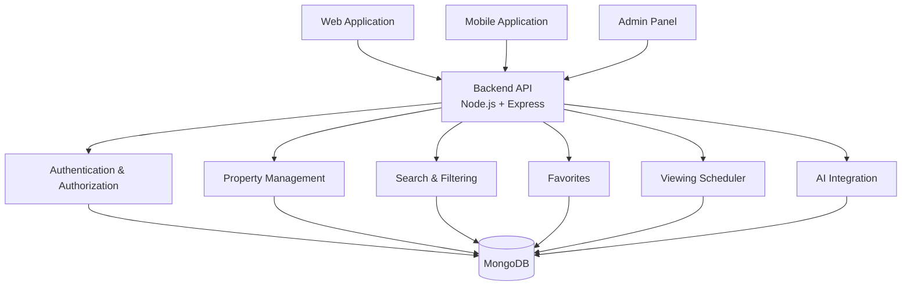

---

## 4. Main Backend Responsibilities

The backend is responsible for:

- Authentication
- Authorization and roles
- User management
- Property CRUD
- Property search and filtering
- Favorites
- Viewing availability
- Viewing requests
- Viewing status management
- AI property description generation
- Property-specific AI chatbot
- Lead scoring
- Admin operations
- Database management
- API validation
- Error handling
- Security
- API documentation

These are the core backend responsibilities.

---

## 5. Backend Does NOT Handle

The backend should not contain frontend UI logic.

It does not build:

- Web pages
- React components
- Mobile screens
- Admin UI
- Buttons
- Forms
- Frontend styling
- Mobile navigation UI
- Property cards

Frontend applications communicate with the backend through APIs.

```
Web / Mobile
     |
     | HTTP Request
     v
Backend API
     |
     v
MongoDB
```

---

## 6. Backend Architecture

The backend follows a layered architecture.

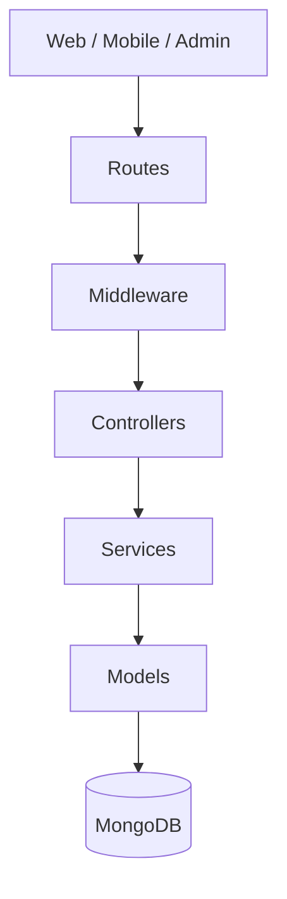

### Layer Responsibilities

**Routes**

Define API endpoints.

Examples:

```
POST /api/v1/auth/login
GET /api/v1/properties
POST /api/v1/viewings
```

Routes should not contain large business logic.

**Middleware**

Handles cross-cutting concerns such as:

- Authentication
- Authorization
- Request validation
- Error handling

**Controllers**

Controllers receive HTTP requests and return HTTP responses.

They coordinate requests without containing large amounts of business logic.

**Services**

Services contain business logic.

Examples:

- Creating a property
- Checking viewing availability
- Creating a viewing request
- Confirming a viewing
- Calling an AI service

**Models**

Models define the MongoDB/Mongoose data structures.

Core models include:

- User
- Property
- Favorite
- ViewingRequest

---

## 7. Backend Architecture (Layered Principles)

The backend follows a clear separation of responsibilities. The exact file layout may evolve as
features are added (each feature is typically introduced by its own RFC), but the **layer
responsibilities below are stable** and must be respected.

```text
backend/
│
├── src/
│   ├── config/         ← environment + database configuration
│   ├── routes/         ← HTTP endpoint definitions
│   ├── middleware/     ← cross-cutting HTTP concerns
│   ├── controllers/    ← HTTP request/response handling
│   ├── services/       ← business / domain logic
│   ├── models/         ← persistence / data structures
│   ├── utils/          ← small reusable technical helpers
│   ├── app.js
│   └── server.js
│
├── docs/               ← RFCs and backend documentation
├── .env / .env.example
├── package.json
└── AGENTS.md
```

**Routes** define HTTP endpoints and compose middleware. They should not contain business logic.

**Middleware** handles cross-cutting HTTP concerns such as authentication, authorization,
validation, and error handling.

**Controllers** handle HTTP concerns: request parsing, calling services, response formatting, and
HTTP status codes. They should not contain substantial business logic.

**Services** contain business/domain logic.

**Models** define persistence/data structures (MongoDB/Mongoose).

**Utilities** contain small reusable technical helpers (e.g. JWT, password, token, email) and
should not become a dumping ground for business logic.

The exact structure can be adjusted during implementation if required, but these responsibilities
should remain separated. Feature-specific files (for example, authentication modules) are defined
by their own RFC rather than prescribed here.

---

## 8. API Versioning

All APIs should use a common API prefix.

Recommended:

```
/api/v1
```

Examples:

```
/api/v1/auth/login
/api/v1/properties
/api/v1/favorites
/api/v1/viewings
/api/v1/chat
```

This allows the API to evolve later without immediately breaking existing clients.

---

## 9. Authentication

Authentication is one of the first backend features.

The system needs authenticated users so the backend knows who is performing an action.

### Authentication Flow

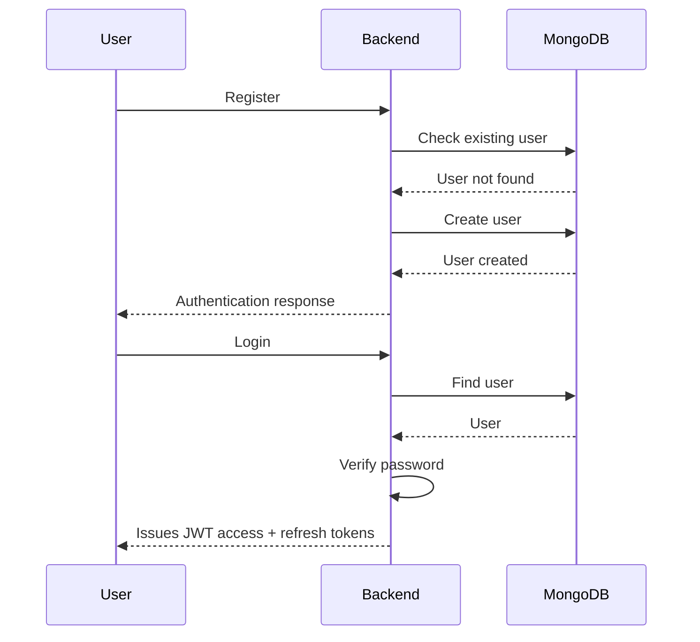

Authentication issues JWTs that are delivered to the client as **httpOnly cookies** (never in the
JSON response body, never in `localStorage`). Access tokens are short-lived and used to
authenticate protected requests; refresh tokens are longer-lived and stored server-side as hashes
to allow rotation and revocation. The detailed authentication design (registration, email
verification, refresh rotation, logout, password reset) is specified per feature in its RFC (e.g.
RFC-001-B).

---

## 10. User Roles

The system supports role-based access.

Initial roles:

- TENANT
- ADMIN

**Tenant**

A tenant can:

- Browse published properties
- Search properties
- Filter properties
- View property details
- Manage favorites
- Ask property-specific AI questions
- Request property viewing
- View their viewing requests and statuses

**Admin**

An admin can:

- Manage properties
- Publish/unpublish properties
- Manage users
- Manage viewing requests
- Confirm/reject viewing requests
- Use AI property content generation
- Access administrative functionality

Authorization must be enforced by the backend.

A frontend must never be trusted to enforce permissions by itself.

---

## 11. User Data

The User model should contain the agreed user information.

```
User
├── id
├── name
├── email
├── password
├── role
├── createdAt
└── updatedAt
```

See RFC-001-B for authentication-specific fields (`isEmailVerified`, `isActive`,
`isBlocked`, `lastLoginAt`, `passwordChangedAt`, etc.).

Passwords must never be stored as plain text.

The backend must store a secure password hash.

---

## 12. Property Management

Property management is one of the main backend modules.

The backend provides complete property CRUD operations.

CRUD means:

- Create
- Read
- Update
- Delete

---

## 13. Property Data

The common Property structure is:

```
Property
├── propertyId
├── title
├── description
├── propertyType
├── price
├── location
├── bedrooms
├── bathrooms
├── amenities
├── furnished
├── images
├── availability
├── status
├── createdAt
└── updatedAt
```

---

## 14. Property Status

The backend maintains the property's publication state.

Recommended statuses:

- draft
- pending
- published
- unpublished

Only published properties should normally be returned in public property listing APIs.

For example:

```
GET /api/v1/properties
```

should normally return:

```
status = published
```

Admin APIs may return properties with other statuses.

---

## 15. Property CRUD Flow

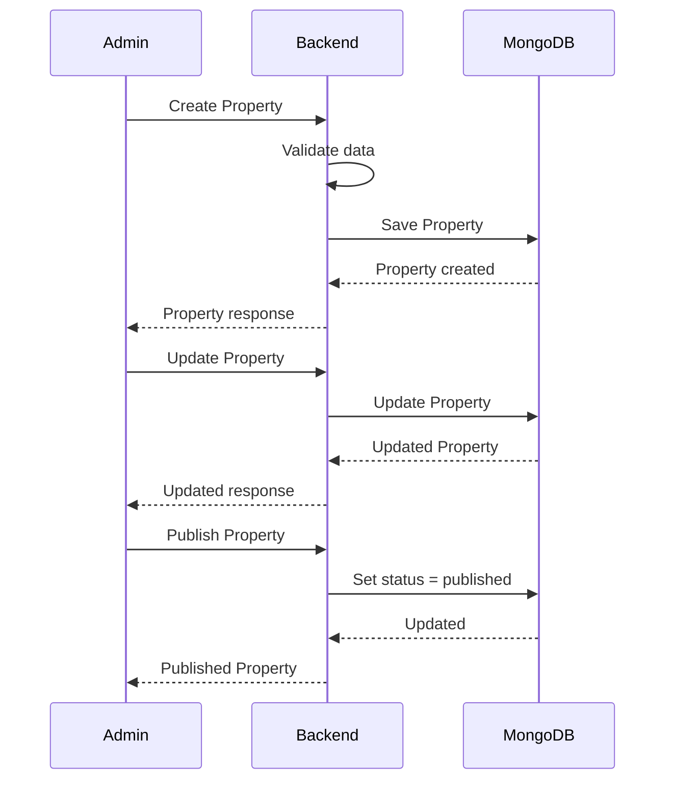

---

## 16. Property Search and Filtering

Search and filtering are backend responsibilities.

The frontend provides the search/filter values.

The backend creates the appropriate MongoDB query.

Possible query parameters:

- location
- minPrice
- maxPrice
- propertyType
- bedrooms
- bathrooms
- furnished
- availability

Example:

```
GET /api/v1/properties?location=Gulshan&minPrice=40000&maxPrice=70000
```

Flow:

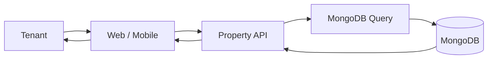

---

## 17. Property Details

A tenant can request a single property:

```
GET /api/v1/properties/:propertyId
```

The backend should return the property's public information.

Example response:

```json
{
  "id": "...",
  "title": "...",
  "description": "...",
  "propertyType": "...",
  "price": 50000,
  "location": "...",
  "bedrooms": 2,
  "bathrooms": 2,
  "amenities": [],
  "furnished": true,
  "images": [],
  "availability": true,
  "status": "published"
}
```

---

## 18. Favorites

Tenants can save properties.

The relationship is:

```
User
  |
  +---- Favorite ----> Property
```

Favorite data:

```
Favorite
├── favoriteId
├── userId
├── propertyId
└── createdAt
```

Required operations:

```
POST   /api/v1/favorites
DELETE /api/v1/favorites/:propertyId
GET    /api/v1/favorites
```

A tenant should only be able to manage their own favorites.

---

## 19. Viewing Scheduler

The platform includes a viewing scheduler.

The backend is responsible for controlling viewing availability and preventing conflicting bookings.

Basic flow:

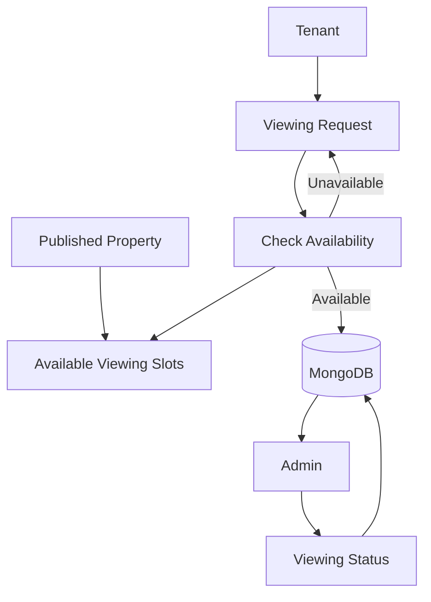

---

## 20. Viewing Request

The tenant does not create a general inquiry record.

The main saved tenant request is the property viewing request.

Viewing data:

```
ViewingRequest
├── viewingId
├── userId
├── propertyId
├── userName
├── date
├── time
├── message
├── status
├── createdAt
└── updatedAt
```

---

## 21. Viewing Status

Recommended statuses:

- pending
- confirmed
- rejected
- cancelled
- completed

Initial request:

```
pending
```

Admin action:

```
pending → confirmed
```

or:

```
pending → rejected
```

---

## 22. Viewing Request Flow

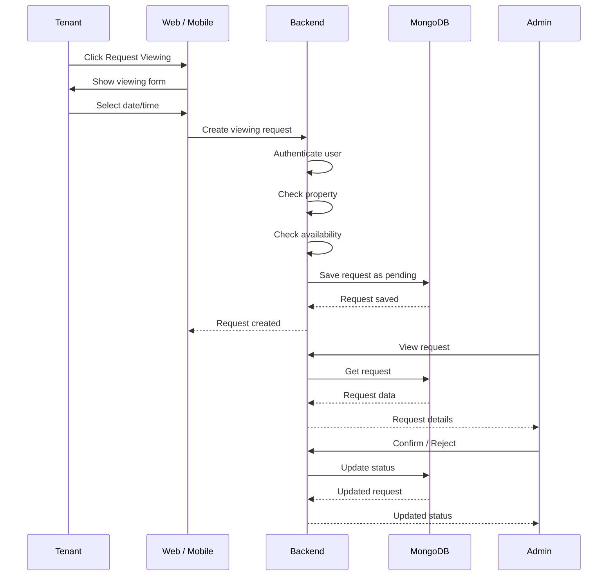

---

## 23. Viewing Availability Rules

The backend must verify:

- The property exists.
- The property is available.
- The requested date is valid.
- The requested time is valid.
- The requested slot is available.
- The user is authenticated.
- The request does not conflict with another confirmed viewing.

The backend is responsible for these checks.

The frontend only provides the UI for selecting the date and time.

---

## 24. Property-Specific AI Chatbot

The chatbot is not a general platform chatbot.

It is tied to the property the tenant is currently viewing.

Example:

```
Property ID: 123

User:
"Is parking available?"
```

The backend receives:

- propertyId
- question

The backend retrieves the relevant property information and sends the property context to the AI service.

---

## 25. Chatbot Flow

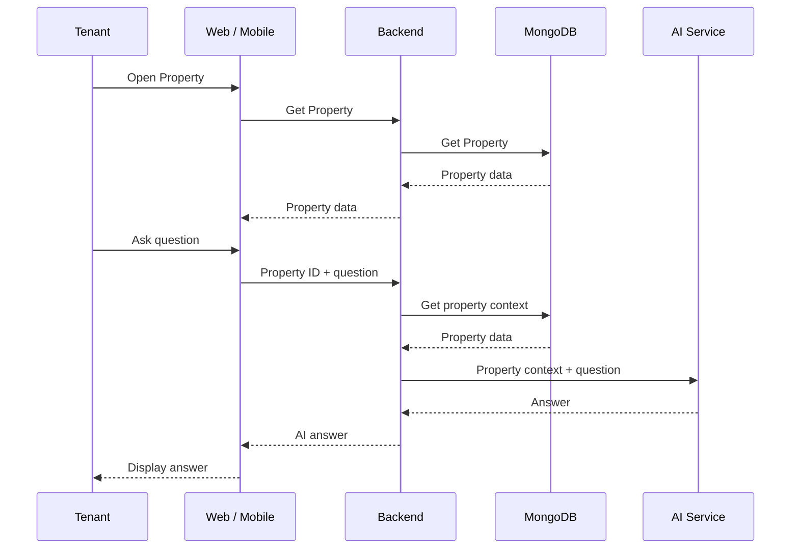

Normal chatbot questions should not be stored in the application database.

---

## 26. AI Property Description Generation

The admin can provide raw property information.

The backend sends that information to the AI service.

AI returns:

- Professional title
- Professional description

Flow:

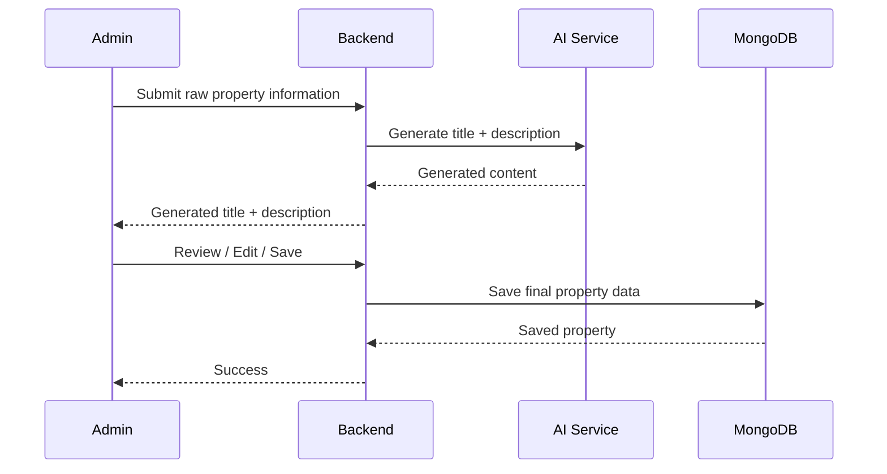

AI-generated content should go through the intended admin review process before becoming final published content.

---

## 27. AI Lead Scoring

The platform includes AI-based tenant seriousness scoring.

The backend provides the required tenant/property/request context to the AI service.

```
Tenant information
+
Property information
+
Viewing/request information
        |
        v
    AI Service
        |
        v
    Lead Score
```

Example:

```
leadScore: 90
```

The score is intended for internal/admin use.

The backend controls when and how the score is generated and returned.

---

## 28. Admin Backend Operations

Admin functionality is protected by authorization.

Examples:

```
Admin
  |
  +-- Create Property
  +-- Update Property
  +-- Publish Property
  +-- Unpublish Property
  +-- View Users
  +-- View Viewing Requests
  +-- Confirm Viewing
  +-- Reject Viewing
  +-- Generate AI Property Content
```

The backend must verify the user's role before executing protected operations.

---

## 29. API Groups

The backend API should be organized into logical groups.

```
/api/v1
│
├── /auth
├── /users
├── /properties
├── /favorites
├── /viewings
├── /chat
└── /ai
```

---

## 30. Authentication APIs

Core endpoints:

```
POST /api/v1/auth/register
POST /api/v1/auth/login
GET  /api/v1/auth/me
```

Additional authentication endpoints should only be added when required.

---

## 31. User APIs

Possible endpoints:

```
GET   /api/v1/users/me
PATCH /api/v1/users/me
```

Admin user management uses protected admin endpoints.

---

## 32. Property APIs

Core endpoints:

```
POST   /api/v1/properties
GET    /api/v1/properties
GET    /api/v1/properties/:id
PATCH  /api/v1/properties/:id
DELETE /api/v1/properties/:id
```

Publishing can be implemented through a dedicated status operation or the property update endpoint.

---

## 33. Favorite APIs

```
POST   /api/v1/favorites
GET    /api/v1/favorites
DELETE /api/v1/favorites/:propertyId
```

---

## 34. Viewing APIs

Core endpoints:

```
POST  /api/v1/viewings
GET   /api/v1/viewings/my
GET   /api/v1/viewings/:id
PATCH /api/v1/viewings/:id/status
```

Availability can be exposed through a dedicated endpoint:

```
GET /api/v1/properties/:propertyId/availability
```

The exact endpoint structure can be finalized during API design.

---

## 35. Chat API

The chatbot can use:

```
POST /api/v1/chat
```

Request:

```json
{
  "propertyId": "...",
  "question": "Is parking available?"
}
```

Response:

```json
{
  "answer": "Yes, parking is available for this property."
}
```

Normal chat interactions should not create a database record.

---

## 36. AI APIs

AI-related endpoints may include:

```
POST /api/v1/ai/property-description
POST /api/v1/ai/lead-score
```

The chatbot can remain under:

```
POST /api/v1/chat
```

AI API keys must remain server-side.

---

## 37. API Request Flow

Every normal request should follow this general flow:

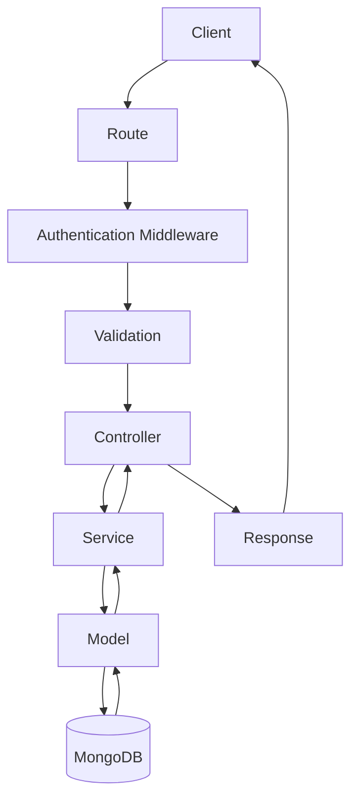

Not every endpoint requires authentication.

For example:

```
GET /api/v1/properties
```

may be public.

While:

```
POST /api/v1/favorites
```

requires an authenticated tenant.

---

## 38. Public vs Protected APIs

**Public**

Examples:

```
GET /api/v1/properties
GET /api/v1/properties/:id
```

These are used for public property discovery.

**Authenticated**

Examples:

```
GET /api/v1/auth/me
POST /api/v1/favorites
DELETE /api/v1/favorites/:propertyId
POST /api/v1/viewings
GET /api/v1/viewings/my
POST /api/v1/chat
```

**Admin Only**

Examples:

```
POST /api/v1/properties
PATCH /api/v1/properties/:id
DELETE /api/v1/properties/:id
GET /api/v1/users
PATCH /api/v1/viewings/:id/status
POST /api/v1/ai/property-description
```

The exact protection should be finalized as the routes are implemented.

---

## 39. Database Collections

The initial MongoDB collections are:

- users
- properties
- favorites
- viewingRequests

AI chatbot conversations are not stored as a normal requirement.

If future requirements introduce chat history, it should be added as a separate feature and documented before implementation.

---

## 40. Database Relationships

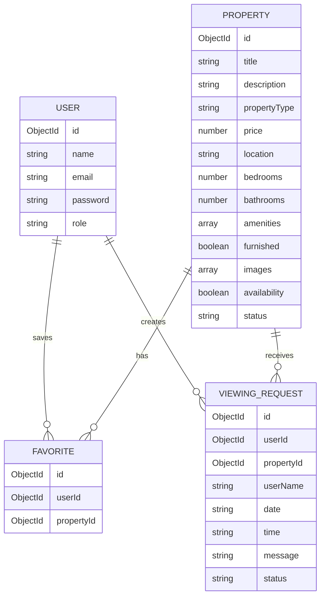

---

## 41. Validation

The backend must validate incoming data before saving it.

**Registration**

- Name required
- Valid email
- Password required

**Property**

- Title
- Description
- Property type
- Price
- Location
- Required property fields

**Viewing Request**

- Authenticated user
- Valid property
- Valid date
- Valid time
- Available slot

Never assume frontend validation is enough.

Frontend validation improves user experience.

Backend validation protects the actual system.

---

## 42. Error Handling

The backend should return consistent errors.

Example error response:

```json
{
  "statusCode": 404,
  "success": false,
  "message": "Property not found"
}
```

Example success response:

```json
{
  "statusCode": 200,
  "success": true,
  "message": "Property retrieved successfully",
  "data": { }
}
```

Common HTTP status codes:

```
200 OK
201 Created
400 Bad Request
401 Unauthorized
403 Forbidden
404 Not Found
409 Conflict
500 Internal Server Error
```

Errors should be handled centrally through error-handling middleware.

---

## 43. Security Requirements

The backend must:

- Hash passwords.
- Never return passwords in API responses.
- Protect private routes with authentication.
- Protect admin routes with role authorization.
- Validate incoming requests.
- Keep JWT secrets private.
- Keep AI API keys private.
- Keep MongoDB credentials private.
- Never expose .env files.
- Avoid returning unnecessary sensitive user information.

---

## 44. Environment Variables

Environment-specific configuration must use environment variables.

Example `.env.example`:

```
PORT=5000
MONGO_URI=
NODE_ENV=development

JWT_ACCESS_SECRET=
JWT_REFRESH_SECRET=
JWT_ACCESS_EXPIRY=15m
JWT_REFRESH_EXPIRY=7d

CLIENT_ORIGIN=http://localhost:3000

AI_API_KEY=
```

Actual `.env` files must never be committed to Git.

---

## 45. Configuration

Configuration should be centralized rather than scattered throughout the application.

Examples:

- Server port
- MongoDB connection
- JWT configuration
- AI API configuration
- Environment mode

Application code should not contain hardcoded secrets or environment-specific credentials.

---

## 46. Backend Startup Flow

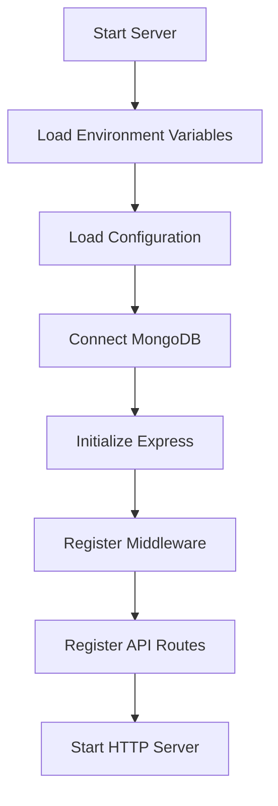

The server should not accept application traffic before required infrastructure such as the database is ready.

---

## 47. Backend and Frontend Communication

Frontend applications should never know how MongoDB works.

They only communicate with the API.

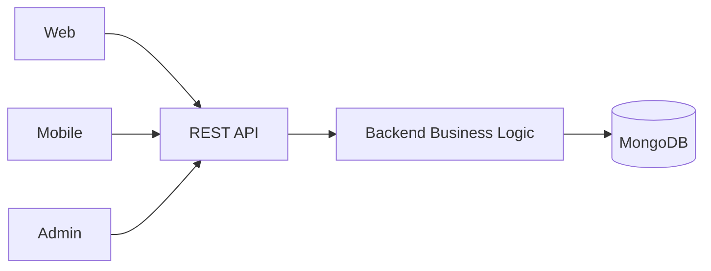

Example:

```
Web:
GET /api/v1/properties


Backend:
Query MongoDB


Response:
Published properties
```

---

## 48. Complete Backend Business Flow

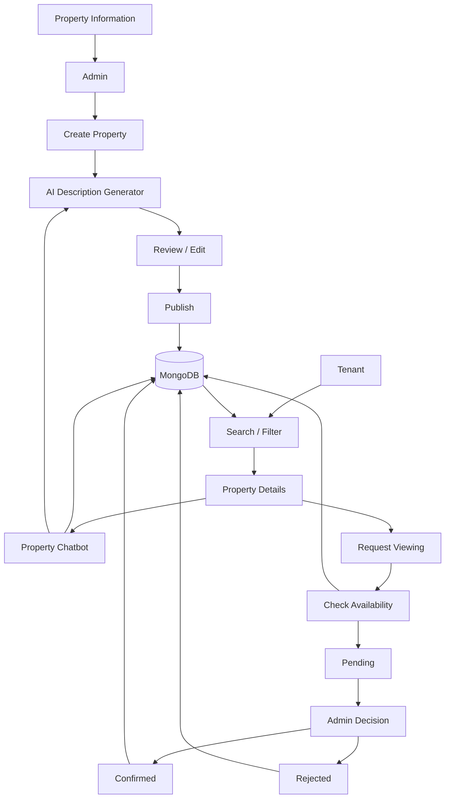

---

## 49. Backend Scope Summary

The backend's complete scope can be summarized as:

```
AUTHENTICATION
      ↓
AUTHORIZATION
      ↓
USERS
      ↓
PROPERTIES
      ↓
SEARCH / FILTERS
      ↓
FAVORITES
      ↓
VIEWING AVAILABILITY
      ↓
VIEWING REQUESTS
      ↓
VIEWING STATUS
      ↓
AI DESCRIPTION GENERATION
      ↓
PROPERTY-SPECIFIC CHATBOT
      ↓
LEAD SCORING
      ↓
MONGODB
```

The backend is responsible for the data and business logic behind all of these areas.

---

## 50. Important Backend Rules

- The backend is the single API boundary for Web, Mobile, and Admin.
- Only the backend communicates directly with MongoDB.
- Only the backend communicates with external AI services.
- Authentication must be handled by the backend.
- Authorization must be enforced by the backend.
- Frontend validation must not replace backend validation.
- Only published properties should be publicly discoverable.
- Only authenticated tenants can create favorites and viewing requests.
- Only authorized admins can perform administrative operations.
- Viewing availability must be checked by the backend.
- Viewing conflicts must be prevented by backend logic.
- Normal property chatbot questions are not stored.
- AI-generated property content must go through the intended admin review flow.
- Secrets must never be exposed to frontend applications.
- API contracts must remain consistent with Web, Mobile, and Admin.
- Database changes must be documented.
- Breaking API changes must be coordinated with affected clients.
- Business logic should remain on the server, not in frontend applications.

---

## 51. Scope Boundary

This document defines the complete backend scope.

Detailed development conventions will be documented separately in:

```
backend/
├── AGENTS.md
├── BestPractice.md
├── development.md
├── rules.md
└── RFCs/
```

These documents should not unnecessarily duplicate the complete backend scope defined here.

---

## 52. Backend Engineering Rules (Stable Conventions)

These rules apply to backend development generally and are stable across features. They are
intentionally not tied to any single feature (e.g. authentication).

- **API versioning:** All APIs use the `/api/v1` prefix (see §8). New versions are introduced
  only when a breaking change is required.
- **Response format:** Use a consistent envelope: `{ statusCode, success, message, data }`
  (see §42). Success and error shapes must be uniform.
- **Error handling:** Centralized error-handling middleware returns the standard error envelope
  with appropriate HTTP status codes (see §42). Never leak stack traces or secrets.
- **Validation:** Validate all incoming data server-side before use (see §41). Frontend
  validation is UX only and never a security boundary.
- **Authentication:** JWT-based; tokens delivered as httpOnly cookies (see §9). Never return JWTs
  in the response body or store them in `localStorage`.
- **Authorization:** Enforced server-side via role/permission checks (see §10). A frontend must
  never be trusted to enforce permissions.
- **Security:** Hash passwords, never return passwords, protect private/admin routes, keep all
  secrets in environment variables, and avoid returning unnecessary sensitive data (see §43).
- **Environment variables:** All environment-specific configuration uses env vars; `.env` is
  never committed (see §44). Centralize configuration loading (see §45).
- **Logging:** Log only non-sensitive information. Never log passwords, tokens, or full PII.
- **Database access:** Only the backend communicates with MongoDB (see §3). Models define the
  data structures; business logic stays in services.
- **Naming:** Use descriptive, consistent names for files, functions, routes, and models
  (e.g. `getPropertyById`, `createViewingRequest`).
- **Testing:** Features should be verified locally (happy path, edge cases, error handling) before
  a Pull Request (see root `AGENTS.md` §14).
- **Documentation / RFCs:** Architectural decisions and feature contracts live in RFCs under
  `docs/`. `AGENTS.md` holds stable engineering rules; RFCs hold feature-specific design.
- **Dependency management:** Do not add a package unless it is genuinely required. Prefer reusing
  existing dependencies and the established layered structure over new abstractions.

---

## 53. Documentation Responsibility

Keep the three layers separate to avoid contradiction and duplication:

- **AGENTS.md — "How we build backend software."** Stable engineering rules, architecture
  principles, conventions, and security baseline that apply to all backend work.
- **RFC — "What we are building for this specific feature."** Feature scope, API contracts,
  flows, data requirements, and security rules for one feature (e.g. RFC-001-B for user
  authentication). An RFC may propose a feature-specific implementation structure but must not
  dictate the final architecture of unrelated features.
- **Implementation — "How the approved RFC is translated into code."** Concrete files, libraries,
  and code written in the implementation task, following AGENTS.md rules and the approved RFC.

AGENTS.md and RFCs must not contradict each other. If an RFC requires a convention change, update
AGENTS.md accordingly rather than letting the two diverge.