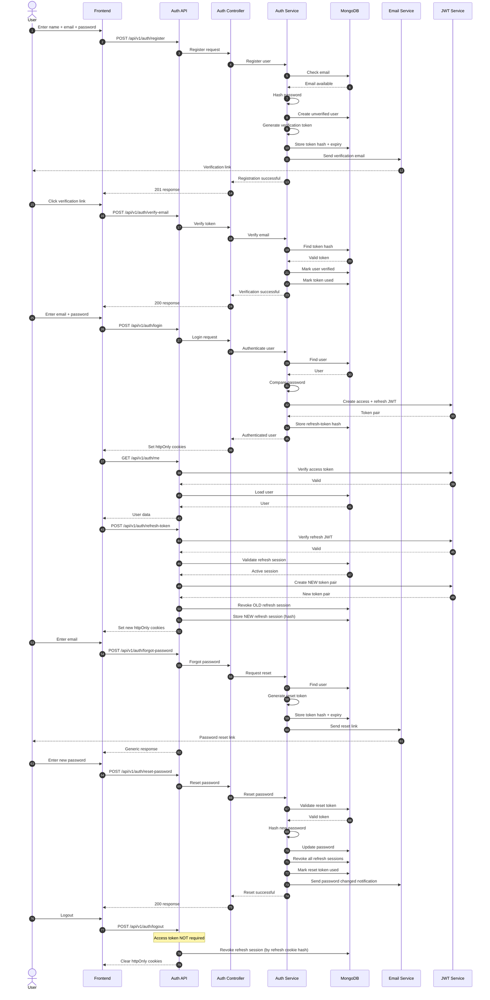

# RFC-001-B — Complete User Authentication

**Status:** Draft (revised) 
**Author:** Mohammad Arsalan
**Created:** 2026-08-19
**Scope:** `backend/` — email + password authentication for platform **users** (tenants)

---

## 1. Overview

This RFC defines the **email + password authentication system** for the rental platform's end
users (tenants). It covers registration with email verification, login, access/refresh token
handling via httpOnly cookies, forgot-password / reset-password, logout, and an authenticated
identity endpoint.

It is scoped to **users only**: no SMS or OTP mechanisms. Vendor and admin
authentication are out of scope (see §17).

The design follows the backend's stable engineering conventions in `backend/AGENTS.md`
(layered routes → middleware → controllers → services → models, `/api/v1` prefix, JWT auth,
centralized config, secrets in environment variables only).

### 1.1 Design decisions (summary)

| Decision | Choice | Reason |
| --- | --- | --- |
| Identity | Email + password | Required by scope; no OTP |
| Tokens | JWT access + JWT refresh | `backend/AGENTS.md` (JWT-based auth) |
| Token storage | httpOnly cookies | Avoids XSS token theft from `localStorage`; never returned in JSON |
| Refresh-token record | Stored **hashed** server-side | Enables rotation, revocation, replay detection, session invalidation |
| Verification/reset tokens | Random token sent to user; **hash stored** | Single-use, expiring; raw token never persisted |
| Verification required before login | **Yes** | Guarantees a reachable, verified email |
| Response envelope | `{ statusCode, success, message, data }` | Extends `backend/AGENTS.md` §42 `{ success, message }` |
| Email delivery | Provider-agnostic email service | No email code exists yet; interface only |

---

## 2. Goals & Non-Goals

**Goals:** secure user registration, email verification, login, token refresh, logout, and
password recovery via email — all with clear API contracts and a security-first posture.

**Non-Goals:** see §17 Out of Scope.

---

## 3. Complete Authentication System Sequence Diagram



---

## 4. Authentication Flows (Individual)

### 4.1 Registration

```text
[User submits name + email + password + confirmPassword]
        ↓
[POST /api/v1/auth/register]
→ validate name, email format + uniqueness, password policy, password === confirmPassword
→ normalize email (trim + lowercase)
→ hash password (bcrypt)
→ create User (isEmailVerified: false, isActive: true, isBlocked: false)
→ generate verification token (random 32 bytes)
→ store SHA-256(token) + expiresAt in AuthToken (type: email_verification)
→ send verification email with frontend link containing raw token
        ↓
[201 Created — NO authentication tokens issued]
```

Registration intentionally does **not** issue tokens. The account must be verified first.

### 4.2 Email Verification

```text
[User clicks link → Frontend opens verify-email screen with token]
        ↓
[POST /api/v1/auth/verify-email { token }]
→ lookup AuthToken by SHA-256(token); must exist, not used, not expired
→ mark User.isEmailVerified = true, emailVerifiedAt = now
→ mark token used
        ↓
[200 — account ready for login]
```

Expired token → `401` "Verification link expired." Already verified → `200` idempotent.

### 4.3 Login

```text
[User submits email + password]
        ↓
[POST /api/v1/auth/login]
→ validate email + password present
→ find User by normalized email
→ if not found OR password mismatch → generic 401
→ if isBlocked → 403; if !isActive → 403; if !isEmailVerified → 403
→ compare bcrypt password; reset failedLoginAttempts; set lastLoginAt
→ sign access JWT (short-lived) + refresh JWT (long-lived)
→ store SHA-256(refreshToken) in RefreshToken (userId, expiresAt)
→ set accessToken + refreshToken as httpOnly cookies
        ↓
[200 — authenticated; access token used for protected routes]
```

### 4.4 Access-Token Authentication

```text
[Client sends accessToken cookie on protected request, e.g. GET /api/v1/auth/me]
        ↓
[auth.middleware]
→ verify access JWT signature + expiry
→ load User; attach req.user = { _id, email, role }
        ↓
[Controller returns user data]
```

If access token is missing/invalid/expired → `401`. The frontend uses `/auth/me` to learn the
current user and to redirect unauthenticated users to login.

### 4.5 Refresh-Token Rotation

```text
[Client sends refreshToken cookie to POST /api/v1/auth/refresh-token]
        ↓
→ verify refresh JWT signature + expiry
→ lookup RefreshToken by SHA-256(refreshToken); must exist, not revoked, not expired
→ CREATE NEW refresh JWT + NEW access JWT
→ CREATE NEW RefreshToken record (SHA-256 of new refresh token)
→ REVOKE the OLD RefreshToken record (do NOT overwrite it)
        ↓
[Set NEW accessToken + refreshToken cookies]
```

The old record is **revoked, not overwritten**, so replay of the old token can be detected.

**Replay detection:** If a **revoked** refresh token is replayed, **revoke ALL refresh
sessions** for that user. This is a security-critical nuclear option — if an attacker
replayed a stolen token, all sessions must be invalidated to protect the account.

### 4.6 Forgot Password

```text
[User submits email]
        ↓
[POST /api/v1/auth/forgot-password { email }]
→ ALWAYS respond 200 generic "If this email exists, a reset link was sent."
→ if User exists & active: generate reset token, store SHA-256 + expiresAt (1h),
  send email with frontend link containing raw token
        ↓
[200 generic — anti-enumeration]
```

### 4.7 Reset Password

```text
[User clicks link → Frontend opens reset-password screen]
        ↓
[POST /api/v1/auth/reset-password { token, newPassword, confirmPassword }]
→ lookup AuthToken by SHA-256(token), type password_reset, not used, not expired
→ validate new password policy, newPassword === confirmPassword
→ hash newPassword; update User.password; set passwordChangedAt
→ mark reset token used
→ REVOKE all RefreshToken records for the user (session invalidation)
→ send password-changed notification email
        ↓
[200 — user logs in with new password]
```

### 4.8 Logout

```text
[Client → POST /api/v1/auth/logout]
        ↓
→ read refreshToken cookie (access token NOT required / may be expired)
→ identify corresponding RefreshToken session by SHA-256(refreshToken)
→ revoke that RefreshToken session
→ clear accessToken cookie
→ clear refreshToken cookie
        ↓
[200 — logout successful]
```

Logout does **not** depend on a valid access token, so it works even after the access token
has expired. If no refresh cookie is present, the backend still clears any cookies sent and
returns success (best-effort logout).

---

## 5. API Endpoints (Summary Table)

All routes are under `/api/v1` (root `API_ROOT`). "Access cookie" = valid `accessToken` cookie.

| Method | Endpoint | Purpose | Auth Required |
| --- | --- | --- | --- |
| POST | `/api/v1/auth/register` | Register + send verification email | No |
| POST | `/api/v1/auth/verify-email` | Verify email via token (POST only) | No |
| POST | `/api/v1/auth/resend-verification` | Resend verification email | No |
| POST | `/api/v1/auth/login` | Email + password login | No |
| POST | `/api/v1/auth/logout` | Logout + revoke refresh session | Refresh cookie (no access token) |
| POST | `/api/v1/auth/refresh-token` | Issue new access token via refresh cookie | Refresh cookie |
| POST | `/api/v1/auth/forgot-password` | Request password reset email | No |
| POST | `/api/v1/auth/reset-password` | Set new password via reset token | No |
| GET | `/api/v1/auth/me` | Current authenticated user (defined by this RFC) | Access cookie |

> **No `GET /api/v1/auth/verify-email` backend endpoint.** Email verification is a
> state-changing operation and is performed only via `POST /api/v1/auth/verify-email`. The
> verification email contains a **frontend** URL (e.g. `https://client.example.com/verify-email?token=...`);
> the frontend then calls the POST endpoint with the token. A `GET` endpoint would risk
> token leakage via logs, browser history, and pre-fetch/link scanners, and conflates a safe
> link with a mutating action.

---

## 6. Request & Response Contracts

### 6.1 Standard response envelope

```json
{ "statusCode": 200, "success": true, "message": "OK", "data": { } }
```

Error:

```json
{ "statusCode": 401, "success": false, "message": "Invalid email or password" }
```

Validation error (`400`):

```json
{
  "statusCode": 400,
  "success": false,
  "message": "Validation failed",
  "errors": [
    { "field": "email", "message": "A valid email is required" },
    { "field": "password", "message": "Password must be at least 8 characters" }
  ]
}
```

**Passwords are never returned or logged.** Returned `user` objects omit `password`,
`failedLoginAttempts`, `lockUntil`, and token hashes.

### 6.2 POST /api/v1/auth/register

- **Auth:** No
- **Request body:** `{ "name": "John Doe", "email": "user@example.com", "password": "SecretPass123", "confirmPassword": "SecretPass123" }`
- **Fields:** `name` (string, required), `email` (string, required), `password` (string, required), `confirmPassword` (string, required)
- **Validation:** name required (2–50 chars); valid email format; email normalized (trim+lowercase); password policy §12;
  `password === confirmPassword`; email not already registered.
- **Success:** `201`
- **Success response:**

```json
{
  "statusCode": 201,
  "success": true,
  "message": "Registration successful. Check your email to verify your account.",
  "data": {
    "user": {
      "_id": "64f...",
      "name": "John Doe",
      "email": "user@example.com",
      "role": "TENANT",
      "isEmailVerified": false
    }
  }
}
```

- **Errors:** `400` validation; `409` email already registered; `429` rate limit.
- **Side effects:** creates unverified `User`; stores `AuthToken` (email_verification) hash; sends verification email.
- **Cookies:** none issued.
- **Security:** no tokens returned; generic duplicate-email handling.

### 6.3 POST /api/v1/auth/verify-email

- **Auth:** No
- **Request body:** `{ "token": "<raw-token>" }`
- **Fields:** `token` (string, required)
- **Validation:** token present and non-empty.
- **Success:** `200`
- **Success response:**

```json
{
  "statusCode": 200,
  "success": true,
  "message": "Email verified successfully. You can now log in.",
  "data": { "isEmailVerified": true }
}
```

- **Errors:** `401` invalid/expired/used token.
- **Side effects:** sets `User.isEmailVerified=true`; marks `AuthToken` used.
- **Cookies:** none.
- **Security:** raw token accepted in body only; DB stores only hash.

### 6.4 POST /api/v1/auth/resend-verification

- **Auth:** No
- **Request body:** `{ "email": "user@example.com" }`
- **Fields:** `email` (string, required)
- **Validation:** valid email format.
- **Success:** `200` (always generic)
- **Success response:**

```json
{ "statusCode": 200, "success": true, "message": "If this email is registered and unverified, a verification link has been sent." }
```

- **Side effects:** if user exists, is active, and unverified, issues a new `AuthToken` and sends email.
- **Security:** generic `200` prevents account enumeration.

### 6.5 POST /api/v1/auth/login

- **Auth:** No
- **Request body:** `{ "email": "user@example.com", "password": "SecretPass123" }`
- **Fields:** `email` (string, required), `password` (string, required)
- **Validation:** email + password present; email normalized.
- **Success:** `200`
- **Success response:**

```json
{
  "statusCode": 200,
  "success": true,
  "message": "Login successful",
  "data": {
    "user": {
      "_id": "64f...",
      "name": "John Doe",
      "email": "user@example.com",
      "role": "TENANT",
      "isEmailVerified": true,
      "lastLoginAt": "2026-08-19T12:00:00.000Z"
    }
  }
}
```

- **Errors:** `400` validation; `401` invalid email or password (generic); `403` email not
  verified; `403` account disabled/blocked; `429` rate limit / lockout.
- **Side effects:** validates credentials and account state; creates a `RefreshToken` record;
  updates `lastLoginAt`; resets failed-attempt counter.
- **Cookies:** sets `accessToken` + `refreshToken` (httpOnly).
- **Security:** no tokens in body; generic failure; account-state checks; brute-force protection.

### 6.6 POST /api/v1/auth/logout

- **Auth:** Refresh cookie **only** (valid access token **not** required).
- **Request body:** none.
- **Validation:** none.
- **Success:** `200`
- **Success response:**

```json
{ "statusCode": 200, "success": true, "message": "Logged out successfully", "data": null }
```

- **Errors:** none terminal (best-effort clear even without cookie).
- **Side effects:** revokes the `RefreshToken` session matching the refresh cookie; clears both cookies.
- **Cookies:** cleared (`accessToken`, `refreshToken`).
- **Security:** works without a valid access token; revokes server-side session.

### 6.7 POST /api/v1/auth/refresh-token

- **Auth:** Refresh cookie.
- **Request body:** none.
- **Validation:** refresh cookie present.
- **Success:** `200`
- **Success response:**

```json
{ "statusCode": 200, "success": true, "message": "Token refreshed", "data": null }
```

- **Errors:** `401` invalid/expired/revoked refresh token (cookies cleared).
- **Side effects:** verifies refresh JWT + DB session; **creates a new** `RefreshToken` record;
  **revokes the old** record; sets new cookies.
- **Cookies:** sets new `accessToken` + `refreshToken`.
- **Security:** rotation + replay detection.

### 6.8 POST /api/v1/auth/forgot-password

- **Auth:** No
- **Request body:** `{ "email": "user@example.com" }`
- **Fields:** `email` (string, required)
- **Validation:** valid email format.
- **Success:** `200` (always generic)
- **Success response:**

```json
{ "statusCode": 200, "success": true, "message": "If this email exists, a password reset link has been sent." }
```

- **Errors:** `400` invalid email format; `429` rate limit.
- **Side effects:** if user exists & active, issues `AuthToken` (password_reset) and sends email.
- **Security:** generic `200` prevents email enumeration.

### 6.9 POST /api/v1/auth/reset-password

- **Auth:** No
- **Request body:** `{ "token": "<raw-token>", "newPassword": "NewSecret456", "confirmPassword": "NewSecret456" }`
- **Fields:** `token` (string, required), `newPassword` (string, required), `confirmPassword` (string, required)
- **Validation:** token present; new password policy §12; `newPassword === confirmPassword`.
- **Success:** `200`
- **Success response:**

```json
{ "statusCode": 200, "success": true, "message": "Password reset successful. Please log in with your new password.", "data": null }
```

- **Errors:** `400` validation/mismatch; `401` invalid/expired/used reset token; `429` rate limit.
- **Side effects:** updates password; marks reset token used; **revokes all `RefreshToken`
  sessions**; sends password-changed notification email.
- **Security:** hashed single-use token; forced re-login on all devices.

### 6.10 GET /api/v1/auth/me

- **Auth:** Access cookie.
- **Request:** none.
- **Success:** `200`
- **Success response:**

```json
{
  "statusCode": 200,
  "success": true,
  "message": "OK",
  "data": {
    "user": {
      "_id": "64f...",
      "name": "John Doe",
      "email": "user@example.com",
      "role": "TENANT",
      "isEmailVerified": true
    }
  }
}
```

- **Errors:** `401` missing/invalid/expired access token.
- **Side effects:** none (read-only).
- **Usage:** standard authenticated identity endpoint defined by RFC-001-B; the frontend calls
  it on app load to determine the current user and auth state.

---

## 7. JWT Strategy

Two token types, signed with **separate secrets** (`JWT_ACCESS_SECRET`, `JWT_REFRESH_SECRET`):

| Token | Payload | Expiry (proposed) | Storage |
| --- | --- | --- | --- |
| `accessToken` | `{ sub: userId, role, type: "access" }` | 15 minutes | httpOnly cookie |
| `refreshToken` | `{ sub: userId, type: "refresh", jti }` | 7 days | httpOnly cookie **+** `RefreshToken` collection (SHA-256 hash) |

- The `type` claim prevents using an access token as a refresh token and vice versa.
- `jti` (or the stored record id) links the refresh JWT to its server-side `RefreshToken` row.
- Access token is **stateless** (verified by signature + expiry). Refresh token is **stateful**
  (verified against the DB record) so it can be revoked.
- **No JWTs in `localStorage` and none in response bodies** — cookies only.

---

## 8. Cookie Strategy

Set by the backend via `res.cookie(...)`.

| Cookie | httpOnly | Secure | SameSite | Path | Max-Age |
| --- | --- | --- | --- | --- | --- |
| `accessToken` | true | prod only | see note | `/` | 15 min |
| `refreshToken` | true | prod only | see note | `/api/v1/auth` | 7 days |

- **httpOnly:** tokens are inaccessible to JavaScript, mitigating XSS token theft. Note that
  `httpOnly` protects against script access but does **not by itself eliminate CSRF** (see §14).
- **Secure:** `true` in production (`NODE_ENV === "production"`); `false` in development so
  cookies work over `http://localhost`. Derive from `NODE_ENV`.
- **SameSite:** the **final** value depends on the actual frontend/API deployment topology and
  must be decided during implementation:
  - Same-site deployment (frontend and API share a root domain): `Lax` (access) / `Strict`
    (refresh) is typically sufficient.
  - Cross-site deployment (distinct origins, e.g. `app.example.com` → `api.example.com`):
    `None` + `Secure` is required for the cookie to be sent, which makes CSRF controls
    (CORS allowlist + explicit CSRF protection) mandatory.
  - This RFC requires that the chosen `SameSite` configuration be documented and validated
    against the real topology before production; it is **not** hardcoded here.
- **Path:** refresh restricted to `/api/v1/auth` so the refresh cookie is only sent to
  refresh/logout routes.
- **Expiration:** bound to token lifetime (`maxAge`); cleared on logout/failure by expiring the cookie.
- **CORS credentials:** the API must use credentials-aware CORS with an **explicit origin
  allowlist** (`CLIENT_ORIGIN`). The open `cors()` currently in `app.js` must be replaced before
  auth ships.
- **Frontend origin allowlisting:** only trusted frontend origin(s) may send credentials.

---

## 9. Token & Session Lifecycle / Authentication Lifecycle

```text
Registration
    ↓
Unverified user
    ↓
Email verification
    ↓
Verified user
    ↓
Login
    ↓
Access + refresh session
    ↓
Access token expires
    ↓
Refresh token rotation (NEW session created, OLD session revoked)
    ↓
New access + refresh pair
    ↓
Logout
    ↓
Current refresh session revoked
```

```text
Forgot password
    ↓
Reset token
    ↓
Password reset
    ↓
All refresh sessions revoked
    ↓
User must log in again
```

---

## 10. Implementation Structure (RFC-001-B ONLY)

> The structure below is the **proposed implementation layout for RFC-001-B only**. It does
> **not** represent the final architecture of the entire backend. Future RFCs may introduce
> additional modules, folders, files, or architectural refinements based on their own
> requirements.

```
backend/
├── src/
│   ├── controllers/
│   │   └── auth.controller.js
│   ├── middleware/
│   │   └── auth.middleware.js
│   ├── models/
│   │   ├── User.js
│   │   ├── AuthToken.js
│   │   └── RefreshToken.js
│   ├── routes/
│   │   └── auth.routes.js
│   ├── services/
│   │   └── auth.service.js
│   └── utils/
│       ├── jwt.js
│       ├── password.js
│       ├── token.js
│       └── email.js
│
└── docs/
    └── RFC-001-B-authentication.md
```

### `src/controllers/auth.controller.js`
- **Location:** `backend/src/controllers/auth.controller.js`
- **Status:** NEW
- **Responsibility:** Handles HTTP request/response concerns for authentication endpoints
  (parsing input, calling the auth service, formatting the standard envelope, setting/clearing
  cookies, HTTP status codes). Contains no substantial business logic.

### `src/middleware/auth.middleware.js`
- **Location:** `backend/src/middleware/auth.middleware.js`
- **Status:** NEW (for RFC-001-B; general-purpose authentication middleware)
- **Responsibility:** Reads the `accessToken` cookie, verifies the JWT, loads the user, and
  attaches `req.user = { _id, email, role }`. Returns `401` when missing/invalid/expired.
  Used by `GET /api/v1/auth/me` and other protected routes.

### `src/models/User.js`
- **Location:** `backend/src/models/User.js`
- **Status:** MODIFY (extend the existing conceptual User model)
- **Responsibility:** Persists user identity and auth state — adds `isEmailVerified`,
  `emailVerifiedAt`, `isActive`, `isBlocked`, `lastLoginAt`, `passwordChangedAt`,
  `failedLoginAttempts`, `lockUntil` to the existing `name/email/password/role` fields.
  Stores the password hash with `select: false`.

### `src/models/AuthToken.js`
- **Location:** `backend/src/models/AuthToken.js`
- **Status:** NEW
- **Responsibility:** Stores email-verification and password-reset tokens as **hashes** with a
  TTL (`expiresAt`), a `type` discriminator, and a `used` flag. Raw tokens are never persisted.

### `src/models/RefreshToken.js`
- **Location:** `backend/src/models/RefreshToken.js`
- **Status:** NEW
- **Responsibility:** Stores refresh-token sessions as **SHA-256 hashes** with `expiresAt`,
  `revoked`, and optional audit fields. Enables rotation, revocation, and replay detection.
  Raw refresh JWTs are never persisted.

### `src/routes/auth.routes.js`
- **Location:** `backend/src/routes/auth.routes.js`
- **Status:** NEW
- **Responsibility:** Maps the `/api/v1/auth/*` endpoints to the auth controller and composes
  middleware (auth, validation). Contains no business logic.

### `src/services/auth.service.js`
- **Location:** `backend/src/services/auth.service.js`
- **Status:** NEW
- **Responsibility:** Contains all authentication business/domain logic: registration, email
  verification, login, refresh/rotation, logout, forgot/reset password, token generation,
  hashing, and session revocation.

### `src/utils/jwt.js`
- **Location:** `backend/src/utils/jwt.js`
- **Status:** NEW
- **Responsibility:** Small reusable helpers to sign and verify access/refresh JWTs using the
  two configured secrets. Technical helper only.

### `src/utils/password.js`
- **Location:** `backend/src/utils/password.js`
- **Status:** NEW
- **Responsibility:** Hash and compare passwords (bcrypt). Technical helper only.

### `src/utils/token.js`
- **Location:** `backend/src/utils/token.js`
- **Status:** NEW
- **Responsibility:** Generate secure random tokens (`crypto.randomBytes`) and compute their
  SHA-256 hashes for storage. Technical helper only.

### `src/utils/email.js`
- **Location:** `backend/src/utils/email.js`
- **Status:** NEW
- **Responsibility:** Provider-agnostic email transport (e.g. nodemailer) with functions to
  send verification, password-reset, and password-changed emails. Interface only; provider
  chosen during implementation.

---

## 11. Database Design

MongoDB collections. Conceptual schemas below; field types per Mongoose.

### 11.1 User (extend existing model)

- **Purpose:** user identity and authentication state.
- **Fields:** `_id`; `name` (required, 2–50 chars); `email` (required, unique, indexed, normalized);
  `password` (required, bcrypt hash, `select:false`); `role`
  (enum `TENANT`/`ADMIN`, default `TENANT`); `isEmailVerified` (bool, default false);
  `emailVerifiedAt` (Date|null); `isActive` (bool, default true); `isBlocked` (bool, default
  false); `lastLoginAt` (Date|null); `passwordChangedAt` (Date|null); `failedLoginAttempts`
  (number, default 0); `lockUntil` (Date|null); `createdAt`/`updatedAt`.
- **Indexes:** unique on `email`; indexes on `isEmailVerified`, `isBlocked`, `isActive`.
- **TTL:** none.
- **Security:** password `select:false`; never returned or logged.

### 11.2 AuthToken (NEW)

- **Purpose:** email-verification and password-reset tokens.
- **Fields:** `_id`; `userId` (ObjectId ref User, indexed); `type`
  (enum `email_verification`/`password_reset`); `tokenHash` (SHA-256 of raw token, required);
  `expiresAt` (Date, required, TTL); `used` (bool, default false); `createdAt`.
- **Relationships:** belongs to `User`.
- **Indexes:** TTL on `expiresAt` (`expireAfterSeconds: 0`); unique compound `(tokenHash, type)`;
  index on `userId`.
- **TTL:** auto-deletes expired tokens.
- **Security:** **raw token never stored** — only its SHA-256 hash; single-use via `used`.

### 11.3 RefreshToken (NEW)

- **Purpose:** server-side refresh-token sessions.
- **Fields:** `_id`; `userId` (ObjectId ref User, indexed); `tokenHash` (SHA-256 of refresh JWT,
  required); `expiresAt` (Date, required, TTL); `revoked` (bool, default false); `userAgent`
  (optional); `ip` (optional); `createdAt`.
- **Relationships:** belongs to `User`.
- **Indexes:** TTL on `expiresAt`; index on `userId`+`revoked`; index on `tokenHash`.
- **TTL:** auto-deletes expired sessions.
- **Security:** **raw refresh JWT never stored** — only its SHA-256 hash. Rotation creates a
  **NEW** record and **revokes** the OLD one (never overwrites it), enabling replay detection.

---

## 12. Password Policy

A reasonable, non-overcomplicated policy:

- **Minimum length:** 8 characters (proposal; configurable).
- **Maximum length:** 128 characters (prevents bcrypt CPU-exhaustion DoS on very long inputs).
- **Password confirmation:** `password` must equal `confirmPassword` at registration and reset.
- **No normalization:** passwords are not trimmed or case-folded.
- **Hashing:** bcrypt (proposed 12 rounds) — password is never stored or compared in plaintext.
- **Never returned / never logged.**
- **Complexity (proposal):** at minimum one letter and one digit is recommended; strict
  complexity rules are not mandated by this RFC and can be finalized during implementation.

---

## 13. Business Rules

| Rule | Value / Behavior | Justification |
| --- | --- | --- |
| Email uniqueness | One account per email; `409` on duplicate | `backend/AGENTS.md` |
| Email normalization | `trim()` + `toLowerCase()` before save/lookup | Prevents case/space duplicates |
| Password length | 8–128 chars; confirm match; hashed | §12 |
| Verification before login | `403` if `isEmailVerified=false` | Guarantees reachable email |
| Verification token TTL | 24h (proposal) | Safe window to check mail |
| Reset token TTL | 1h (proposal) | Standard reset window |
| Tokens single-use | `used=true` after consume | Prevents replay |
| Access-token lifetime | 15m (proposal) | Limits stolen-token window |
| Refresh-token lifetime | 7d (proposal) | Reasonable session length |
| Refresh rotation | New record created; old revoked | Theft/replay detection |
| Failed login attempts | Max 5 (proposal) → lock 15m (`lockUntil`) | Brute-force protection |
| Forgot-password response | Always generic `200` | Anti-enumeration |
| Resend-verification response | Always generic `200` | Anti-enumeration |
| Account states | `isActive`, `isBlocked` enforced at login | Admin control |
| Session invalidation | All refresh rows revoked on password reset | Security requirement |
| Password-changed email | Sent after successful reset | User awareness / security |
| Roles | `TENANT` default; `ADMIN` via separate flow | `backend/AGENTS.md` §10 |

---

## 14. Security Considerations

- **Password hashing:** bcrypt; `select:false`; never in logs/responses.
- **Password never returned / never logged.**
- **httpOnly cookies:** tokens invisible to JS → mitigates XSS token theft. Does **not** by
  itself eliminate CSRF.
- **Secure cookies:** `secure=true` in production only; derived from `NODE_ENV`.
- **SameSite:** configured per deployment topology (§8); not hardcoded.
- **CSRF:** authentication uses cookies, so CSRF **must** be considered. Mitigations:
  credentials-aware CORS with a strict origin allowlist, appropriate `SameSite` cookies, and
  explicit CSRF protection (e.g. double-submit cookie / CSRF token) **if** the deployment
  topology requires it (cross-site origins). The exact mechanism is finalized during
  implementation; CSRF is a required concern, not optional.
- **CORS:** replace open `cors()` with `cors({ origin: CLIENT_ORIGIN, credentials: true })`.
- **Rate limiting:** apply per-IP limits to register, login, forgot-password,
  resend-verification, verify-email (e.g. 5–10/min; stricter on sensitive endpoints).
- **Brute-force protection:** failed-attempt counter + `lockUntil` on login.
- **Email enumeration prevention:** forgot-password and resend-verification return identical
  generic `200`.
- **Token hashing:** verification/reset tokens and refresh JWTs stored only as SHA-256 hashes.
- **Token expiry:** access 15m, refresh 7d, verify 24h, reset 1h.
- **Single-use verification/reset tokens.**
- **Refresh-token rotation + replay detection:** old session revoked; replay rejected and all
  sessions revoked.
- **Session invalidation:** all refresh rows revoked on password reset.
- **Secret management:** `JWT_ACCESS_SECRET`, `JWT_REFRESH_SECRET`, email credentials only in
  `.env` (documented in `.env.example`); never committed.
- **Sensitive logging:** never log passwords, tokens, or full PII; log only non-sensitive markers.
- **Account status checks:** `isActive` / `isBlocked` enforced at login.

---

## 15. Environment Variables

Extend `backend/.env.example` (none exist today):

```text
PORT=5000
MONGO_URI=

JWT_ACCESS_SECRET=
JWT_REFRESH_SECRET=
JWT_ACCESS_EXPIRY=15m
JWT_REFRESH_EXPIRY=7d

CLIENT_ORIGIN=http://localhost:3000

EMAIL_HOST=
EMAIL_PORT=
EMAIL_USER=
EMAIL_PASS=
EMAIL_FROM=no-reply@rentalplatform.com

APP_VERIFY_EMAIL_URL=http://localhost:3000/verify-email
APP_RESET_PASSWORD_URL=http://localhost:3000/reset-password

NODE_ENV=development
```

`CLIENT_ORIGIN` is the **trusted frontend origin(s)** allowed for CORS credentials. It is not
tied to any specific client platform here.

---

## 16. Error Handling

Consistent envelope (`backend/AGENTS.md` §42). Auth-specific codes:

| Scenario | Status | Message |
| --- | --- | --- |
| Validation failure | 400 | "Validation failed" (+ `errors`) |
| Email already registered | 409 | "An account with this email already exists." |
| Invalid credentials | 401 | "Invalid email or password." (generic) |
| Email not verified | 403 | "Email not verified. Please check your inbox." |
| Account inactive/blocked | 403 | "Account is disabled/blocked." |
| Invalid verification token | 401 | "Invalid or expired verification token." |
| Expired verification token | 401 | "Verification link expired. Request a new one." |
| Already verified | 200 | "Email is already verified." |
| Invalid reset token | 401 | "Invalid or expired reset token." |
| Expired reset token | 401 | "Reset link expired. Request a new one." |
| Invalid/expired refresh token | 401 | "Session expired. Please log in again." |
| Rate limit exceeded | 429 | "Too many attempts. Please try again later." |
| Account temporarily locked | 429 | "Too many failed attempts. Try again later." |
| Missing/invalid access token | 401 | "Authentication required." |

---

## 17. Out of Scope

- SMS and any OTP mechanism.
- Vendor authentication (the attached RFC-001 is vendor-specific and not adopted).
- Admin authentication / admin account creation (separate future RFC; this RFC sets
  `role: TENANT` at registration).
- Social login (Google/Apple/etc.).
- User profile / onboarding (preferences) — future profile RFC.
- Property listings, favorites, viewing requests, AI chatbot, lead scoring.
- Payments, reviews, notifications beyond verification/reset/changed emails.
- Email provider selection and email template design (interface defined only).

---

## 18. Open Questions (genuine decisions only)

- [ ] **Email provider:** `nodemailer` + SMTP vs a transactional API (SendGrid/Resend/etc.).
      Interface is provider-agnostic; confirm provider and env vars.
- [ ] **SameSite / CSRF final config:** depends on real frontend/API deployment topology
      (same-site vs cross-site origins). Finalize during implementation.
- [ ] **Password complexity strictness:** enforce letter+digit (recommended) or length-only.
- [ ] **Rate-limit & lockout thresholds:** propose 5–10/min and 5 attempts/15-min lock; confirm.
- [ ] **Admin provisioning:** how are `ADMIN` users created? (Separate RFC; out of scope here.)

---

## 19. Implementation Capabilities (Guidance, Not Requirements)

This RFC defines **what** to build, not the exact packages. The backend architecture already
implies some capabilities; others are proposed for implementation:

| Capability | Status |
| --- | --- |
| MongoDB persistence (Mongoose) | Implied by `backend/AGENTS.md` |
| JWT signing/verification | Implied by `backend/AGENTS.md` (JWT-based auth) |
| Secure password hashing | Required (bcrypt proposed) |
| Email delivery | Required (provider-agnostic; nodemailer proposed) |
| Request validation | Required (implementation choice, e.g. `express-validator`) |
| Rate limiting | Required (implementation choice, e.g. `express-rate-limit`) |
| Cookie parsing | Required (e.g. `cookie-parser`; needed to read httpOnly cookies) |

Treat specific libraries as **implementation guidance**. Do not install dependencies or modify
`package.json` as part of this RFC; that happens in the implementation task.

---

## 20. Consistency Checklist

- [x] Every endpoint in the flows exists in the endpoint table.
- [x] Every endpoint in the table is represented in the flows.
- [x] Registration does not issue authentication tokens.
- [x] Email verification is required before login.
- [x] Backend email verification uses POST only (no GET).
- [x] Login issues access + refresh cookies.
- [x] Tokens are never returned in JSON.
- [x] Access and refresh tokens have distinct purposes.
- [x] Refresh token is stored hashed server-side.
- [x] Refresh rotation creates a NEW refresh session record; old is revoked.
- [x] Refresh-token replay can be detected.
- [x] Logout works even if access token is expired.
- [x] Logout revokes the current refresh session and clears both cookies.
- [x] Forgot-password response does not reveal whether an email exists.
- [x] Reset tokens are hashed and single-use; they expire.
- [x] Password reset revokes all refresh sessions and sends a changed-notification email.
- [x] `/auth/me` requires authentication.
- [x] Cookies documented; CSRF and CORS explicitly addressed; rate limiting documented.
- [x] Passwords never logged or returned; raw tokens never persisted.
- [x] RFC contains only the RFC-001-B implementation structure; does not define the final
      entire backend.
- [x] Consistent with `backend/AGENTS.md` (no contradictions).
