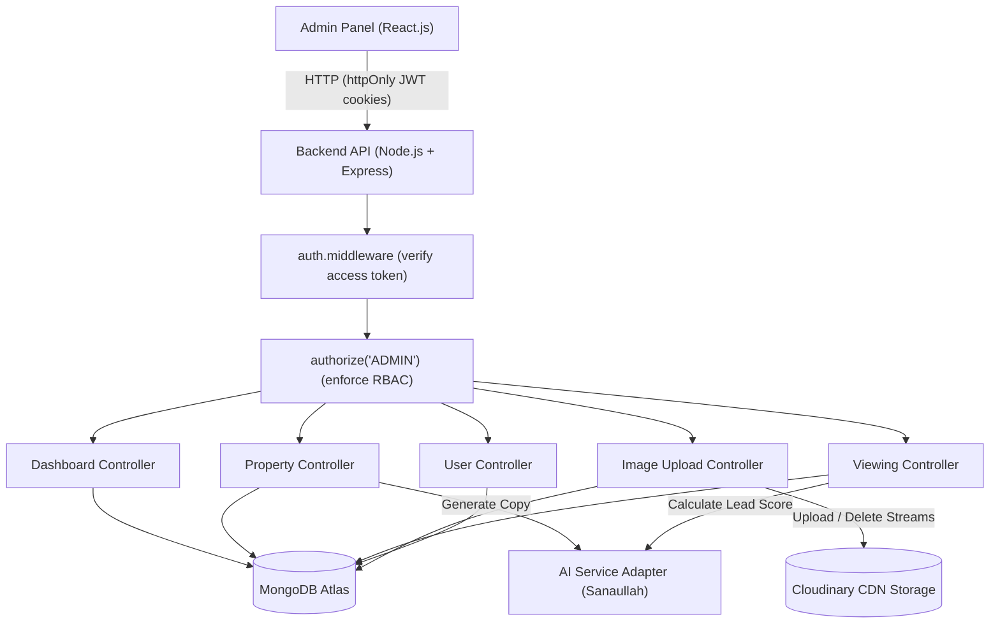
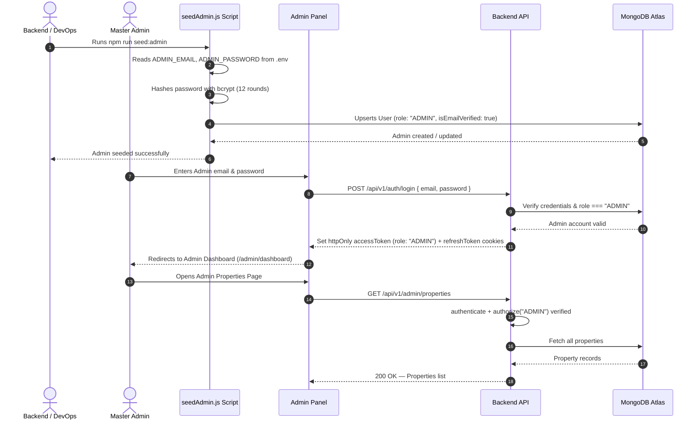
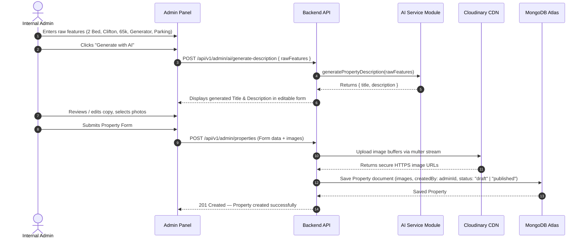
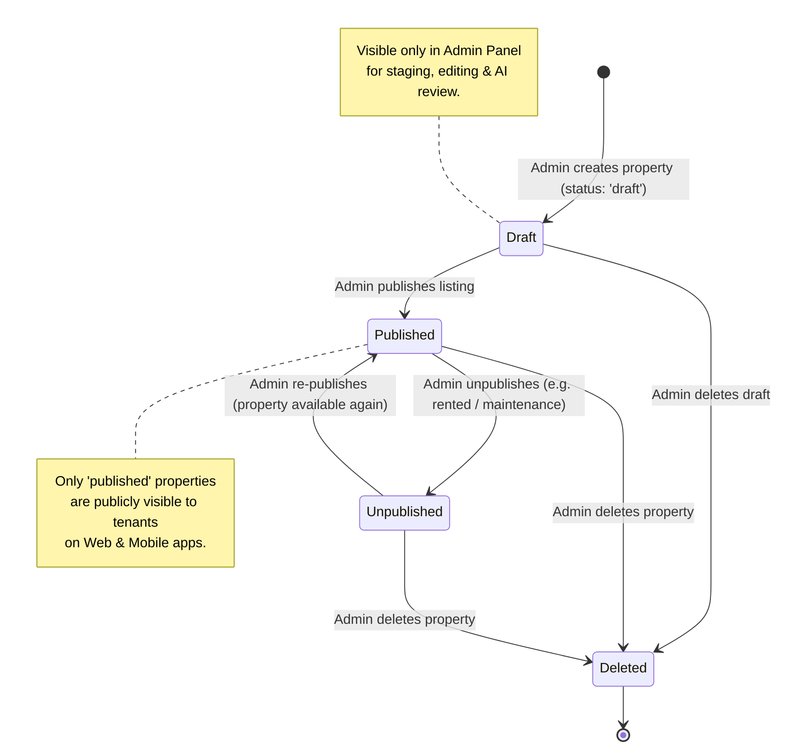
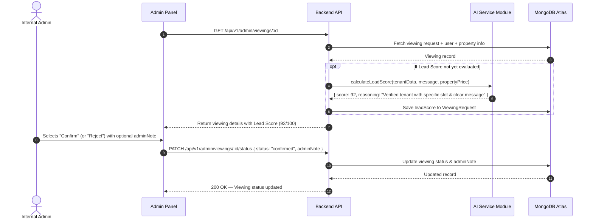
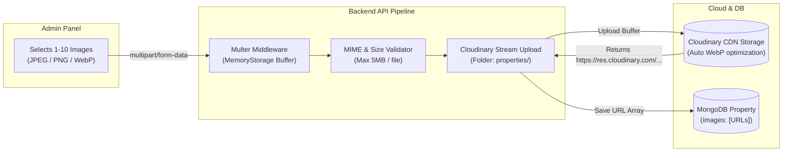
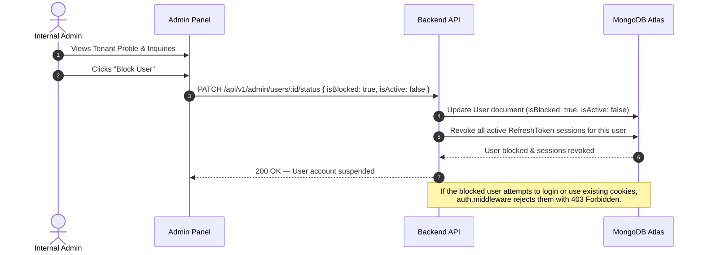
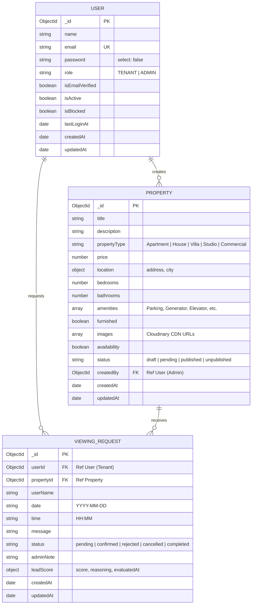

# RFC-002-B — Admin Operations, Property Management, Cloudinary Uploads & AI Integration

**Status:** Proposed  
**Author:** Mohammad Arsalan  
**Created:** 2026-08-21  
**Scope:** `backend/` — Admin Panel APIs, Property CRUD, Publishing Lifecycle, Cloudinary Multi-Image Upload, Viewing Request Management, User Moderation, Dashboard Analytics, and AI Provider Layer  

---

## 1. Overview

This RFC defines the backend architecture and API contracts for the **Admin Panel** of the Property Rental Platform.

The Admin Panel is an **internal management system** used by the internal operations team (Muhammad Hanif) to manage rental listings, review AI-generated property marketing copy, coordinate tenant viewing requests, analyze AI lead seriousness scores, and moderate tenant accounts.

This RFC builds directly on top of the established **RFC-001-B** authentication and security foundation, reusing `auth.middleware.js`, `authorize.middleware.js`, `ApiResponse.js`, `ApiError.js`, and centralized configuration.

### 1.1 Key Design Decisions

| Decision | Choice | Reason |
| :--- | :--- | :--- |
| **Admin Provisioning** | Single Master Admin via Environment Seed Script (`npm run seed:admin`) | Prevents public admin registration vulnerabilities; single admin credentials configured safely in `.env`. |
| **Authorization** | Server-side RBAC (`authorize("ADMIN")`) | Enforces strict role boundary. Regular tenants cannot access admin routes (`403 Forbidden`). |
| **Image Storage** | **Cloudinary** CDN via `multer` | Fast CDN delivery, automatic WebP optimization, avoids database bloating and ephemeral filesystem loss. |
| **Property Visibility** | Status-driven State Machine (`draft` → `pending` → `published` → `unpublished`) | Only `published` properties are visible to tenants on Web/Mobile. Admins control the publishing lifecycle. |
| **AI Integration** | Provider-Agnostic AI Service Adapter (`src/services/ai.service.js`) | Decouples backend API structure from AI prompt engineering, allowing AI developer (Sanaullah) to plug in LLMs (Gemini/OpenAI) seamlessly without blocking frontend or backend progress. |
| **Lead Scoring** | On-demand AI scoring stored in `ViewingRequest` | Enables admin team to prioritize serious rental inquiries. |
| **Response Format** | `{ statusCode, success, message, data }` | Fully adheres to `backend/AGENTS.md` and RFC-001-B standards. |

---

## 2. Goals & Non-Goals

### Goals
1. Secure single Admin provisioning and protected access via JWT cookies.
2. Complete Property CRUD (Create, Read, Update, Delete) with comprehensive filtering and search.
3. Multi-image upload and deletion with Cloudinary integration.
4. Property publication state management (`draft`, `published`, `unpublished`).
5. AI-assisted property title and marketing description generator endpoint.
6. Viewing request management (review, confirm, reject, add internal admin notes).
7. AI-powered tenant lead scoring calculation and persistence.
8. User inspection and moderation (view tenant activity, block/unblock accounts).
9. Dashboard overview metrics (total properties, published count, pending viewings, total tenants).

### Non-Goals
1. Public tenant property discovery and search APIs (defined in Tenant Property RFC or shared endpoints).
2. Public admin self-registration (forbidden by design).
3. Live real-time chat history persistence (property chatbot questions remain stateless per `AGENTS.md`).
4. Financial payment processing / rent transactions (out of project scope).

---

## 3. System Architecture & Mermaid Diagrams

### 3.1 High-Level Admin Architecture



---

### 3.2 Master Admin Provisioning & Authentication Flow



---

### 3.3 Property Creation & AI Marketing Flow



---

### 3.4 Property Publication Lifecycle State Machine



---

### 3.5 Viewing Request Decision & AI Lead Scoring Flow



---

### 3.6 Cloudinary Multi-Image Upload & Deletion Pipeline



---

### 3.7 Tenant Moderation & Account Suspension Flow



---

## 4. Database Schemas & Entity Relationships

### 4.1 Entity-Relationship Diagram (ERD)



---

### 4.2 Property Model (`src/models/Property.js`)

```javascript
const propertySchema = new mongoose.Schema(
  {
    title: {
      type: String,
      required: [true, "Property title is required"],
      trim: true,
      minlength: [5, "Title must be at least 5 characters"],
      maxlength: [150, "Title cannot exceed 150 characters"],
      index: true,
    },
    description: {
      type: String,
      required: [true, "Property description is required"],
      trim: true,
    },
    propertyType: {
      type: String,
      required: [true, "Property type is required"],
      enum: ["Apartment", "House", "Villa", "Studio", "Commercial", "Penthouse"],
      index: true,
    },
    price: {
      type: Number,
      required: [true, "Monthly rent price is required"],
      min: [0, "Price cannot be negative"],
      index: true,
    },
    location: {
      address: {
        type: String,
        required: [true, "Street address / area is required"],
        trim: true,
      },
      city: {
        type: String,
        required: [true, "City is required"],
        trim: true,
        index: true,
      },
    },
    bedrooms: {
      type: Number,
      required: [true, "Number of bedrooms is required"],
      min: [0, "Bedrooms cannot be negative"],
      index: true,
    },
    bathrooms: {
      type: Number,
      required: [true, "Number of bathrooms is required"],
      min: [1, "At least 1 bathroom is required"],
    },
    amenities: {
      type: [String],
      default: [],
      index: true,
    },
    furnished: {
      type: Boolean,
      default: false,
      index: true,
    },
    images: {
      type: [String], // Cloudinary secure URLs
      default: [],
    },
    availability: {
      type: Boolean,
      default: true, // true = available for rent, false = occupied/rented
      index: true,
    },
    status: {
      type: String,
      enum: ["draft", "pending", "published", "unpublished"],
      default: "draft",
      index: true,
    },
    createdBy: {
      type: mongoose.Schema.Types.ObjectId,
      ref: "User",
      required: true,
      index: true,
    },
  },
  {
    timestamps: true,
  }
);

// Text index for search across title, description, address, and city
propertySchema.index({
  title: "text",
  description: "text",
  "location.address": "text",
  "location.city": "text",
});
```

---

### 4.2 ViewingRequest Model (`src/models/ViewingRequest.js`)

```javascript
const viewingRequestSchema = new mongoose.Schema(
  {
    userId: {
      type: mongoose.Schema.Types.ObjectId,
      ref: "User",
      required: true,
      index: true,
    },
    propertyId: {
      type: mongoose.Schema.Types.ObjectId,
      ref: "Property",
      required: true,
      index: true,
    },
    userName: {
      type: String,
      required: true,
      trim: true,
    },
    date: {
      type: String, // Format: YYYY-MM-DD
      required: [true, "Viewing date is required"],
      index: true,
    },
    time: {
      type: String, // Format: HH:MM or "14:00"
      required: [true, "Viewing time slot is required"],
    },
    message: {
      type: String,
      trim: true,
      default: "",
      maxlength: [500, "Message cannot exceed 500 characters"],
    },
    status: {
      type: String,
      enum: ["pending", "confirmed", "rejected", "cancelled", "completed"],
      default: "pending",
      index: true,
    },
    adminNote: {
      type: String,
      trim: true,
      default: null,
    },
    leadScore: {
      score: {
        type: Number,
        min: 0,
        max: 100,
        default: null,
      },
      reasoning: {
        type: String,
        default: null,
      },
      evaluatedAt: {
        type: Date,
        default: null,
      },
    },
  },
  {
    timestamps: true,
  }
);

viewingRequestSchema.index({ propertyId: 1, date: 1, time: 1, status: 1 });
```

---

## 5. API Endpoints Summary Table

All endpoints require authentication (`authenticate`) and admin authorization (`authorize("ADMIN")`) unless explicitly noted.

| Group | Method | Endpoint | Purpose |
| :--- | :--- | :--- | :--- |
| **Auth & Seed** | `POST` | `/api/v1/auth/login` | Login (returns admin user + sets JWT cookies) |
| **Auth & Seed** | CLI | `npm run seed:admin` | Script to create/reset the single Master Admin from `.env` |
| **Dashboard** | `GET` | `/api/v1/admin/dashboard/stats` | Overview statistics & recent activities |
| **Properties** | `GET` | `/api/v1/admin/properties` | List all properties (all statuses, pagination, filters) |
| **Properties** | `GET` | `/api/v1/admin/properties/:id` | Get single property with creator details |
| **Properties** | `POST` | `/api/v1/admin/properties` | Create new property (`draft` or `published`) |
| **Properties** | `PATCH` | `/api/v1/admin/properties/:id` | Update property fields |
| **Properties** | `PATCH` | `/api/v1/admin/properties/:id/status` | Update publication status (`draft`/`published`/`unpublished`) |
| **Properties** | `DELETE` | `/api/v1/admin/properties/:id` | Delete property & remove associated Cloudinary images |
| **Images** | `POST` | `/api/v1/admin/properties/:id/images` | Upload image files to Cloudinary and attach to property |
| **Images** | `DELETE` | `/api/v1/admin/properties/:id/images` | Remove specific image URL from property & Cloudinary |
| **AI Features** | `POST` | `/api/v1/admin/ai/generate-description` | Generate professional property title & description |
| **AI Features** | `GET` | `/api/v1/admin/viewings/:id/lead-score` | Compute / retrieve AI lead score for a viewing request |
| **Viewings** | `GET` | `/api/v1/admin/viewings` | List all tenant viewing requests (filters & pagination) |
| **Viewings** | `GET` | `/api/v1/admin/viewings/:id` | Get single viewing request with tenant & property context |
| **Viewings** | `PATCH` | `/api/v1/admin/viewings/:id/status` | Confirm, reject, or complete viewing request |
| **Users** | `GET` | `/api/v1/admin/users` | List platform users/tenants with search & pagination |
| **Users** | `GET` | `/api/v1/admin/users/:id` | Get user details with viewing history |
| **Users** | `PATCH` | `/api/v1/admin/users/:id/status` | Block or unblock user account |

---

## 6. Request & Response Contracts

### 6.1 Admin Dashboard Metrics

#### `GET /api/v1/admin/dashboard/stats`
* **Auth:** Required (`ADMIN`)
* **Success Response (200 OK):**
```json
{
  "statusCode": 200,
  "success": true,
  "message": "Dashboard statistics retrieved successfully",
  "data": {
    "properties": {
      "total": 45,
      "published": 38,
      "draft": 5,
      "unpublished": 2,
      "available": 35,
      "rented": 10
    },
    "viewings": {
      "total": 120,
      "pending": 14,
      "confirmed": 22,
      "completed": 75,
      "rejected": 9
    },
    "users": {
      "totalTenants": 310,
      "verifiedTenants": 295,
      "blockedTenants": 3
    },
    "recentViewings": [
      {
        "_id": "66c5f1a2...",
        "userName": "Farhan Khan",
        "propertyTitle": "2 Bed Modern Apartment in Gulshan",
        "date": "2026-08-25",
        "time": "16:00",
        "status": "pending",
        "leadScore": 88
      }
    ]
  }
}
```

---

### 6.2 Property Management

#### `POST /api/v1/admin/properties`
* **Auth:** Required (`ADMIN`)
* **Request Body:**
```json
{
  "title": "Spacious 3-Bedroom Luxury Apartment",
  "description": "Exquisite 3-bedroom apartment with panoramic views, modern open kitchen, and dedicated parking.",
  "propertyType": "Apartment",
  "price": 85000,
  "location": {
    "address": "Khayaban-e-Ittehad, Phase 6, DHA",
    "city": "Karachi"
  },
  "bedrooms": 3,
  "bathrooms": 3,
  "amenities": ["Parking", "Generator", "Elevator", "Security", "Gym"],
  "furnished": true,
  "availability": true,
  "status": "draft"
}
```
* **Success Response (201 Created):**
```json
{
  "statusCode": 201,
  "success": true,
  "message": "Property created successfully",
  "data": {
    "property": {
      "_id": "66c5f8...",
      "title": "Spacious 3-Bedroom Luxury Apartment",
      "description": "Exquisite 3-bedroom apartment...",
      "propertyType": "Apartment",
      "price": 85000,
      "location": {
        "address": "Khayaban-e-Ittehad, Phase 6, DHA",
        "city": "Karachi"
      },
      "bedrooms": 3,
      "bathrooms": 3,
      "amenities": ["Parking", "Generator", "Elevator", "Security", "Gym"],
      "furnished": true,
      "images": [],
      "availability": true,
      "status": "draft",
      "createdBy": "66c5e0...",
      "createdAt": "2026-08-21T10:00:00.000Z"
    }
  }
}
```

---

#### `GET /api/v1/admin/properties`
* **Auth:** Required (`ADMIN`)
* **Query Parameters:**
  * `page` (default: 1)
  * `limit` (default: 10)
  * `search` (text search in title/city/address)
  * `status` (`draft`, `published`, `unpublished`)
  * `propertyType` (`Apartment`, `House`, etc.)
  * `city` (string)
  * `minPrice` / `maxPrice` (number)
* **Success Response (200 OK):**
```json
{
  "statusCode": 200,
  "success": true,
  "message": "Properties retrieved successfully",
  "data": {
    "properties": [ ... ],
    "pagination": {
      "currentPage": 1,
      "totalPages": 5,
      "totalProperties": 45,
      "limit": 10
    }
  }
}
```

---

#### `PATCH /api/v1/admin/properties/:id/status`
* **Auth:** Required (`ADMIN`)
* **Request Body:**
```json
{
  "status": "published"
}
```
* **Success Response (200 OK):**
```json
{
  "statusCode": 200,
  "success": true,
  "message": "Property status updated to published",
  "data": {
    "propertyId": "66c5f8...",
    "status": "published"
  }
}
```

---

### 6.3 Cloudinary Image Uploads

#### `POST /api/v1/admin/properties/:id/images`
* **Auth:** Required (`ADMIN`)
* **Content-Type:** `multipart/form-data`
* **Form Field:** `images` (array of file uploads, max 10 files, max 5MB each)
* **Success Response (200 OK):**
```json
{
  "statusCode": 200,
  "success": true,
  "message": "Images uploaded successfully",
  "data": {
    "images": [
      "https://res.cloudinary.com/rental-platform/image/upload/v123456/properties/prop_1.webp",
      "https://res.cloudinary.com/rental-platform/image/upload/v123456/properties/prop_2.webp"
    ]
  }
}
```

---

### 6.4 AI Integrations

#### `POST /api/v1/admin/ai/generate-description`
* **Auth:** Required (`ADMIN`)
* **Request Body:**
```json
{
  "propertyType": "Apartment",
  "city": "Karachi",
  "address": "Gulshan-e-Iqbal, Block 6",
  "bedrooms": 2,
  "bathrooms": 2,
  "price": 55000,
  "amenities": ["Standby Generator", "Reserved Parking", "Elevator", "24/7 Security"],
  "furnished": true,
  "rawNotes": "Corner apartment with west open breeze, recently renovated tile flooring and fitted modern kitchen."
}
```
* **Success Response (200 OK):**
```json
{
  "statusCode": 200,
  "success": true,
  "message": "AI content generated successfully",
  "data": {
    "title": "Modern 2-Bedroom Fully Furnished Corner Apartment in Gulshan-e-Iqbal",
    "description": "Experience comfortable urban living in this newly renovated 2-bedroom corner apartment situated in the prime location of Gulshan-e-Iqbal, Block 6. Enjoy excellent natural airflow with west-open exposure, high-quality porcelain tile flooring, and a sleek contemporary fitted kitchen.\n\nKey features include a dedicated parking space, full standby generator backup, high-speed elevator, and round-the-clock security surveillance. Ideal for families and working professionals seeking convenience and comfort."
  }
}
```

---

#### `GET /api/v1/admin/viewings/:id/lead-score`
* **Auth:** Required (`ADMIN`)
* **Success Response (200 OK):**
```json
{
  "statusCode": 200,
  "success": true,
  "message": "AI lead score evaluated",
  "data": {
    "viewingId": "66c5f1a2...",
    "leadScore": {
      "score": 92,
      "reasoning": "Tenant has an established email, provided a specific viewing time slot, and wrote a polite inquiry demonstrating high booking readiness.",
      "evaluatedAt": "2026-08-21T10:15:00.000Z"
    }
  }
}
```

---

### 6.5 Viewing Request Management

#### `PATCH /api/v1/admin/viewings/:id/status`
* **Auth:** Required (`ADMIN`)
* **Request Body:**
```json
{
  "status": "confirmed",
  "adminNote": "Confirmed viewing with building caretaker for 4:00 PM."
}
```
* **Success Response (200 OK):**
```json
{
  "statusCode": 200,
  "success": true,
  "message": "Viewing request status updated to confirmed",
  "data": {
    "viewing": {
      "_id": "66c5f1a2...",
      "status": "confirmed",
      "adminNote": "Confirmed viewing with building caretaker for 4:00 PM.",
      "updatedAt": "2026-08-21T10:20:00.000Z"
    }
  }
}
```

---

### 6.6 User Management & Moderation

#### `GET /api/v1/admin/users`
* **Auth:** Required (`ADMIN`)
* **Query Parameters:** `page`, `limit`, `search`, `isBlocked`
* **Success Response (200 OK):**
```json
{
  "statusCode": 200,
  "success": true,
  "message": "Users retrieved successfully",
  "data": {
    "users": [
      {
        "_id": "66c5e0...",
        "name": "Hamza Ali",
        "email": "hamza@example.com",
        "role": "TENANT",
        "isEmailVerified": true,
        "isActive": true,
        "isBlocked": false,
        "createdAt": "2026-08-20T12:00:00.000Z"
      }
    ],
    "pagination": {
      "currentPage": 1,
      "totalPages": 10,
      "totalUsers": 95,
      "limit": 10
    }
  }
}
```

---

#### `PATCH /api/v1/admin/users/:id/status`
* **Auth:** Required (`ADMIN`)
* **Request Body:**
```json
{
  "isBlocked": true,
  "isActive": false
}
```
* **Success Response (200 OK):**
```json
{
  "statusCode": 200,
  "success": true,
  "message": "User account status updated successfully",
  "data": {
    "userId": "66c5e0...",
    "isBlocked": true,
    "isActive": false
  }
}
```

---

## 7. Cloudinary & Multer File Upload Architecture

### 7.1 Setup & Configuration

```text
backend/
├── src/
│   ├── config/
│   │   └── cloudinary.js      ← Cloudinary SDK initialization
│   ├── middleware/
│   │   └── upload.middleware.js ← Multer memory storage & MIME filtering
│   └── utils/
│       └── cloudinary.js      ← Stream upload & image deletion helpers
```

### 7.2 Upload Constraints
* **Allowed MIME Types:** `image/jpeg`, `image/jpg`, `image/png`, `image/webp`.
* **File Size Limit:** 5 MB per file.
* **Max Batch Size:** 10 images per upload request.
* **Storage Mode:** `multer.memoryStorage()` → streams buffer directly to Cloudinary (no temp files saved to disk, preserving 100% serverless and container compatibility).

---

## 8. AI Provider Architecture (`src/services/ai.service.js`)

To enable seamless collaboration with the AI developer (Sanaullah), the backend exposes a provider-agnostic interface with working fallback mock responses.

```javascript
class AIService {
  /**
   * Generates marketing copy from raw features.
   */
  async generatePropertyDescription(features) { ... }

  /**
   * Evaluates tenant seriousness score (0 to 100).
   */
  async calculateLeadScore(viewingData) { ... }

  /**
   * Answers property-specific tenant questions.
   */
  async answerPropertyQuestion(context, question) { ... }
}
```

When Sanaullah integrates Gemini or OpenAI, he only updates the body of `src/services/ai.service.js` using `process.env.AI_API_KEY`. No routes, controllers, or database schemas will be disrupted.

---

## 9. Admin Provisioning (Seeding)

The single master admin is seeded via a standalone script:

```bash
npm run seed:admin
```

### `src/scripts/seedAdmin.js` Logic:
1. Reads `ADMIN_NAME`, `ADMIN_EMAIL`, and `ADMIN_PASSWORD` from `.env`.
2. Connects to MongoDB Atlas.
3. Checks if an Admin with `email === ADMIN_EMAIL` already exists.
4. If not, hashes the password with 12 bcrypt rounds and creates the User with `role: "ADMIN"`, `isEmailVerified: true`, `isActive: true`, `isBlocked: false`.
5. If already exists, updates the password hash if changed.
6. Logs clean status message and disconnects.

---

## 10. Environment Variables

Update `backend/.env.example` to include:

```env
# Admin Master Account
ADMIN_NAME=Platform Admin
ADMIN_EMAIL=admin@rentalplatform.com
ADMIN_PASSWORD=AdminSecurePass123!

# Cloudinary (Image Storage)
CLOUDINARY_CLOUD_NAME=
CLOUDINARY_API_KEY=
CLOUDINARY_API_SECRET=

# AI Service (LLM API Key)
AI_API_KEY=
```

---

## 11. Consistency Checklist

- [x] Follows all layered backend rules defined in `backend/AGENTS.md`.
- [x] Reuses RFC-001-B authentication, cookie strategy, and error response envelope `{ statusCode, success, message, data }`.
- [x] Strictly enforces `authorize("ADMIN")` on all administrative endpoints.
- [x] Eliminates binary image storage in MongoDB in favor of Cloudinary CDN URLs.
- [x] Zero references to phone numbers anywhere in schemas or APIs.
- [x] AI integration layer fully abstracted to prevent cross-developer blocking.
- [x] Complete CRUD and state management for properties and viewing requests.
