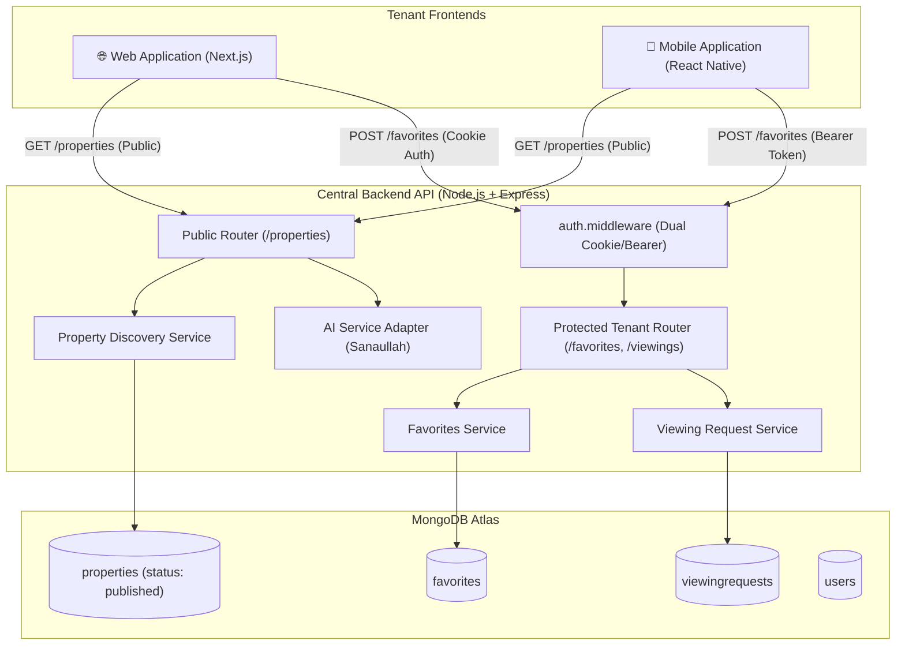
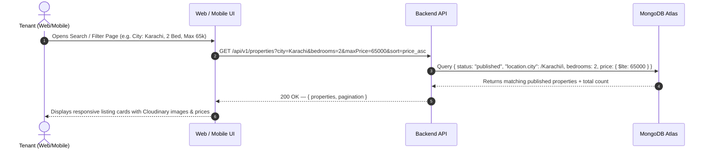
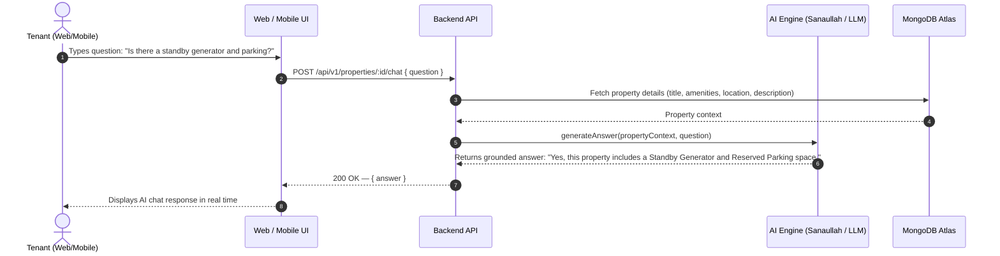
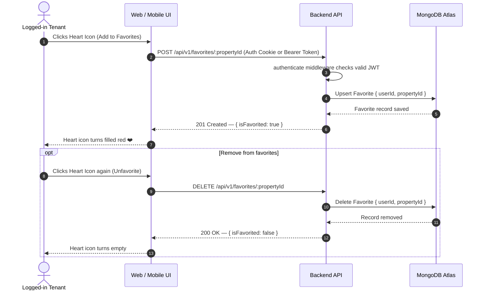
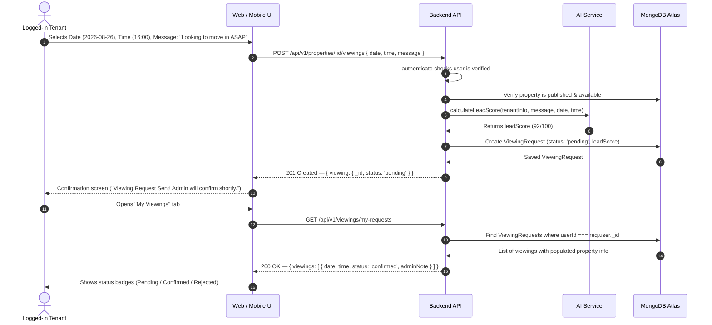
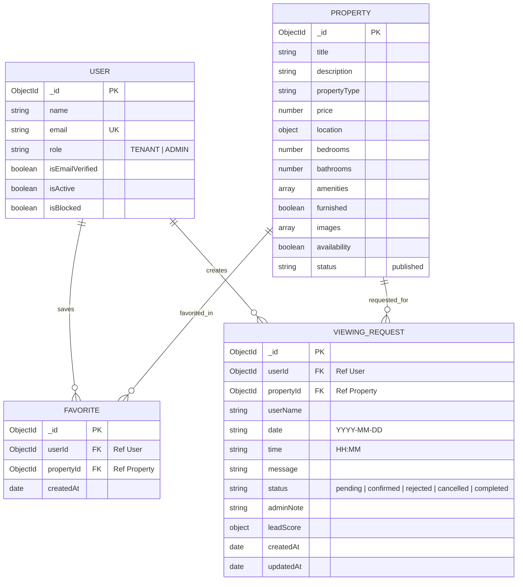

# RFC-003-B — Tenant Property Discovery, Favorites, Viewing Inquiries & Property AI Chatbot

**Status:** Proposed  
**Author:** Mohammad Arsalan  
**Created:** 2026-08-21  
**Scope:** `backend/` — Tenant-facing APIs shared identically by Web (Next.js/React) and Mobile (React Native/Expo) applications  

---

## 1. Overview

This RFC defines the backend architecture, database schemas, and API contracts for the **Tenant-Facing Experience** across both **Web** and **Mobile** platforms.

The platform provides an **open discovery model**:
* Tenants can browse listings, apply multi-attribute filters, search locations, inspect detailed photo galleries, and ask property-specific questions through the AI Chatbot **without mandatory login**.
* Authentication (`authenticate` middleware) is required only for personalized actions: **saving favorite properties**, **booking physical viewing appointments**, and **tracking viewing request statuses**.

### 1.1 Key Architectural Decisions

| Decision | Choice | Reason |
| :--- | :--- | :--- |
| **Cross-Platform Uniformity** | Identical API endpoints for Web & Mobile | Unified business logic, single source of truth in MongoDB, zero code duplication. |
| **Authentication Enforcement** | Public exploration + Protected personal actions | Maximum user conversion on landing pages; protects user-specific state (`favorites`, `viewings`). |
| **Token Transport Flexibility** | Automatic Cookie OR Bearer Authorization Header | Web browser handles httpOnly cookies automatically; Mobile apps use `Bearer <token>` in headers. |
| **Public Listing Visibility** | Hard-enforced query constraint (`status: "published"`) | Draft, pending, and unpublished listings managed by Admins are never leaked to tenants. |
| **AI Chatbot Architecture** | Grounded Context Injection (`src/services/ai.service.js`) | Passes full property metadata (price, amenities, location, rooms) to the LLM prompt to guarantee factual, hallucination-free answers. |
| **Favorites Model** | Separate `Favorite` collection with compound unique index | Prevents document bloating on the User model; enables fast indexing and pagination. |
| **Response Contract** | Standard Envelope `{ statusCode, success, message, data }` | Adheres strictly to `backend/AGENTS.md`, RFC-001-B, and RFC-002-B. |

---

## 2. Goals & Non-Goals

### Goals
1. High-performance public property search and filtering (city, price range, propertyType, bedrooms, bathrooms, amenities, furnished, sorting).
2. Curated featured listings endpoint for landing page hero/carousel sections.
3. Detailed property profile endpoint returning full photo gallery, location details, and amenities list.
4. AI Property Chatbot endpoint enabling natural-language Q&A based on the listing context.
5. User Favorites / Wishlist CRUD with real-time check helper (`isFavorited`).
6. Viewing visit request submission with validation (date, time, tenant message).
7. Tenant viewing history tracking (listing all submitted requests and admin decisions: `pending`, `confirmed`, `rejected`, `completed`, `cancelled`).
8. Viewing cancellation endpoint for tenants.

### Non-Goals
1. Public property creation or modification (restricted to Admin Panel via RFC-002-B).
2. Real-time peer-to-peer chat history between tenant and property owner (chatbot is automated Q&A).
3. Online rent payment processing or security deposit transactions (out of project scope).

---

## 3. System Architecture & Mermaid Diagrams

### 3.1 High-Level Tenant System Flow



---

### 3.2 Property Discovery & Filtering Flow



---

### 3.3 Property AI Chatbot Q&A Flow



---

### 3.4 Favorites Toggle & Sync Flow



---

### 3.5 Viewing Request Submission & Lifecycle Tracking Flow



---

### 3.6 Entity-Relationship Diagram (ERD)



---

## 4. Database Models

### 4.1 Favorite Model (`src/models/Favorite.js`)

```javascript
const mongoose = require("mongoose");

const favoriteSchema = new mongoose.Schema(
  {
    userId: {
      type: mongoose.Schema.Types.ObjectId,
      ref: "User",
      required: [true, "User ID is required"],
      index: true,
    },
    propertyId: {
      type: mongoose.Schema.Types.ObjectId,
      ref: "Property",
      required: [true, "Property ID is required"],
      index: true,
    },
  },
  {
    timestamps: { createdAt: true, updatedAt: false },
  }
);

// Compound unique index: A user can favorite a property only once
favoriteSchema.index({ userId: 1, propertyId: 1 }, { unique: true });

const Favorite = mongoose.model("Favorite", favoriteSchema);

module.exports = Favorite;
```

---

## 5. API Endpoints Summary Table

### 5.1 Public Endpoints (No Authentication Required)
| Method | Endpoint | Description |
| :--- | :--- | :--- |
| `GET` | `/api/v1/properties` | Search & filter published properties (pagination, multi-attribute filters, sorting). |
| `GET` | `/api/v1/properties/featured` | Curated list of top featured / recent published properties for homepage banners. |
| `GET` | `/api/v1/properties/:id` | Get full property details, full image gallery, amenities list, and related listings. |
| `POST` | `/api/v1/properties/:id/chat` | Ask the AI Chatbot specific questions about the property listing. |

### 5.2 Protected Tenant Endpoints (`authenticate` Required)
| Method | Endpoint | Description |
| :--- | :--- | :--- |
| `GET` | `/api/v1/favorites` | Retrieve logged-in tenant's saved favorite properties with pagination. |
| `POST` | `/api/v1/favorites/:propertyId` | Save property to favorites (idempotent). |
| `DELETE` | `/api/v1/favorites/:propertyId` | Remove property from favorites. |
| `GET` | `/api/v1/favorites/check/:propertyId` | Check if a property is already favorited by the logged-in tenant (`{ isFavorited: true/false }`). |
| `POST` | `/api/v1/properties/:id/viewings` | Submit a physical viewing visit request. |
| `GET` | `/api/v1/viewings/my-requests` | View tenant's submitted viewing request history & admin status updates. |
| `PATCH` | `/api/v1/viewings/:id/cancel` | Cancel a pending viewing request submitted by the tenant. |

---

## 6. Request & Response Contracts

### 6.1 Public Property Discovery

#### `GET /api/v1/properties`
* **Auth:** None (Public)
* **Query Parameters:**
  * `page` (default: 1)
  * `limit` (default: 12, max: 50)
  * `search` (text search in title, address, city, description)
  * `city` (case-insensitive city name, e.g. `Karachi`, `Lahore`, `Islamabad`)
  * `propertyType` (`Apartment`, `House`, `Villa`, `Studio`, `Commercial`, `Penthouse`)
  * `minPrice` / `maxPrice` (e.g. `minPrice=30000&maxPrice=70000`)
  * `bedrooms` (integer, e.g. `2`, `3`)
  * `bathrooms` (integer, e.g. `2`)
  * `furnished` (`true` / `false`)
  * `amenities` (comma-separated string, e.g. `Parking,Generator,Elevator`)
  * `sort` (`newest`, `price_asc`, `price_desc`, `bedrooms_desc`)
* **Success Response (200 OK):**
```json
{
  "statusCode": 200,
  "success": true,
  "message": "Properties retrieved successfully",
  "data": {
    "properties": [
      {
        "_id": "66c5f8...",
        "title": "Modern 2-Bedroom Fully Furnished Apartment in Clifton",
        "description": "Spacious and modern apartment with elevator and standby generator.",
        "propertyType": "Apartment",
        "price": 65000,
        "location": {
          "address": "Block 4, Clifton",
          "city": "Karachi"
        },
        "bedrooms": 2,
        "bathrooms": 2,
        "amenities": ["Generator", "Parking", "Elevator", "Security"],
        "furnished": true,
        "images": [
          "https://res.cloudinary.com/rental-platform/image/upload/v1/properties/img1.webp"
        ],
        "availability": true,
        "createdAt": "2026-08-21T10:00:00.000Z"
      }
    ],
    "pagination": {
      "currentPage": 1,
      "totalPages": 4,
      "totalProperties": 42,
      "limit": 12
    }
  }
}
```

---

#### `GET /api/v1/properties/featured`
* **Auth:** None (Public)
* **Success Response (200 OK):**
```json
{
  "statusCode": 200,
  "success": true,
  "message": "Featured properties retrieved successfully",
  "data": {
    "properties": [ ... ]
  }
}
```

---

#### `GET /api/v1/properties/:id`
* **Auth:** Optional (If authenticated, also includes `isFavorited: true/false`)
* **Success Response (200 OK):**
```json
{
  "statusCode": 200,
  "success": true,
  "message": "Property retrieved successfully",
  "data": {
    "property": {
      "_id": "66c5f8...",
      "title": "Modern 2-Bedroom Fully Furnished Apartment in Clifton",
      "description": "Full detailed description...",
      "propertyType": "Apartment",
      "price": 65000,
      "location": {
        "address": "Block 4, Clifton",
        "city": "Karachi"
      },
      "bedrooms": 2,
      "bathrooms": 2,
      "amenities": ["Generator", "Parking", "Elevator", "Security", "Gym"],
      "furnished": true,
      "images": [
        "https://res.cloudinary.com/.../img1.webp",
        "https://res.cloudinary.com/.../img2.webp",
        "https://res.cloudinary.com/.../img3.webp"
      ],
      "availability": true,
      "isFavorited": false,
      "createdAt": "2026-08-21T10:00:00.000Z"
    }
  }
}
```

---

### 6.2 Property AI Chatbot

#### `POST /api/v1/properties/:id/chat`
* **Auth:** None (Public)
* **Request Body:**
```json
{
  "question": "Is parking included and does the building have a backup generator?"
}
```
* **Success Response (200 OK):**
```json
{
  "statusCode": 200,
  "success": true,
  "message": "AI answer generated successfully",
  "data": {
    "propertyId": "66c5f8...",
    "question": "Is parking included and does the building have a backup generator?",
    "answer": "Yes, according to the listing details, this property includes Reserved Parking and a Standby Generator among its featured amenities."
  }
}
```

---

### 6.3 Favorites / Wishlist

#### `GET /api/v1/favorites`
* **Auth:** Required (`authenticate`)
* **Query Parameters:** `page`, `limit`
* **Success Response (200 OK):**
```json
{
  "statusCode": 200,
  "success": true,
  "message": "Favorites retrieved successfully",
  "data": {
    "favorites": [
      {
        "_id": "66c5fa...",
        "property": {
          "_id": "66c5f8...",
          "title": "Modern 2-Bedroom Apartment in Clifton",
          "price": 65000,
          "location": { "address": "Block 4, Clifton", "city": "Karachi" },
          "bedrooms": 2,
          "bathrooms": 2,
          "images": ["https://res.cloudinary.com/.../img1.webp"],
          "availability": true
        },
        "createdAt": "2026-08-21T11:00:00.000Z"
      }
    ],
    "pagination": {
      "currentPage": 1,
      "totalPages": 1,
      "totalFavorites": 3,
      "limit": 10
    }
  }
}
```

---

#### `POST /api/v1/favorites/:propertyId`
* **Auth:** Required (`authenticate`)
* **Success Response (201 Created):**
```json
{
  "statusCode": 201,
  "success": true,
  "message": "Property added to favorites",
  "data": {
    "isFavorited": true,
    "propertyId": "66c5f8..."
  }
}
```

---

#### `DELETE /api/v1/favorites/:propertyId`
* **Auth:** Required (`authenticate`)
* **Success Response (200 OK):**
```json
{
  "statusCode": 200,
  "success": true,
  "message": "Property removed from favorites",
  "data": {
    "isFavorited": false,
    "propertyId": "66c5f8..."
  }
}
```

---

#### `GET /api/v1/favorites/check/:propertyId`
* **Auth:** Required (`authenticate`)
* **Success Response (200 OK):**
```json
{
  "statusCode": 200,
  "success": true,
  "message": "Favorite status checked",
  "data": {
    "propertyId": "66c5f8...",
    "isFavorited": true
  }
}
```

---

### 6.4 Viewing Request Submissions

#### `POST /api/v1/properties/:id/viewings`
* **Auth:** Required (`authenticate`)
* **Request Body:**
```json
{
  "date": "2026-08-26",
  "time": "16:00",
  "message": "Hello, I am relocating for work and would love to visit this Wednesday afternoon."
}
```
* **Success Response (201 Created):**
```json
{
  "statusCode": 201,
  "success": true,
  "message": "Viewing request submitted successfully. The team will review and confirm shortly.",
  "data": {
    "viewing": {
      "_id": "66c5fc...",
      "propertyId": "66c5f8...",
      "userName": "Farhan Khan",
      "date": "2026-08-26",
      "time": "16:00",
      "message": "Hello, I am relocating for work...",
      "status": "pending",
      "createdAt": "2026-08-21T12:00:00.000Z"
    }
  }
}
```

---

#### `GET /api/v1/viewings/my-requests`
* **Auth:** Required (`authenticate`)
* **Query Parameters:** `page`, `limit`, `status`
* **Success Response (200 OK):**
```json
{
  "statusCode": 200,
  "success": true,
  "message": "Viewing requests retrieved successfully",
  "data": {
    "viewings": [
      {
        "_id": "66c5fc...",
        "property": {
          "_id": "66c5f8...",
          "title": "Modern 2-Bedroom Apartment in Clifton",
          "price": 65000,
          "location": { "address": "Block 4, Clifton", "city": "Karachi" },
          "images": ["https://res.cloudinary.com/.../img1.webp"]
        },
        "date": "2026-08-26",
        "time": "16:00",
        "message": "Hello, I am relocating for work...",
        "status": "confirmed",
        "adminNote": "Confirmed. Building caretaker will meet you at the main reception.",
        "createdAt": "2026-08-21T12:00:00.000Z"
      }
    ],
    "pagination": {
      "currentPage": 1,
      "totalPages": 1,
      "totalViewings": 1,
      "limit": 10
    }
  }
}
```

---

#### `PATCH /api/v1/viewings/:id/cancel`
* **Auth:** Required (`authenticate`)
* **Success Response (200 OK):**
```json
{
  "statusCode": 200,
  "success": true,
  "message": "Viewing request cancelled successfully",
  "data": {
    "viewingId": "66c5fc...",
    "status": "cancelled"
  }
}
```

---

## 7. Security & Performance Optimizations

1. **Strict Public Data Boundary:** All public listing queries enforce `{ status: "published" }`. Even if an attacker attempts to pass query params like `status=draft`, the controller hardcodes `status: "published"`.
2. **AI Chatbot Rate Limiting:** A dedicated `chatbotLimiter` (e.g. 20 questions per 10 minutes per IP) protects LLM API quota and prevents abuse.
3. **Compound Unique Indexing:** The `Favorite` collection prevents race condition duplicate entries via `{ userId: 1, propertyId: 1 }`.
4. **Ownership Verification on Tenant Actions:** A tenant can only view, check, or cancel viewing requests that belong to their own `req.user._id`.
5. **No Exposure of AI Secrets:** Frontends communicate exclusively through the `/chat` route; AI keys remain on the backend server.

---

## 8. Consistency Checklist

- [x] Follows all layered backend rules defined in `backend/AGENTS.md`.
- [x] Reuses RFC-001-B authentication and cookie/header transport.
- [x] Reuses RFC-002-B `Property` and `ViewingRequest` database schemas.
- [x] 100% identical endpoint routes and response envelopes for Web and Mobile.
- [x] Open public exploration with authentication gated only on favorites & viewing requests.
- [x] Zero references to phone numbers.
- [x] Full Mermaid sequence diagrams and ERD included.
