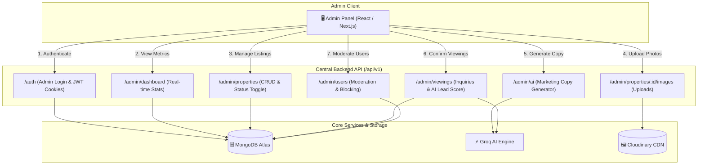

# Property Rental Platform — Admin Panel Developer Guide & Complete API Reference

**Document Version:** 1.0.0  
**Target Audience:** Admin Panel Frontend Developers (React / Next.js / Vue)  
**Backend Base URL:** `http://localhost:5000/api/v1`  
**Authentication Standard:** Dual Transport (HTTP-Only Secure Cookie `accessToken` + Optional `Authorization: Bearer <token>` Header)  

---

## 1. Architectural Overview & Best Practices

The **Admin Panel** is an internal management dashboard used to create, enrich with AI, review, publish, and manage rental properties, handle tenant viewing inquiries, evaluate AI lead seriousness scores, and moderate tenant accounts.



### Standard Response Envelope
All API endpoints return JSON in the standard 4-key envelope:
```json
{
  "statusCode": 200,
  "success": true,
  "message": "Operation description string",
  "data": { ... }
}
```

### Standard Error Envelope
```json
{
  "statusCode": 400,
  "success": false,
  "message": "Human-readable error explanation",
  "errors": [
    { "field": "price", "message": "Price must be a positive number" }
  ]
}
```

### Frontend HTTP Client Configuration (Axios / Fetch)
For cookie-based authentication, always set `withCredentials: true` in your HTTP client:
```javascript
import axios from "axios";

const adminApi = axios.create({
  baseURL: "http://localhost:5000/api/v1",
  withCredentials: true, // Crucial: enables automatic cookie sending & receiving
});

export default adminApi;
```

---

## 2. Admin Authentication Endpoints

> **Note:** The platform uses a **Single Master Admin** seeded account. Admins do not register publicly. Use the credentials configured in the system.

### 2.1 Admin Login
Authenticates the admin, sets `accessToken` and `refreshToken` in secure httpOnly cookies, and returns the admin profile.

* **Method:** `POST`
* **Endpoint:** `/auth/login`
* **Headers:** `Content-Type: application/json`
* **Request Body:**
```json
{
  "email": "admin@rentalplatform.com",
  "password": "AdminSecurePass123!"
}
```
* **Validation Rules:**
  - `email`: Required, valid email format.
  - `password`: Required string.
* **Success Response (`200 OK`):**
```json
{
  "statusCode": 200,
  "success": true,
  "message": "Login successful",
  "data": {
    "user": {
      "_id": "6a87e3be0786514489e62a0b",
      "name": "Platform Admin",
      "email": "admin@rentalplatform.com",
      "role": "ADMIN",
      "isEmailVerified": true,
      "isActive": true,
      "isBlocked": false,
      "createdAt": "2026-08-21T05:33:02.000Z",
      "updatedAt": "2026-08-21T05:33:02.000Z"
    }
  }
}
```
* **Cookies Set by Server:**
  - `accessToken` (`httpOnly`, `SameSite=Lax`, `maxAge=15m`)
  - `refreshToken` (`httpOnly`, `SameSite=Lax`, `maxAge=7d`)

---

### 2.2 Get Current Admin Profile
Fetches the logged-in admin's profile and validates session validity on dashboard reload.

* **Method:** `GET`
* **Endpoint:** `/auth/me`
* **Headers:** None (cookies sent automatically)
* **Success Response (`200 OK`):**
```json
{
  "statusCode": 200,
  "success": true,
  "message": "Current user profile retrieved",
  "data": {
    "user": {
      "_id": "6a87e3be0786514489e62a0b",
      "name": "Platform Admin",
      "email": "admin@rentalplatform.com",
      "role": "ADMIN",
      "isEmailVerified": true
    }
  }
}
```
* **Error Response (`401 Unauthorized`):** Token expired or missing.

---

### 2.3 Refresh Access Token
Silently exchanges the valid `refreshToken` cookie for a fresh `accessToken` cookie. Call this in an Axios response interceptor upon receiving a `401`.

* **Method:** `POST`
* **Endpoint:** `/auth/refresh-token`
* **Headers:** None
* **Request Body:** `{}` (empty)
* **Success Response (`200 OK`):**
```json
{
  "statusCode": 200,
  "success": true,
  "message": "Token refreshed successfully",
  "data": null
}
```

---

### 2.4 Admin Logout
Invalidates the refresh token session in MongoDB and clears cookies.

* **Method:** `POST`
* **Endpoint:** `/auth/logout`
* **Headers:** None
* **Request Body:** `{}` (empty)
* **Success Response (`200 OK`):**
```json
{
  "statusCode": 200,
  "success": true,
  "message": "Logged out successfully",
  "data": null
}
```

---

## 3. Dashboard & Analytics

### 3.1 Get Platform Metrics & Overview Stats
Retrieves real-time counts of properties across all states, viewing request statuses, tenant verification metrics, and recent inquiries.

* **Method:** `GET`
* **Endpoint:** `/admin/dashboard/stats`
* **Headers:** None
* **Success Response (`200 OK`):**
```json
{
  "statusCode": 200,
  "success": true,
  "message": "Dashboard statistics retrieved successfully",
  "data": {
    "properties": {
      "total": 14,
      "published": 8,
      "draft": 4,
      "unpublished": 2,
      "available": 7,
      "rented": 1
    },
    "viewings": {
      "total": 25,
      "pending": 6,
      "confirmed": 14,
      "completed": 3,
      "rejected": 2
    },
    "users": {
      "totalTenants": 84,
      "verifiedTenants": 78,
      "blockedTenants": 1
    },
    "recentViewings": [
      {
        "_id": "6a8832c795c732432f56d8df",
        "userName": "Farhan Khan",
        "date": "2026-08-28",
        "time": "16:30",
        "status": "pending",
        "createdAt": "2026-08-21T11:13:00.000Z",
        "property": {
          "_id": "6a87f5453c9d9669882d9477",
          "title": "Modern 2-Bedroom Luxury Apartment in Gulshan",
          "price": 60000,
          "location": { "address": "Block 6, Gulshan-e-Iqbal", "city": "Karachi" }
        }
      }
    ]
  }
}
```

---

## 4. AI Marketing Copy Generator

### 4.1 Generate Property Title & Description
Uses Groq AI (`openai/gpt-oss-120b`) to convert raw specifications, location, and informal notes into high-converting marketing copy.

* **Method:** `POST`
* **Endpoint:** `/admin/ai/generate-description`
* **Headers:** `Content-Type: application/json`
* **Request Body:**
```json
{
  "propertyType": "Apartment",
  "city": "Karachi",
  "address": "Block 4, Clifton",
  "bedrooms": 3,
  "bathrooms": 3,
  "price": 125000,
  "amenities": ["Standby Generator", "Reserved Parking", "High-speed Elevator", "24/7 Security", "Gym"],
  "furnished": true,
  "rawNotes": "Corner apartment on 7th floor, sea facing balcony, Italian tiled flooring, fully renovated kitchen."
}
```
* **Validation Rules:**
  - `propertyType`: Required string (`Apartment`, `House`, `Villa`, `Studio`, `Commercial`, `Penthouse`).
  - `city`: Required string (2–50 chars).
  - `address`: Optional string.
  - `bedrooms`: Required integer >= 0.
  - `bathrooms`: Required integer >= 0.
  - `price`: Required positive number.
  - `amenities`: Optional array of strings or comma-separated string.
  - `furnished`: Optional boolean.
  - `rawNotes`: Optional string (max 1000 chars).
* **Success Response (`200 OK`):**
```json
{
  "statusCode": 200,
  "success": true,
  "message": "AI content generated successfully",
  "data": {
    "title": "Luxury 3-Bedroom Corner Apartment, Sea-Facing Balcony, Fully Furnished – Clifton",
    "description": "Experience elevated city living in this fully furnished, three-bedroom, three-bathroom corner apartment on the 7th floor of a prestigious Clifton building. Sun-lit through expansive windows and a sea-facing balcony, the residence offers sweeping views and abundant natural light that fills the Italian-tiled living spaces. The completely renovated kitchen boasts modern fixtures and sleek countertops, perfect for effortless entertaining.\n\nDesigned for a sophisticated lifestyle, the home includes premium amenities such as a standby generator, reserved parking, a high-speed elevator, 24/7 security, and an on-site gym. Situated in Block 4, Clifton, you are moments away from upscale shopping, fine dining, and major business hubs, ensuring convenience without compromise. All of this is available for Rs. 125,000 per month."
  }
}
```

---

## 5. Property Management (CRUD & Publishing)

### 5.1 Create New Property
Creates a property in either `draft` (default) or `published` status.

* **Method:** `POST`
* **Endpoint:** `/admin/properties`
* **Headers:** `Content-Type: application/json`
* **Request Body:**
```json
{
  "title": "Modern 2-Bedroom Luxury Apartment in Gulshan",
  "description": "Beautiful 2-bedroom flat with modern open kitchen and high-speed elevator.",
  "propertyType": "Apartment",
  "price": 60000,
  "location": {
    "address": "Block 6, Gulshan-e-Iqbal",
    "city": "Karachi"
  },
  "bedrooms": 2,
  "bathrooms": 2,
  "amenities": ["Generator", "Parking", "Elevator", "Security"],
  "furnished": true,
  "availability": true,
  "status": "draft"
}
```
* **Validation Rules:**
  - `title`: Required string (3–120 chars).
  - `description`: Required string (10–5000 chars).
  - `propertyType`: Required enum (`Apartment`, `House`, `Villa`, `Studio`, `Commercial`, `Penthouse`).
  - `price`: Required positive number.
  - `location.city`: Required string.
  - `location.address`: Optional string.
  - `bedrooms`: Required integer >= 0.
  - `bathrooms`: Required integer >= 0.
  - `amenities`: Optional array of strings.
  - `furnished`: Optional boolean (default: false).
  - `availability`: Optional boolean (default: true).
  - `status`: Optional enum (`draft`, `pending`, `published`, `unpublished`, default: `draft`).
* **Success Response (`201 Created`):**
```json
{
  "statusCode": 201,
  "success": true,
  "message": "Property created successfully",
  "data": {
    "property": {
      "_id": "6a87f5453c9d9669882d9477",
      "title": "Modern 2-Bedroom Luxury Apartment in Gulshan",
      "description": "Beautiful 2-bedroom flat with modern open kitchen and high-speed elevator.",
      "propertyType": "Apartment",
      "price": 60000,
      "location": {
        "address": "Block 6, Gulshan-e-Iqbal",
        "city": "Karachi"
      },
      "bedrooms": 2,
      "bathrooms": 2,
      "amenities": ["Generator", "Parking", "Elevator", "Security"],
      "furnished": true,
      "images": [],
      "availability": true,
      "status": "draft",
      "createdBy": "6a87e3be0786514489e62a0b",
      "createdAt": "2026-08-21T06:50:45.000Z",
      "updatedAt": "2026-08-21T06:50:45.000Z"
    }
  }
}
```

---

### 5.2 List All Properties (Admin View)
Retrieves all properties across all statuses with full filtering, searching, and pagination.

* **Method:** `GET`
* **Endpoint:** `/admin/properties`
* **Query Parameters:**
  - `page` (default: 1)
  - `limit` (default: 10, max: 50)
  - `search` (searches title, address, city, description)
  - `status` (`draft`, `pending`, `published`, `unpublished`)
  - `city` (case-insensitive city name)
  - `propertyType` (`Apartment`, `House`, `Villa`, etc.)
  - `minPrice` / `maxPrice` (e.g. `minPrice=50000&maxPrice=100000`)
  - `bedrooms` (integer)
  - `furnished` (`true` / `false`)
  - `sort` (`newest`, `price_asc`, `price_desc`, `bedrooms_desc`)
* **Success Response (`200 OK`):**
```json
{
  "statusCode": 200,
  "success": true,
  "message": "Properties retrieved successfully",
  "data": {
    "properties": [
      {
        "_id": "6a87f5453c9d9669882d9477",
        "title": "Modern 2-Bedroom Luxury Apartment in Gulshan",
        "propertyType": "Apartment",
        "price": 60000,
        "location": { "address": "Block 6, Gulshan-e-Iqbal", "city": "Karachi" },
        "bedrooms": 2,
        "bathrooms": 2,
        "amenities": ["Generator", "Parking", "Elevator", "Security"],
        "furnished": true,
        "images": [
          "https://res.cloudinary.com/rental-platform/image/upload/v1/properties/img1.webp"
        ],
        "availability": true,
        "status": "published",
        "createdBy": {
          "_id": "6a87e3be0786514489e62a0b",
          "name": "Platform Admin",
          "email": "admin@rentalplatform.com"
        },
        "createdAt": "2026-08-21T06:50:45.000Z",
        "updatedAt": "2026-08-21T07:00:12.000Z"
      }
    ],
    "pagination": {
      "currentPage": 1,
      "totalPages": 2,
      "totalProperties": 14,
      "limit": 10
    }
  }
}
```

---

### 5.3 Get Single Property Details
* **Method:** `GET`
* **Endpoint:** `/admin/properties/:id`
* **URL Params:** `id` (MongoDB ObjectId)
* **Success Response (`200 OK`):** Returns full property object populated with `createdBy` admin info.

---

### 5.4 Update Property Details
* **Method:** `PATCH`
* **Endpoint:** `/admin/properties/:id`
* **Headers:** `Content-Type: application/json`
* **Request Body:** Any partial fields from the property model:
```json
{
  "price": 65000,
  "amenities": ["Generator", "Parking", "Elevator", "Security", "Gym"],
  "availability": true
}
```
* **Success Response (`200 OK`):** Returns updated property object.

---

### 5.5 Quick Status Update (Publish / Unpublish / Draft)
Quick state-machine toggle endpoint for the Admin UI table switch/button.

* **Method:** `PATCH`
* **Endpoint:** `/admin/properties/:id/status`
* **Headers:** `Content-Type: application/json`
* **Request Body:**
```json
{
  "status": "published"
}
```
* **Allowed Values for `status`:** `"draft"`, `"pending"`, `"published"`, `"unpublished"`
* **Success Response (`200 OK`):**
```json
{
  "statusCode": 200,
  "success": true,
  "message": "Property status updated to published",
  "data": {
    "propertyId": "6a87f5453c9d9669882d9477",
    "status": "published"
  }
}
```

---

### 5.6 Delete Property
Permanently deletes the property from the database and removes all linked image assets from Cloudinary CDN.

* **Method:** `DELETE`
* **Endpoint:** `/admin/properties/:id`
* **Success Response (`200 OK`):**
```json
{
  "statusCode": 200,
  "success": true,
  "message": "Property and associated assets deleted successfully",
  "data": null
}
```

---

## 6. Cloudinary Image Management

### 6.1 Upload Property Images (Multi-File)
Uploads 1 to 10 image files directly to Cloudinary CDN via in-memory buffer stream.

* **Method:** `POST`
* **Endpoint:** `/admin/properties/:id/images`
* **Content-Type:** `multipart/form-data`
* **Form-Data Key:** `images` (Type: `File` or `FileList`, max 10 files, max 5MB per file, accepted types: `.jpg`, `.jpeg`, `.png`, `.webp`)
* **JavaScript / FormData Example:**
```javascript
const formData = new FormData();
// Append multiple files with the EXACT key name 'images'
selectedFiles.forEach((file) => {
  formData.append("images", file);
});

const response = await adminApi.post(`/admin/properties/${propertyId}/images`, formData, {
  headers: { "Content-Type": "multipart/form-data" },
});
```
* **Success Response (`200 OK`):**
```json
{
  "statusCode": 200,
  "success": true,
  "message": "Images uploaded successfully",
  "data": {
    "propertyId": "6a87f5453c9d9669882d9477",
    "images": [
      "https://res.cloudinary.com/rental-platform/image/upload/v1/properties/img_front.webp",
      "https://res.cloudinary.com/rental-platform/image/upload/v1/properties/img_living.webp",
      "https://res.cloudinary.com/rental-platform/image/upload/v1/properties/img_kitchen.webp"
    ]
  }
}
```

---

### 6.2 Delete Single Property Image
Removes the image URL from the property's `images` array and destroys the image asset from Cloudinary CDN.

* **Method:** `DELETE`
* **Endpoint:** `/admin/properties/:id/images`
* **Headers:** `Content-Type: application/json`
* **Request Body:**
```json
{
  "imageUrl": "https://res.cloudinary.com/rental-platform/image/upload/v1/properties/img_kitchen.webp"
}
```
* **Success Response (`200 OK`):**
```json
{
  "statusCode": 200,
  "success": true,
  "message": "Image deleted successfully",
  "data": {
    "propertyId": "6a87f5453c9d9669882d9477",
    "images": [
      "https://res.cloudinary.com/rental-platform/image/upload/v1/properties/img_front.webp",
      "https://res.cloudinary.com/rental-platform/image/upload/v1/properties/img_living.webp"
    ]
  }
}
```

---

## 7. Viewing Requests Management & AI Lead Scoring

### 7.1 List All Viewing Requests
* **Method:** `GET`
* **Endpoint:** `/admin/viewings`
* **Query Parameters:**
  - `page` (default: 1)
  - `limit` (default: 10)
  - `status` (`pending`, `confirmed`, `rejected`, `completed`, `cancelled`)
* **Success Response (`200 OK`):**
```json
{
  "statusCode": 200,
  "success": true,
  "message": "Viewing requests retrieved successfully",
  "data": {
    "viewings": [
      {
        "_id": "6a8832c795c732432f56d8df",
        "userName": "Dr. Asad Mansoor",
        "date": "2026-08-29",
        "time": "16:00",
        "message": "Joining South City Hospital next month, looking for a clean apartment for my family.",
        "status": "pending",
        "adminNote": null,
        "leadScore": {
          "score": 100,
          "reasoning": "The message is detailed, polite, and includes a clear move-in timeline and family context (40 pts); a specific date and time for the viewing are provided (30 pts); the email uses a professional domain and the name appears authentic (30 pts).",
          "evaluatedAt": "2026-08-21T11:13:00.000Z"
        },
        "property": {
          "_id": "6a87f5453c9d9669882d9477",
          "title": "Modern 2-Bedroom Luxury Apartment in Gulshan",
          "price": 60000,
          "location": { "address": "Block 6, Gulshan-e-Iqbal", "city": "Karachi" },
          "images": [ "https://res.cloudinary.com/.../img1.webp" ]
        },
        "user": {
          "_id": "6a87e49d69efbb2b27520e1a",
          "name": "Dr. Asad Mansoor",
          "email": "asad.mansoor@hospital.org"
        },
        "createdAt": "2026-08-21T11:13:00.000Z"
      }
    ],
    "pagination": {
      "currentPage": 1,
      "totalPages": 1,
      "totalViewings": 1,
      "limit": 10
    }
  }
}
```

---

### 7.2 Get Single Viewing Request Detail
* **Method:** `GET`
* **Endpoint:** `/admin/viewings/:id`
* **Success Response (`200 OK`):** Full viewing record with populated `user` and `property` details.

---

### 7.3 Evaluate / Fetch AI Lead Score On-Demand
Computes or refreshes the AI seriousness score (`0–100`) with Groq LLM reasoning.

* **Method:** `GET`
* **Endpoint:** `/admin/viewings/:id/lead-score`
* **Success Response (`200 OK`):**
```json
{
  "statusCode": 200,
  "success": true,
  "message": "AI lead score evaluated",
  "data": {
    "viewingId": "6a8832c795c732432f56d8df",
    "leadScore": {
      "score": 100,
      "reasoning": "The message is detailed, polite, and includes a clear move-in timeline and family context (40 pts); a specific date and time for the viewing are provided (30 pts); the email uses a professional domain and the name appears authentic (30 pts).",
      "evaluatedAt": "2026-08-21T11:13:00.000Z"
    }
  }
}
```

---

### 7.4 Confirm or Reject Viewing Request
Updates status and attaches an internal or tenant-facing confirmation note.

* **Method:** `PATCH`
* **Endpoint:** `/admin/viewings/:id/status`
* **Headers:** `Content-Type: application/json`
* **Request Body:**
```json
{
  "status": "confirmed",
  "adminNote": "Confirmed. Building caretaker Mr. Rafiq will meet the tenant at 4:00 PM."
}
```
* **Allowed Values for `status`:** `"pending"`, `"confirmed"`, `"rejected"`, `"completed"`, `"cancelled"`
* **Success Response (`200 OK`):**
```json
{
  "statusCode": 200,
  "success": true,
  "message": "Viewing request status updated to confirmed",
  "data": {
    "viewing": {
      "_id": "6a8832c795c732432f56d8df",
      "status": "confirmed",
      "adminNote": "Confirmed. Building caretaker Mr. Rafiq will meet the tenant at 4:00 PM.",
      "updatedAt": "2026-08-21T11:30:00.000Z"
    }
  }
}
```

---

## 8. Tenant User Management & Moderation

### 8.1 List Registered Users
* **Method:** `GET`
* **Endpoint:** `/admin/users`
* **Query Parameters:**
  - `page` (default: 1)
  - `limit` (default: 10)
  - `search` (searches name and email)
* **Success Response (`200 OK`):**
```json
{
  "statusCode": 200,
  "success": true,
  "message": "Users retrieved successfully",
  "data": {
    "users": [
      {
        "_id": "6a87e49d69efbb2b27520e1a",
        "name": "Dr. Asad Mansoor",
        "email": "asad.mansoor@hospital.org",
        "role": "TENANT",
        "isEmailVerified": true,
        "isActive": true,
        "isBlocked": false,
        "createdAt": "2026-08-21T05:39:46.000Z"
      }
    ],
    "pagination": {
      "currentPage": 1,
      "totalPages": 1,
      "totalUsers": 1,
      "limit": 10
    }
  }
}
```

---

### 8.2 Get Single User Profile & Activity
* **Method:** `GET`
* **Endpoint:** `/admin/users/:id`
* **Success Response (`200 OK`):** Returns user details along with their viewing inquiries count.

---

### 8.3 Block / Suspend or Unblock User Account
* **Method:** `PATCH`
* **Endpoint:** `/admin/users/:id/status`
* **Headers:** `Content-Type: application/json`
* **Request Body:**
```json
{
  "isBlocked": true,
  "isActive": false
}
```
* **Success Response (`200 OK`):**
```json
{
  "statusCode": 200,
  "success": true,
  "message": "User account status updated successfully",
  "data": {
    "userId": "6a87e49d69efbb2b27520e1a",
    "isBlocked": true,
    "isActive": false
  }
}
```
> 🔒 **Security Feature:** Setting `isBlocked: true` immediately revokes and terminates all active refresh token sessions for that user in the database.
