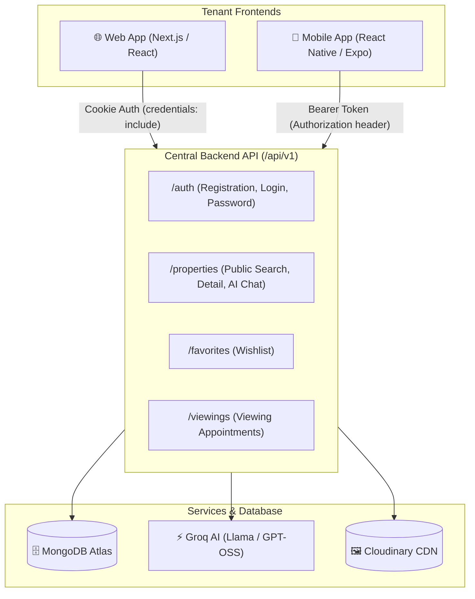

# Property Rental Platform — Web & Mobile Developer Guide & Complete API Reference

**Document Version:** 1.0.0  
**Target Audience:** Web Developers (Next.js / React) and Mobile Developers (React Native / Expo)  
**Backend Base URL:** `http://localhost:5000/api/v1`  
**Data Uniformity:** 100% Identical JSON Endpoints, Schemas, and Response Envelopes for Web & Mobile  

---

## 1. Architectural Overview & Client Setup

Both the **Web Application** and **Mobile Application** connect to the same centralized backend.



---

### Standard JSON Response Envelope
Every endpoint returns a consistent 4-key JSON envelope:
```json
{
  "statusCode": 200,
  "success": true,
  "message": "Operation description",
  "data": { ... }
}
```

### Standard Error Response Envelope
```json
{
  "statusCode": 400,
  "success": false,
  "message": "Validation failed",
  "errors": [
    { "field": "email", "message": "Please provide a valid email address" }
  ]
}
```

---

### 🔑 Authentication Transport: Web vs. Mobile

The backend supports **Dual Transport** seamlessly:

#### 🌐 For Web Developers (Next.js / React Browser):
Browsers automatically manage secure `httpOnly` cookies. Configure your HTTP client with `withCredentials: true`:
```javascript
import axios from "axios";

export const webApi = axios.create({
  baseURL: "http://localhost:5000/api/v1",
  withCredentials: true, // Automatically sends and receives httpOnly cookies
});
```

#### 📱 For Mobile Developers (React Native / Expo):
Mobile apps store tokens in `SecureStore` (Expo) or `AsyncStorage` and send them via the `Authorization` header:
```javascript
import axios from "axios";
import * as SecureStore from "expo-secure-store";

export const mobileApi = axios.create({
  baseURL: "http://localhost:5000/api/v1",
});

// Attach Bearer token to all outgoing requests
mobileApi.interceptors.request.use(async (config) => {
  const token = await SecureStore.getItemAsync("accessToken");
  if (token) {
    config.headers.Authorization = `Bearer ${token}`;
  }
  return config;
});
```

---

## 2. Tenant Authentication Endpoints

### 2.1 Register New Tenant Account
Creates a new tenant account with `role: "TENANT"` and sends an email verification link via Brevo SMTP.

* **Method:** `POST`
* **Endpoint:** `/auth/register`
* **Headers:** `Content-Type: application/json`
* **Request Body:**
```json
{
  "name": "Farhan Khan",
  "email": "farhan.khan@gmail.com",
  "password": "Password123!"
}
```
* **Validation Rules:**
  - `name`: Required string (2–50 characters).
  - `email`: Required, valid email format.
  - `password`: Required, minimum 8 characters (must contain at least 1 uppercase letter, 1 lowercase letter, and 1 number or symbol).
* **Success Response (`201 Created`):**
```json
{
  "statusCode": 201,
  "success": true,
  "message": "Registration successful. Please check your email to verify your account.",
  "data": {
    "userId": "6a87e49d69efbb2b27520e1a",
    "email": "farhan.khan@gmail.com"
  }
}
```

---

### 2.2 Verify Email
Verifies the tenant's email address using the single-use cryptographic token sent to their inbox.

* **Method:** `POST`
* **Endpoint:** `/auth/verify-email`
* **Headers:** `Content-Type: application/json`
* **Request Body:**
```json
{
  "email": "farhan.khan@gmail.com",
  "token": "4f8a9e1c2b3d4e5f6a7b8c9d0e1f2a3b"
}
```
* **Success Response (`200 OK`):**
```json
{
  "statusCode": 200,
  "success": true,
  "message": "Email verified successfully. You can now log in.",
  "data": null
}
```

---

### 2.3 Resend Email Verification Link
Sends a new verification token if the previous one expired (Rate limited to 10 requests per 15 min).

* **Method:** `POST`
* **Endpoint:** `/auth/resend-verification`
* **Headers:** `Content-Type: application/json`
* **Request Body:**
```json
{
  "email": "farhan.khan@gmail.com"
}
```
* **Success Response (`200 OK`):**
```json
{
  "statusCode": 200,
  "success": true,
  "message": "If this email is registered, a new verification link has been sent.",
  "data": null
}
```

---

### 2.4 Tenant Login
Authenticates the tenant, establishes sessions, sets cookies (for Web), and returns `accessToken` (for Mobile header storage).

* **Method:** `POST`
* **Endpoint:** `/auth/login`
* **Headers:** `Content-Type: application/json`
* **Request Body:**
```json
{
  "email": "farhan.khan@gmail.com",
  "password": "Password123!"
}
```
* **Success Response (`200 OK`):**
```json
{
  "statusCode": 200,
  "success": true,
  "message": "Login successful",
  "data": {
    "user": {
      "_id": "6a87e49d69efbb2b27520e1a",
      "name": "Farhan Khan",
      "email": "farhan.khan@gmail.com",
      "role": "TENANT",
      "isEmailVerified": true,
      "isActive": true,
      "isBlocked": false
    }
  }
}
```
> 📱 **Mobile Note:** Extract the `accessToken` from the `Set-Cookie` header or pass it through if configured.

---

### 2.5 Refresh Access Token (Rotation)
Rotates the session and provides a fresh access token.

* **Method:** `POST`
* **Endpoint:** `/auth/refresh-token`
* **Headers:** None (Web sends cookie) OR `Authorization: Bearer <refreshToken>` (Mobile)
* **Request Body:** `{}`
* **Success Response (`200 OK`):**
```json
{
  "statusCode": 200,
  "success": true,
  "message": "Token refreshed successfully",
  "data": null
}
```

---

### 2.6 Forgot Password (Request Reset Link)
Sends a password reset link to the tenant's email address.

* **Method:** `POST`
* **Endpoint:** `/auth/forgot-password`
* **Headers:** `Content-Type: application/json`
* **Request Body:**
```json
{
  "email": "farhan.khan@gmail.com"
}
```
* **Success Response (`200 OK`):**
```json
{
  "statusCode": 200,
  "success": true,
  "message": "If this email is registered, a password reset link has been sent.",
  "data": null
}
```

---

### 2.7 Reset Password
Sets a new password using the reset token received in email.

* **Method:** `POST`
* **Endpoint:** `/auth/reset-password`
* **Headers:** `Content-Type: application/json`
* **Request Body:**
```json
{
  "token": "4f8a9e1c2b3d4e5f6a7b8c9d0e1f2a3b",
  "newPassword": "NewStrongPass456!"
}
```
* **Success Response (`200 OK`):**
```json
{
  "statusCode": 200,
  "success": true,
  "message": "Password reset successfully. You can now log in with your new password.",
  "data": null
}
```

---

### 2.8 Get My Profile (Session Check)
* **Method:** `GET`
* **Endpoint:** `/auth/me`
* **Success Response (`200 OK`):**
```json
{
  "statusCode": 200,
  "success": true,
  "message": "Current user profile retrieved",
  "data": {
    "user": {
      "_id": "6a87e49d69efbb2b27520e1a",
      "name": "Farhan Khan",
      "email": "farhan.khan@gmail.com",
      "role": "TENANT",
      "isEmailVerified": true
    }
  }
}
```

---

### 2.9 Logout
* **Method:** `POST`
* **Endpoint:** `/auth/logout`
* **Success Response (`200 OK`):**
```json
{
  "statusCode": 200,
  "success": true,
  "message": "Logged out successfully",
  "data": null
}
```

---

## 3. Public Property Discovery & Search (No Login Required)

### 3.1 Search & Filter Published Properties
The primary endpoint for listing pages, search bars, and filter sidebars. Strictly returns properties with `status: "published"`.

* **Method:** `GET`
* **Endpoint:** `/properties`
* **Query Parameters:**
  | Parameter | Type | Example | Description |
  | :--- | :--- | :--- | :--- |
  | `page` | Integer | `page=1` | Current page number (default: 1) |
  | `limit` | Integer | `limit=12` | Items per page (default: 12, max: 50) |
  | `search` | String | `search=Clifton` | Full-text search across title, description, address, city |
  | `city` | String | `city=Karachi` | Filter by city name (case-insensitive) |
  | `propertyType` | String | `propertyType=Apartment` | `Apartment`, `House`, `Villa`, `Studio`, `Commercial`, `Penthouse` |
  | `minPrice` | Number | `minPrice=30000` | Minimum monthly rent in PKR |
  | `maxPrice` | Number | `maxPrice=80000` | Maximum monthly rent in PKR |
  | `bedrooms` | Integer | `bedrooms=2` | Exact bedroom count |
  | `bathrooms` | Integer | `bathrooms=2` | Exact bathroom count |
  | `furnished` | Boolean | `furnished=true` | `true` or `false` |
  | `amenities` | String | `amenities=Parking,Generator` | Comma-separated amenities filter |
  | `sort` | String | `sort=price_asc` | `newest`, `price_asc`, `price_desc`, `bedrooms_desc` |

* **Success Response (`200 OK`):**
```json
{
  "statusCode": 200,
  "success": true,
  "message": "Properties retrieved successfully",
  "data": {
    "properties": [
      {
        "_id": "6a87f5453c9d9669882d9477",
        "title": "Modern 2-Bedroom Luxury Apartment in Gulshan",
        "description": "Beautiful 2-bedroom flat with modern open kitchen and high-speed elevator.",
        "propertyType": "Apartment",
        "price": 60000,
        "location": {
          "address": "Block 6, Gulshan-e-Iqbal",
          "city": "Karachi"
        },
        "bedrooms": 2,
        "bathrooms": 2,
        "amenities": ["Generator", "Parking", "Elevator", "Security"],
        "furnished": true,
        "images": [
          "https://res.cloudinary.com/rental-platform/image/upload/v1/properties/img1.webp",
          "https://res.cloudinary.com/rental-platform/image/upload/v1/properties/img2.webp"
        ],
        "availability": true,
        "status": "published",
        "createdAt": "2026-08-21T06:50:45.000Z",
        "updatedAt": "2026-08-21T07:00:12.000Z"
      }
    ],
    "pagination": {
      "currentPage": 1,
      "totalPages": 1,
      "totalProperties": 1,
      "limit": 12
    }
  }
}
```

---

### 3.2 Featured Properties (Homepage Banner / Carousel)
Returns top recent, available published properties optimized for landing page hero components.

* **Method:** `GET`
* **Endpoint:** `/properties/featured`
* **Query Parameters:** `limit` (default: 6, max: 20)
* **Success Response (`200 OK`):** Returns `{ properties: [ ... ] }`.

---

### 3.3 Single Property Detail View
Fetches full property specifications, photo gallery, location, amenities, and automatically includes **`isFavorited: true/false`** if the tenant is logged in.

* **Method:** `GET`
* **Endpoint:** `/properties/:id`
* **Success Response (`200 OK`):**
```json
{
  "statusCode": 200,
  "success": true,
  "message": "Property retrieved successfully",
  "data": {
    "property": {
      "_id": "6a87f5453c9d9669882d9477",
      "title": "Modern 2-Bedroom Luxury Apartment in Gulshan",
      "description": "Full detailed description...",
      "propertyType": "Apartment",
      "price": 60000,
      "location": {
        "address": "Block 6, Gulshan-e-Iqbal",
        "city": "Karachi"
      },
      "bedrooms": 2,
      "bathrooms": 2,
      "amenities": ["Generator", "Parking", "Elevator", "Security"],
      "furnished": true,
      "images": [
        "https://res.cloudinary.com/rental-platform/image/upload/v1/properties/img1.webp",
        "https://res.cloudinary.com/rental-platform/image/upload/v1/properties/img2.webp"
      ],
      "availability": true,
      "isFavorited": false,
      "createdAt": "2026-08-21T06:50:45.000Z"
    }
  }
}
```

---

## 4. Grounded AI Property Chatbot (No Login Required)

### 4.1 Ask Question About Listing
Enables tenants to chat with the property AI assistant. The AI is strictly grounded in the listing's verified details and will never hallucinate or invent features.

* **Method:** `POST`
* **Endpoint:** `/properties/:id/chat`
* **Headers:** `Content-Type: application/json`
* **Request Body:**
```json
{
  "question": "Does this apartment have a backup generator and is parking dedicated?"
}
```
* **Validation Rules:**
  - `question`: Required string (3–500 characters).
* **Success Response (`200 OK`):**
```json
{
  "statusCode": 200,
  "success": true,
  "message": "AI answer generated successfully",
  "data": {
    "propertyId": "6a87f5453c9d9669882d9477",
    "question": "Does this apartment have a backup generator and is parking dedicated?",
    "answer": "Yes, according to the listing, the building provides a Standby Generator and Reserved Dedicated Parking as part of its featured amenities."
  }
}
```

---

## 5. Favorites / Wishlist (Requires Tenant Login)

### 5.1 Add Property to Favorites
* **Method:** `POST`
* **Endpoint:** `/favorites/:propertyId`
* **Success Response (`201 Created`):**
```json
{
  "statusCode": 201,
  "success": true,
  "message": "Property added to favorites",
  "data": {
    "isFavorited": true,
    "propertyId": "6a87f5453c9d9669882d9477"
  }
}
```

---

### 5.2 Remove Property from Favorites
* **Method:** `DELETE`
* **Endpoint:** `/favorites/:propertyId`
* **Success Response (`200 OK`):**
```json
{
  "statusCode": 200,
  "success": true,
  "message": "Property removed from favorites",
  "data": {
    "isFavorited": false,
    "propertyId": "6a87f5453c9d9669882d9477"
  }
}
```

---

### 5.3 Check Favorite Status
* **Method:** `GET`
* **Endpoint:** `/favorites/check/:propertyId`
* **Success Response (`200 OK`):**
```json
{
  "statusCode": 200,
  "success": true,
  "message": "Favorite status checked",
  "data": {
    "propertyId": "6a87f5453c9d9669882d9477",
    "isFavorited": true
  }
}
```

---

### 5.4 List My Saved Favorites
* **Method:** `GET`
* **Endpoint:** `/favorites?page=1&limit=10`
* **Success Response (`200 OK`):**
```json
{
  "statusCode": 200,
  "success": true,
  "message": "Favorites retrieved successfully",
  "data": {
    "favorites": [
      {
        "_id": "6a8832c295c732432f56d8dd",
        "property": {
          "_id": "6a87f5453c9d9669882d9477",
          "title": "Modern 2-Bedroom Luxury Apartment in Gulshan",
          "price": 60000,
          "location": { "address": "Block 6, Gulshan-e-Iqbal", "city": "Karachi" },
          "bedrooms": 2,
          "bathrooms": 2,
          "images": [ "https://res.cloudinary.com/.../img1.webp" ],
          "availability": true
        },
        "createdAt": "2026-08-21T11:00:00.000Z"
      }
    ],
    "pagination": {
      "currentPage": 1,
      "totalPages": 1,
      "totalFavorites": 1,
      "limit": 10
    }
  }
}
```

---

## 6. Viewing Request Appointments (Requires Tenant Login)

### 6.1 Submit a Viewing Visit Request
Allows logged-in tenants to request a physical viewing visit. Automatically calculates an AI lead score for the admin team.

* **Method:** `POST`
* **Endpoint:** `/properties/:id/viewings`
* **Headers:** `Content-Type: application/json`
* **Request Body:**
```json
{
  "date": "2026-08-28",
  "time": "16:30",
  "message": "Hello, I am relocating for work and would like to visit this Friday afternoon with my family."
}
```
* **Validation Rules:**
  - `date`: Required string matching `YYYY-MM-DD` format.
  - `time`: Required string (e.g. `16:30` or `4:30 PM`).
  - `message`: Optional string (max 500 characters).
* **Success Response (`201 Created`):**
```json
{
  "statusCode": 201,
  "success": true,
  "message": "Viewing request submitted successfully. The team will review and confirm shortly.",
  "data": {
    "viewing": {
      "_id": "6a8832c795c732432f56d8df",
      "propertyId": "6a87f5453c9d9669882d9477",
      "userName": "Farhan Khan",
      "date": "2026-08-28",
      "time": "16:30",
      "message": "Hello, I am relocating for work...",
      "status": "pending",
      "createdAt": "2026-08-21T12:00:00.000Z"
    }
  }
}
```

---

### 6.2 View My Viewing History & Status Updates
Displays the list of viewing requests submitted by the logged-in tenant with real-time status badges (`pending`, `confirmed`, `rejected`, `cancelled`, `completed`) and Admin notes.

* **Method:** `GET`
* **Endpoint:** `/viewings/my-requests?page=1&limit=10`
* **Query Parameters:** `page`, `limit`, `status`
* **Success Response (`200 OK`):**
```json
{
  "statusCode": 200,
  "success": true,
  "message": "Viewing requests retrieved successfully",
  "data": {
    "viewings": [
      {
        "_id": "6a8832c795c732432f56d8df",
        "property": {
          "_id": "6a87f5453c9d9669882d9477",
          "title": "Modern 2-Bedroom Luxury Apartment in Gulshan",
          "price": 60000,
          "location": { "address": "Block 6, Gulshan-e-Iqbal", "city": "Karachi" },
          "images": [ "https://res.cloudinary.com/.../img1.webp" ]
        },
        "date": "2026-08-28",
        "time": "16:30",
        "message": "Hello, I am relocating for work...",
        "status": "confirmed",
        "adminNote": "Confirmed. Building caretaker Mr. Rafiq will meet you at the reception.",
        "createdAt": "2026-08-21T12:00:00.000Z"
      }
    ],
    "pagination": {
      "currentPage": 1,
      "totalPages": 1,
      "totalViewings": 1,
      "limit": 10
    }
  }
}
```

---

### 6.3 Cancel Viewing Request
Allows the tenant to cancel their own pending viewing appointment.

* **Method:** `PATCH`
* **Endpoint:** `/viewings/:id/cancel`
* **Success Response (`200 OK`):**
```json
{
  "statusCode": 200,
  "success": true,
  "message": "Viewing request cancelled successfully",
  "data": {
    "viewingId": "6a8832c795c732432f56d8df",
    "status": "cancelled"
  }
}
```
