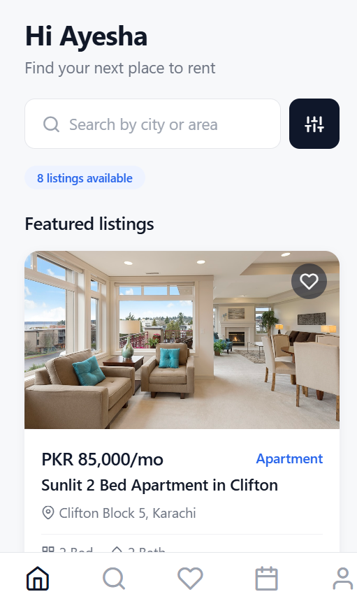
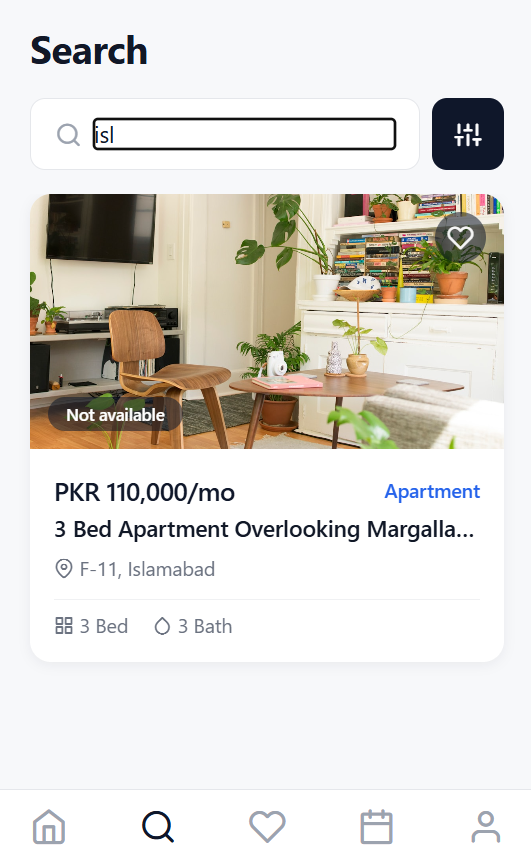
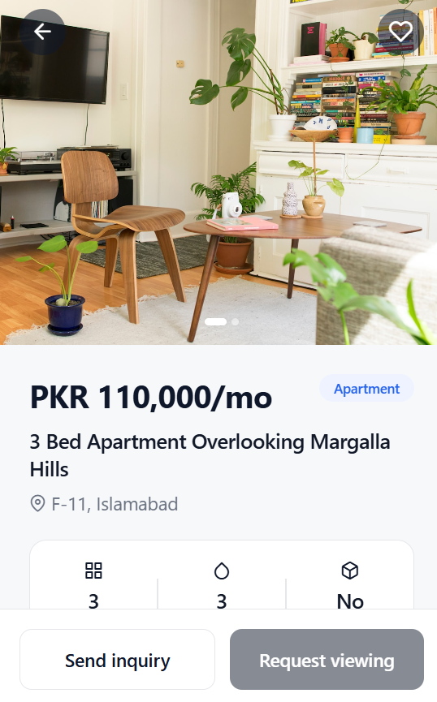
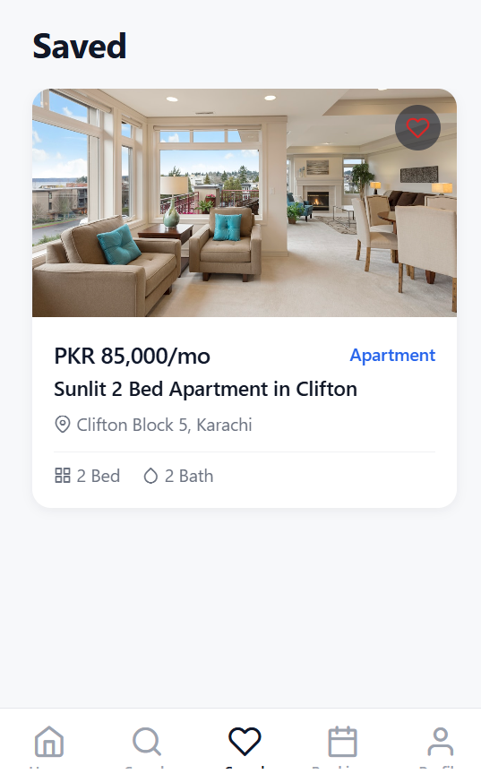
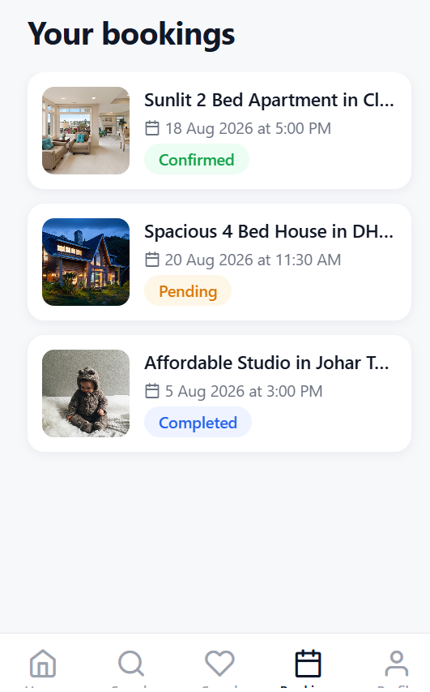
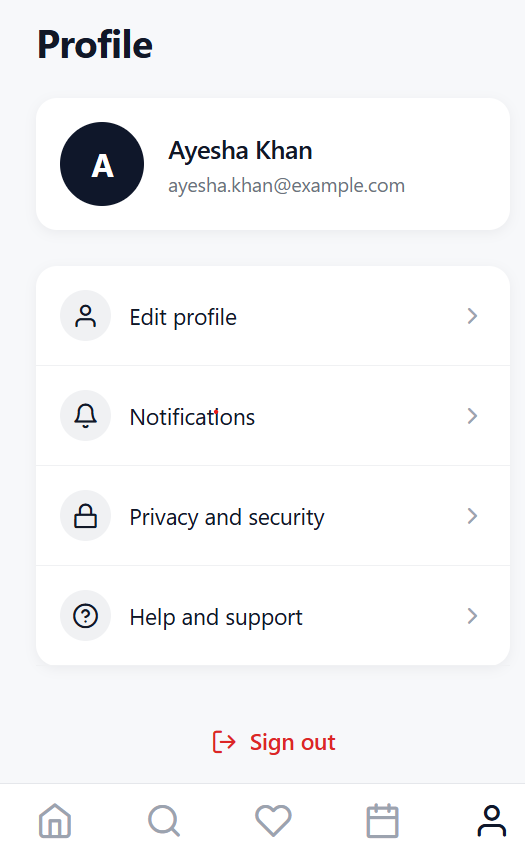

# Property Rental Platform - Mobile App

Tenant-facing mobile application for the Property Rental Platform. Built with React Native and Expo Router, this app lets tenants browse listings, search and filter properties, save favorites, send inquiries, and request property viewings.

This repository contains the mobile app portion of the larger Property Rental Platform project. It runs independently against local demo data during development, and connects to the shared backend once available.

## Screenshots

| Home | Search | Property Details |
|------|--------|-------------------|
|  |  |  |

| Favorites | Bookings | Profile |
|-----------|----------|---------|
|  |  |  |

## Tech stack

- React Native (0.81) with the New Architecture enabled
- Expo SDK 54
- Expo Router for file based navigation
- TypeScript
- React Context for auth and favorites state
- Feather icons via @expo/vector-icons

## Getting started

Requirements: Node.js 18 or later, and the Expo Go app on a physical device, or an Android/iOS simulator.

```
npm install
npx expo install --fix
npx expo start
```

Scan the QR code with Expo Go on Android, or the Camera app on iOS. Press `a` for an Android emulator, `i` for an iOS simulator, or `w` to run in a browser.

## Demo mode

The app currently runs on local mock data so it can be reviewed without a live backend. On the login screen, any email and password combination will sign in as the sample user.

## Connecting the real backend

All network access goes through the `src/api` folder. Screens and components never call `fetch` directly, so switching from demo data to the real backend only requires changes in one place:

1. Open `src/api/config.ts`
2. Set `BASE_URL` to the backend URL
3. Set `API_KEY`, or wire it up to an environment variable
4. Set `USE_MOCK_DATA` to `false`

Each function inside `src/api` already contains the real network request, written and ready, gated behind the mock data flag.

## Project structure

```
app/                      Expo Router screens, file based routing
  (auth)/                 Login and signup
  (tabs)/                 Home, Search, Favorites, Bookings, Profile
  property/[id]/          Property details, inquiry, viewing request

src/
  api/                    One file per resource, mock and real request logic
  components/             Reusable UI components
  constants/theme.ts       Colors, spacing, and typography tokens
  context/                 Auth state and favorites state
  data/                    Demo data used while USE_MOCK_DATA is true
  types/                   Shared TypeScript types matching the backend model
  utils/                   Formatting helpers

assets/                    App icon, adaptive icon, and splash screen images
docs/screenshots/          App screenshots used in this README
```

## Data model

Types in `src/types/index.ts` mirror the shared data model used across the platform, including Property, User, ViewingRequest, and Inquiry. Confirm with the backend developer before renaming any fields, since the web app and admin panel rely on the same shapes.

## Design system

Colors, spacing, and typography are defined once in `src/constants/theme.ts`. Screens and components read from these tokens rather than hardcoding values, so visual changes can be made in a single place.

## My contribution

This mobile app was built end to end as my part of the team's Property Rental Platform project, covering the full tenant-facing experience:

- Authentication flow: login and signup screens with form validation
- Home screen with featured listings
- Search with live filtering by location, and a filter sheet for property type, bedrooms, and price
- Property details screen with an image gallery, amenities, and availability status
- Send inquiry and request viewing flows, each with their own confirmation screen
- Favorites, with optimistic UI updates and rollback on failure
- Bookings screen showing the status of every viewing request
- Profile screen with account details and sign out
- A single design system (colors, spacing, typography) applied consistently across every screen
- An API layer structured so the backend team can plug in real endpoints and an API key by changing one config file, with no changes required in any screen
- Custom animated splash screen, app icon, and adaptive icon

## Working with this repository

This mobile app lives inside the shared team repository. Development work happens on a feature branch, not directly on the main branch.

## Author

Farooque Sajjad

Software Engineer, QA Automation

GitHub: https://github.com/Farooquekk

LinkedIn: https://www.linkedin.com/in/farooque-sajjad-233b41282/